# Kylin Security Center
## Overview
Kylin Security Center is developed by Kylin security team, and it provides 4 functions -- Virus Protection, Account Security, Network Protection, Application Execution Control. The main interface as shown in Fig 1.

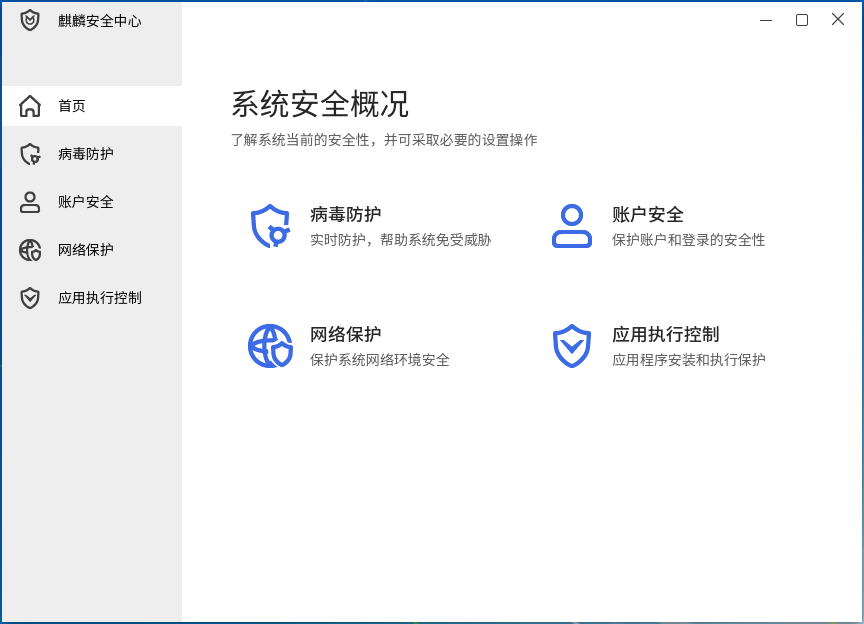
 

## Virus Protection
Show the current protection status and provide some simple protection operations.

Click "Virus Protection" on the main interface or the left side tab to open it, as shown in Fig 2.

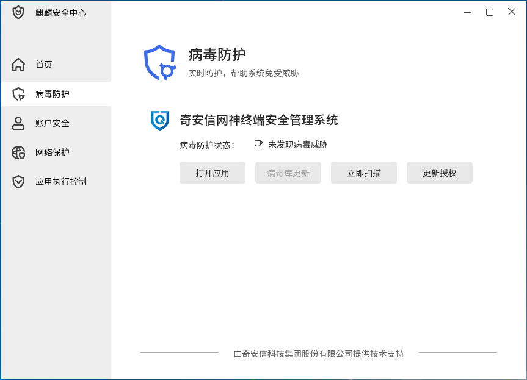

- Update Virus Library: When new virus library is detected, this function is available. Users can update library by this function.

- Scanning Now: Provide rapid scanning function.

- Update Authentication: When the software is expired, users can update the status by this function.

 

## Account Security
Provide password security checking policy, account locking and showing login informations functions.

Click "Account Security" on the main interface or the left side tab to open it, as shown in Fig 3.

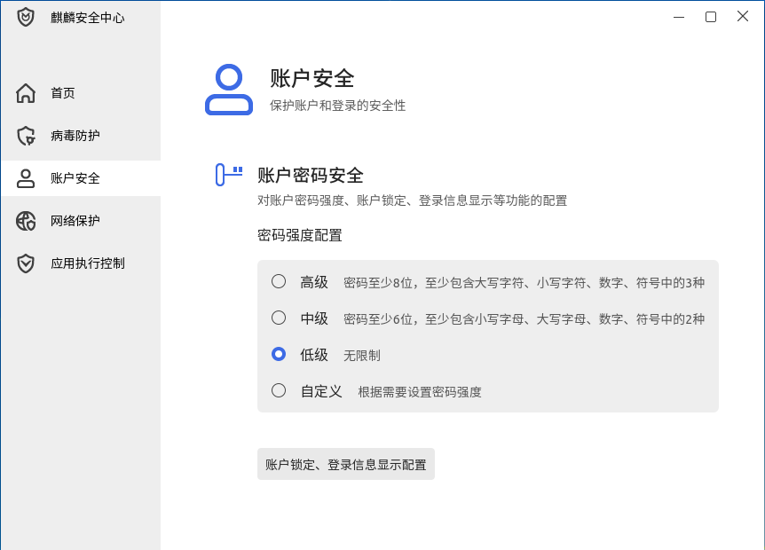

### Password Strength
Here are 4 modes:

- High: ：Length ≥ 8, and contain at least three types of them -- upper case character, lower case character, number, symbol.

- Medium: Length ≥ 6, and contain at least two types of them -- upper case character, lower case character, number, symbol.

- Low: No limits for password.

- Customize: The window as shown in Fig 4.

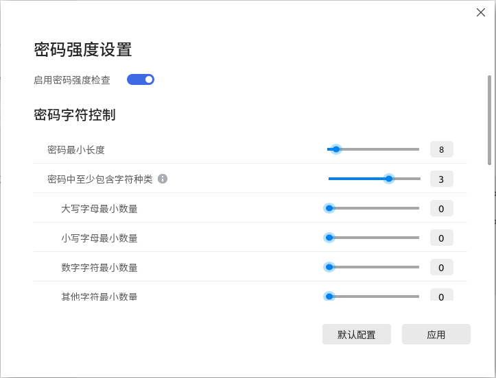

When the mouse hovers on the tips icon, it will show the details.

### Account Locking and Login Information
The interface as shown in Fig 5.

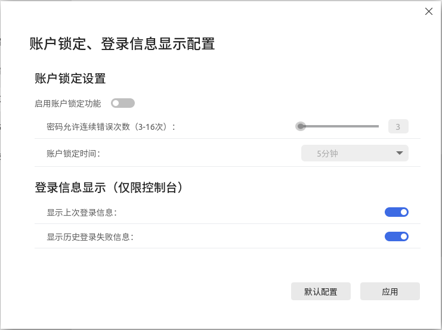

Users can set the password error threshold and locking time.

Login information only valid in terminal login. Users can set whether to show last login information and cumulative failures since last successful login.

 

## Network Protection
Provide firewall and apps networking control functions.

Click "Network Protection" on the main interface or the left side tab to open it, as shown in Fig 6.

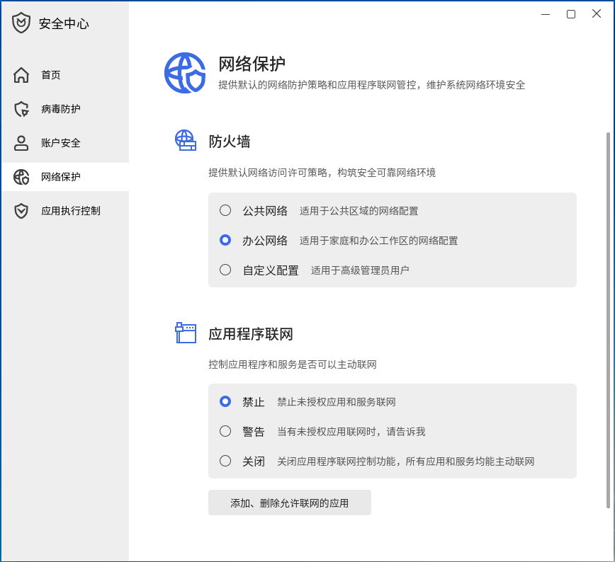

### Firewall
Provide three modes -- Public, Working, Customize.

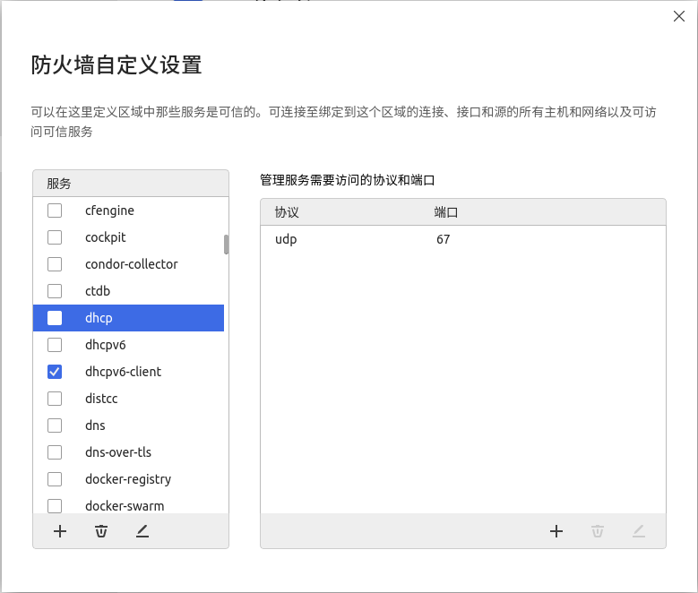

- "Service" list shows the current system's firewall services.

- The right side list shows the protocols and ports.

Users can modify them by the button of "Add", "Delete", "Edit".

Click "Add" and the pop up as shown in Fig 8.

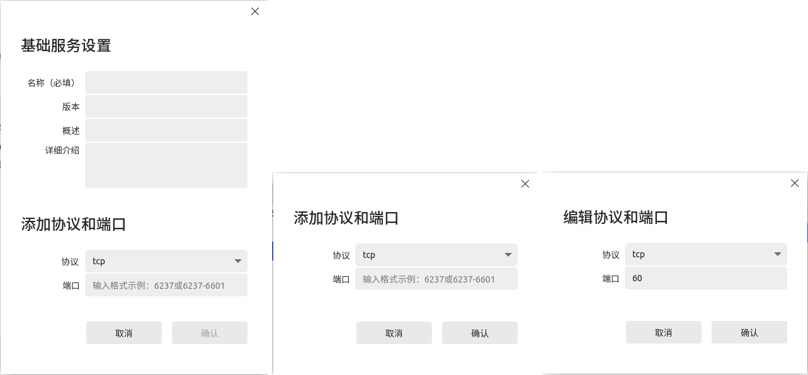

### Apps Networking Control
Here are three modes:

- Forbidden: All apps can't connect to Internet.

- Warning: If the apps have been added to the control list already, it can connect to Internet. Otherwise, authenticated box will pop up, and user can decide to connect or not.

- Close: All apps can connect to Internet.

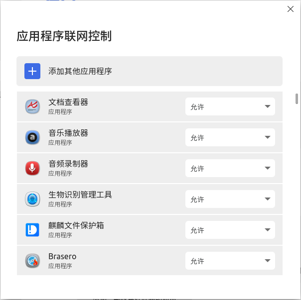

Click "Add" to add other apps to the control list.

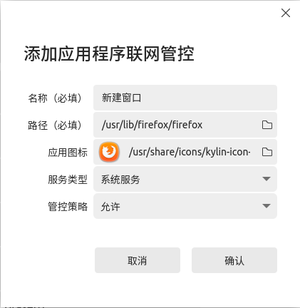
 

## Application Execution Control
Click "Application Execution Control" on the main interface or the left side tab to open it, as shown in Fig 11.

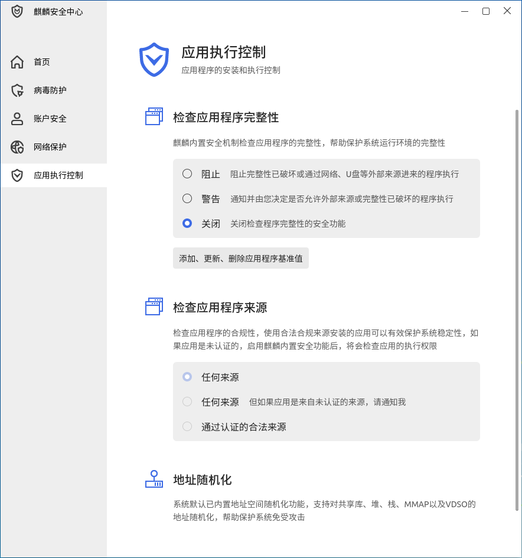

### Check Integrity
Here are 3 modes:

- Forbidden: Unauthenticated or broken apps can't be executed.

- Warning: Users can decide to execute the unauthenticated/broken apps or not.

- Close: No inspection and all apps can be executed.

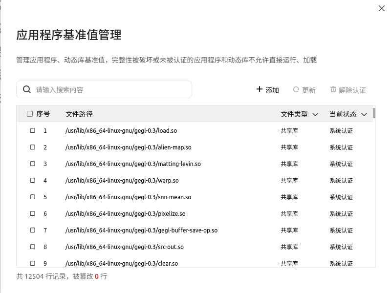

### Random Address
Provide the function of inside address/space randomization, and support the address randomization of sharing libraries, heaps, stacks, MMAP and VDSO.
