# 安全中心
## 概 述
麒麟安全中心是由麒麟安全团队开发的一款系统安全管理程序，包含病毒防护、账户安全、网络保护、应用执行控制4大模块。

可通过“开始菜单” > “所有程序” > “安全中心”打开，或是通过控制面板打开。

主界面如图 1所示。

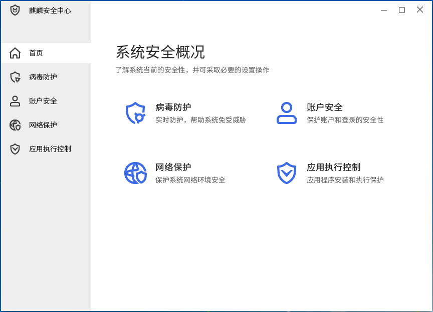
 

## 病毒防护
直观显示系统当前病毒防护状态，并提供简单的防病毒操作。

点击首页的“病毒防护”按钮，或左侧列表中“病毒防护”标签页进入，如图 2所示。

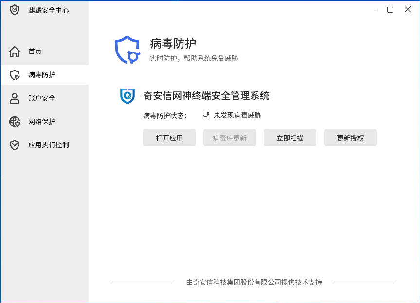

病毒防护集中展示了当前系统安装的防病毒程序；滚动展示各防病毒程序检测下，系统的防病毒待办事项、病毒防护状态及软件更新状态。

同时为每个防病毒程序单独提供打开应用、病毒库更新、立即扫描、更新授权四项功能:

- 病毒库更新：检测到有新的病毒库时，该功能开放。用户可以升级病毒库，更全面的保护当前系统的安全。

- 立即扫描：提供病毒快速扫描功能。

- 更新授权：当防病毒软件授权即将到期或已到期，用户可以通过该功能更新软件的授权状态。

 

## 账户安全
提供系统账户密码安全检查策略配置，账户锁定及登录信息显示配置功能。

点击首页的“账户安全”按钮，或左侧列表中“账户安全”标签页进入，如图 3所示。

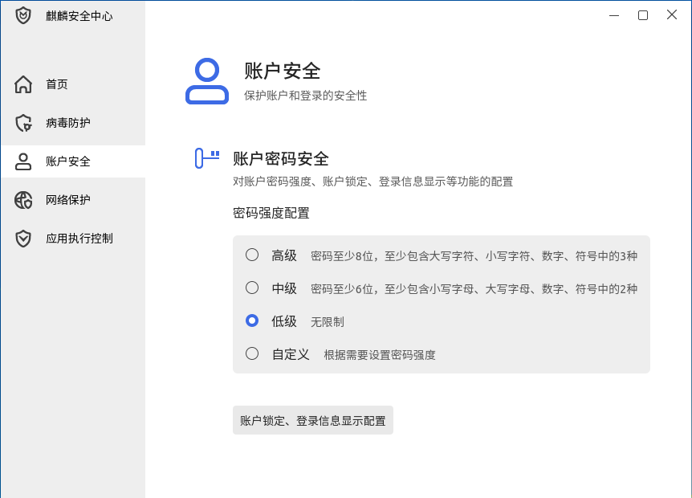

### 密码强度配置
密码强度分为高级、中级、低级、自定义四种配置模式：

- 高级：密码长度至少8位，至少包含大写字符、小写字符、数字、符号中的三种。

- 中级：密码长度至少6位，至少包含大写字符、小写字符、数字、符号中的两种。

- 低级：不对用户密码进行限制。

- 自定义：根据需求自定义相应的密码强度策略，如图 4所示。若设置的策略与高级、中级或低级相同时，再次打开账户安全时，将自动切换到对应模式。

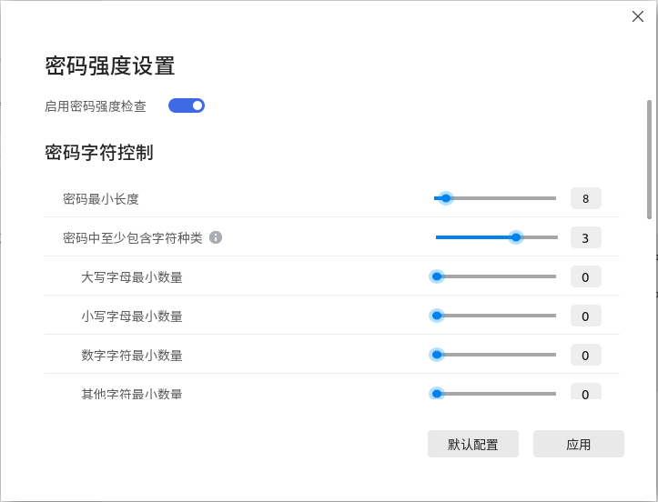

密码强度设置界面中，对于比较难以理解的配置项增加了提示功能。当鼠标悬停在提示图标上时，会显示该配置项的详细说明；同时在密码字符控制类别中，若用户配置内容出现冲突时，也会给出相应提示。

### 账户锁定与登录信息显示
点击“账户锁定、登录信息显示配置”，进入的界面如图 5所示。

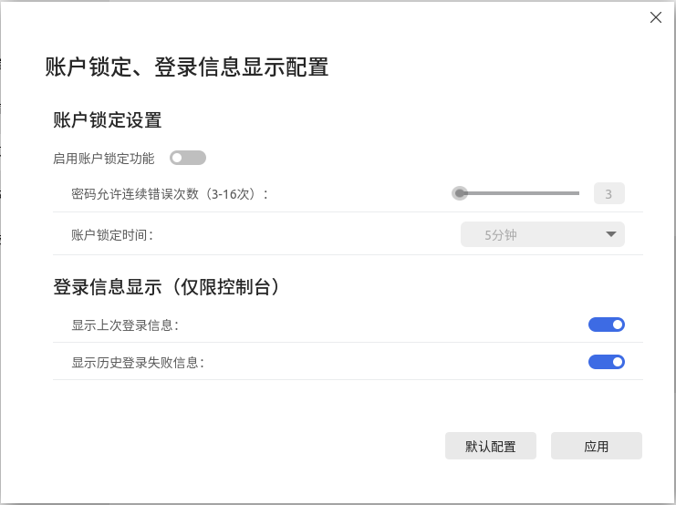

用户设置是否启用账户锁定功能，以及密码错误阈值与锁定时长。

登录信息显示设置仅对控制台有效，可以设置显示上次登录信息和历史登录失败信息。

 

## 网络保护
提供防火墙及应用联网管控功能。

点击首页“网络保护”按钮，或左侧列表中“网络保护”标签页进入，如图 6所示。

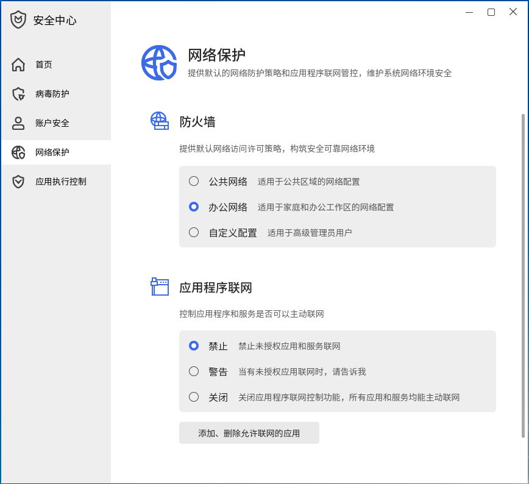

### 防火墙
防护外界应用连接系统，提供公共网络、办公网络和自定义配置三种策略。自定义配置界面如图 7所示。

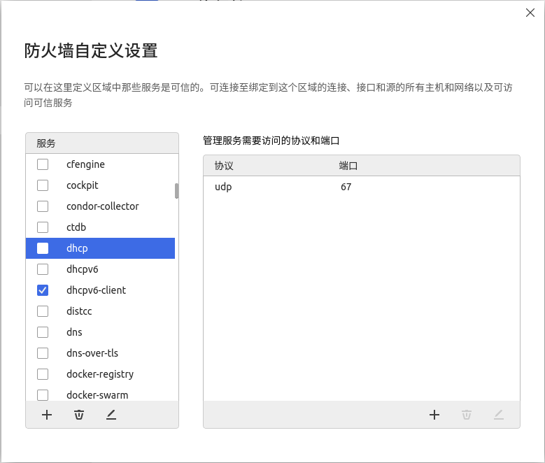

- “服务”列表显示当前系统配置的防火墙服务；

- 右侧列表显示当前服务下配置管控的协议和端口。

勾选后，表示该服务配置启用。

用户可通过添加、删除、编辑功能按钮对服务列表、端口、协议进行修改。

点击服务添加按钮，弹窗如图 8所示。

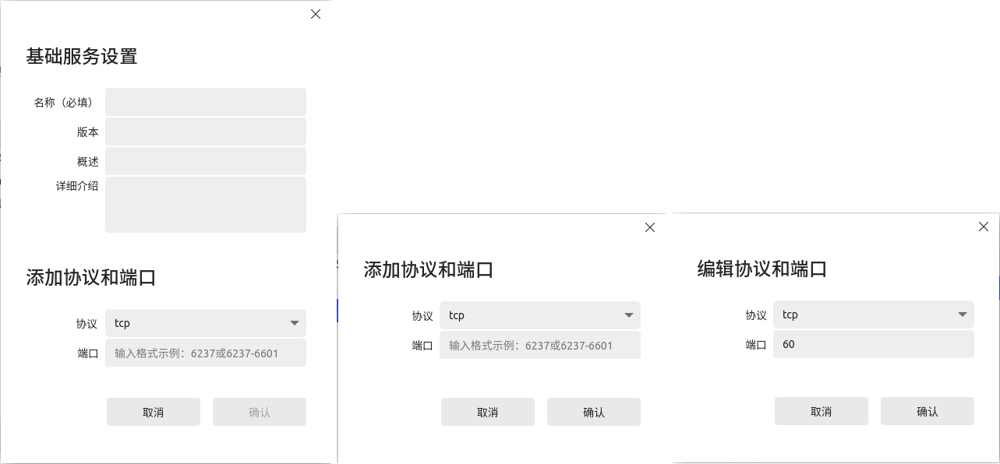

### 应用程序联网
应用程序联网有三种状态：

- 禁止：禁止一切应用程序的联网。

- 警告：若应用程序已添加至管控列表，将根据应用所配置的网络访问策略进行管控；若应用程序未添加至管控列表，将显示认证对话框，由用户选择程序是否可以联网。

- 关闭：所有应用程序均可联网。

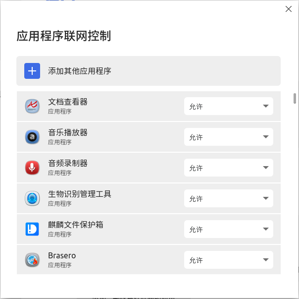

用户选中列表中的应用后，可通过下拉框选择应用的联网策略。点击“添加其他应用程序”按钮，可以添加其他应用程序至管控列表。

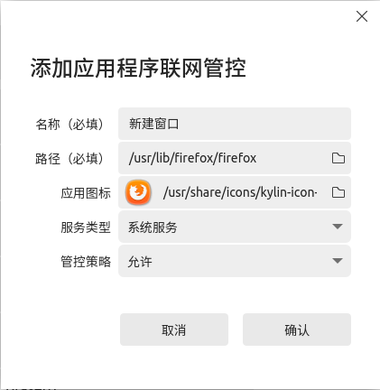
 

## 应用执行控制
提供执行控制运行模式设置，系统白名单快捷操作。

点击首页“应用执行控制”按钮，或左侧列表中“应用执行控制”标签页进入，如图 11所示。

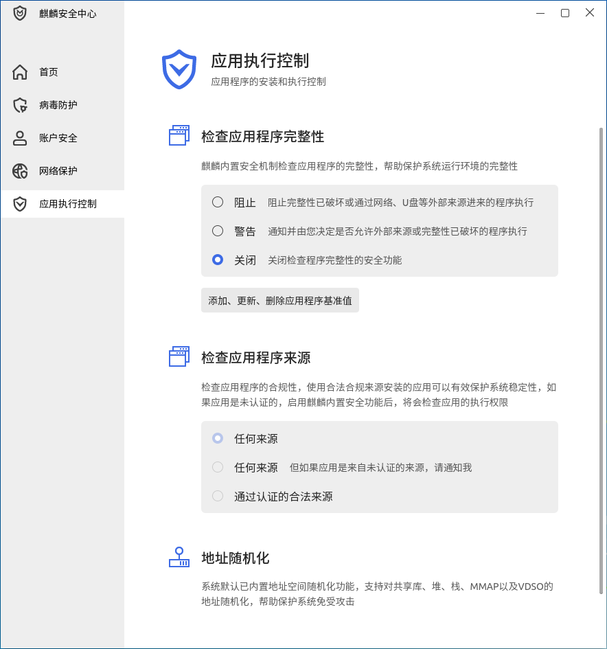

### 检查完整性
应用程序完整性检查有三种状态：

- 禁止：未认证或完整性被破坏的应用程序将不能被执行。

- 警告：由用户来选择是否执行未认证或完整性被破坏的应用程序。

- 关闭：不进行检查，所有应用程序均可执行。

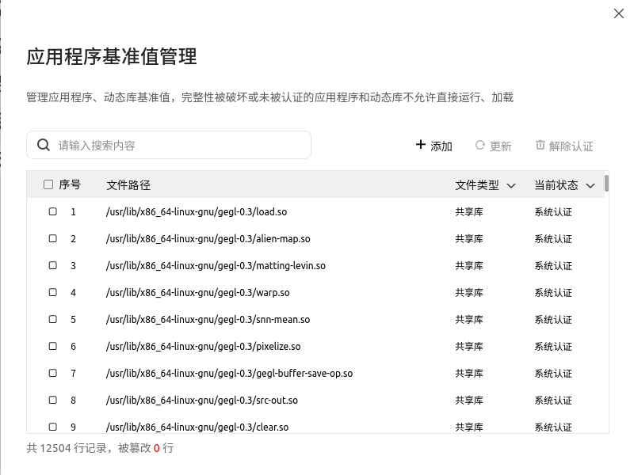

### 地址随机化
提供内置地址空间随机化功能，支持对共享库、堆、栈、MMAP以及VDSO的地址随机化，保护系统免受攻击。
