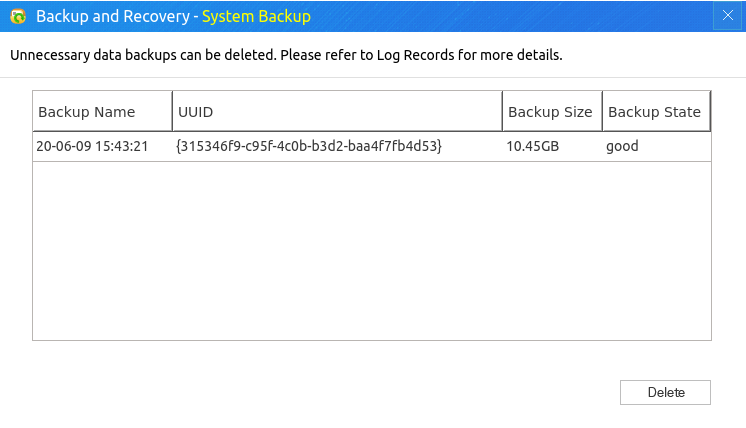
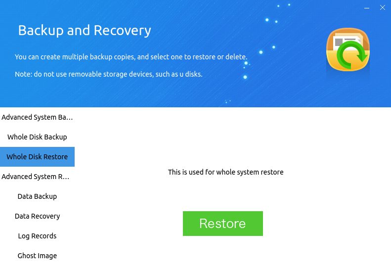
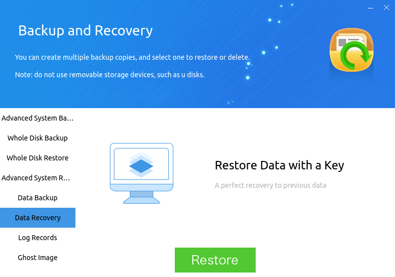
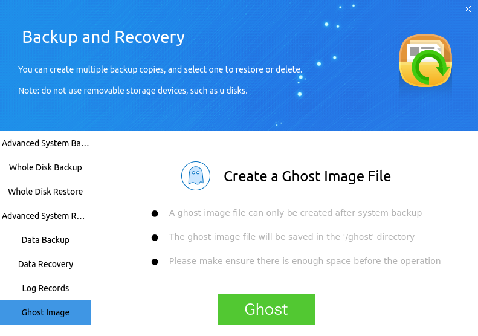

# Kylin Backup and Recovery Tool
## Overview
Kylin Backup and Recovery Tool is used to backup and restore system or user data.

It supports to create new backup points, and incremental backup based on a backup point; as well as restore the system to the state at the time of a backup, and partial restore retaining user data.

There are three modes: General, Grub backup and restore, LiveCD restore.

 

## General
### System Backup
System backup includes "Advanced System Backup" and "Whole Disk Backup" two pages. The interface as shown below.

- **New System Backup** -- Backup the whole system except the backup partition and the data partition.

After selecting "New System Backup", click "Backup" and there will pop up a box allowing users to specify partitions, directories, or files those need to be ignored during backup, as shown in Fig 2.

Directory specification (take /home for example):

| Directory | Effect |
| :------------ | :------------ |
| /home/\* |  Ignore all the files in /home, and an empty /home directory will be created |
| /home | Ignore all the files in /home, and the /home directory won't be created |

 

After clicking "Ok" to backup, the system will chech whether the backup partition has enough space for this operation. If no, it will pop up an 
error reporting window; Conversely, it will pop up prompt in turn, as shown in Fig 3.
 

Click "Continue" to create a new backup in the backup partition. During backup, there will show a window as shown in Fig 4. The length of backup time depends on the size of backup contents.

The button "Backup Management" near "Backup" is used to view the state of system backups and delete invalid backups.

- **Update System Backup** -- Continue backup based on a existed backup.

After selecting this function, there will pop up a window to show all backups. Users can choose one from them.

Incremental backup can be performed on the basis of a failed backup.

- **Whole Disk Backup** -- Backup the whole system except the backup partition and the data partition without the function of specifying contents to be ignored.

### System Restore
System restore can restore the system to its previous backup state, and it include "Advanced System Restore" and "Whole Disk Restore" two pages, as shown below.

Click "Restore" and there will pop up a box allowing users to specify partitions, directories, or files that need to be ignored during restore, as shown in Fig 7. The system will restart automatically after the restore is successfull.

Directory specification (take /home for example):

| Directory | Effect |
| :------------ | :------------ |
| /home/\*  | Don't restore the files in /home, but create an empty /home directory |
| /home  | Neither restore the files in /home nor create /home directory |

 

- If "retaining user data" is checked, the system won't delete the files more than the backup.

- "Whole Disk Restore" means restore the system to its previous backup state without the function of specifying contents to be ignored.

### Data Backup and Data Recovery
- **Data Backup** -- Backup the directories or files specified by user, and the function is similar to system backup.

After selecting "New Data Backup", click "Backup" and there will pop up a box allowing users to specify directories or files those need to be backuped. As shown in Fig 9, it will backup the contents in /home/kylin/.

The button "Backup Management" near "Backup" is used to view the state of data backups and delete invalid backups.

- **Update Data Backup** -- Add new data to a existed data backup.

- **Data Recovery** -- Recovery the data to its previous backup state, and the function is similar to system restore.

The system will restart automatically after recovery is complete.

### Log Records
Record all operations on backup and recovery tool, and the interface as shown in Fig 11. Turn pages by clicking "Up" and "Next" button.

### Ghost Image
Install from ghost image means generate an image file from an installed system, and then use this image file to copy the same state system to other computers. To use this function, a backup is needed first.

#### Create Ghost Image
The interface as shown in Fig 12, including some tips.

Click "Ghost" and there will pop up a window to show all backups. Users select one of them and click "Ok" to start creating, as shown in Fig 13.

Image filename is "computer name + architecture + backup name.kyimg", and only numbers in the backup name are retained.

#### Install from Ghost Image
1) Copy the ghost image (saved in /ghost) to U-disk or other removable storage device.

2) Enter livecd system and insert the removable device.

3) If it doesn't mount automatically, users can manually mount device through terminal:

"sudo mount /dev/sdb1 /mnt"

Removable device is /dev/sdb1 by general, and it can be seen by command "fdisk -l".

4) Double click the install button to start installation guide. Select "Install from ghost image" in Installation Type, and find the ghost image in the removable device, as shown in Fig 14. The follow-up steps can refer to installation manual.

If there exists data partition when creating ghost image file, it needs to check "Create Data Partition" in the next step.

 

## Grub Backup and Recovery

1) Select "Backup and Restore" in grub menu when start-up.

2) Backup or restore are both allowed to select here. If there is an error, restart the system and try again.

- Backup mode: The system will start to backup immediately and the prompt will display on the screen.

For backup mode, is smilar to "Whole Disk Backup" in general mode. If there is no enough space, the backup will fail.

- Restore mode: The system will start to restore to the lastest successful backup state, and the prompt will display on the screen.

For restore mode, is smilar to "Whole Disk Restore" in general mode. If there is no successful backup, the system will not be restored.

 

## LiveCD Restore
Enter livecd system and click "Start Menu" > "All App" > "Kylin Backup and Recovery Tool" to open the application, as shown in Fig 15.

System restore an log records can refer to the function in general mode.

 

## Q&A
### Can not use backup and recovery tool
In order to use this tool, "Create Backup Partition" must be checked when install system.

 

### Backup data/backup partition is allowed?
The contents in data partition are not important to system and have a large capacity, so it's not necessary to backup /data.

Backup partition is used to save and recovery other partitions data, so /backup is not allowed to be backuped or restored.
