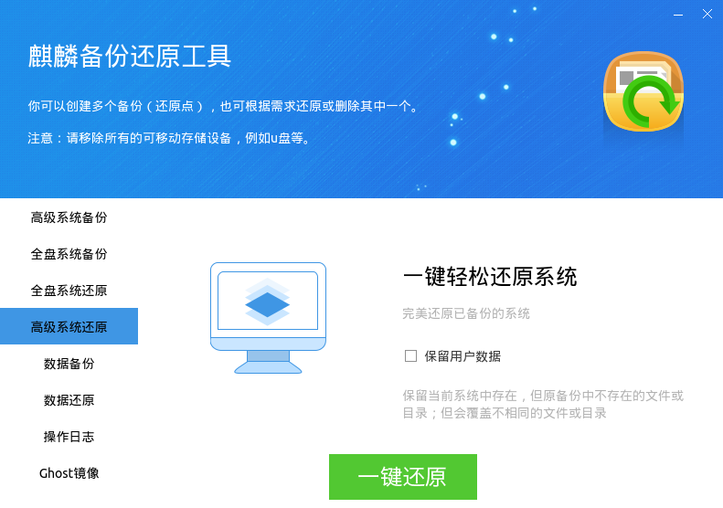

# 麒麟备份还原工具
## 概 述
备份还原工具用于对系统或用户数据进行备份和还原。该工具支持新建备份点，也支持在某个备份点上进行增量备份；支持将系统还原到某次备份时的状态，或者在保留某些数据的情况下进行部分还原。

备份还原工具有3种模式：常规模式、Grub备份还原、LiveCD还原。

 

## 常规模式
### 系统备份
“系统备份”包括“高级系统备份”和“全盘系统备份”两个标签页，主界面如下图所示。

- **新建系统备份** —— 将除备份还原分区、数据分区外的整个系统进行备份。

选择新建后，点击 “开始备份” ，会弹出一个对话框，供用户指定在备份过程中需要忽略的分区、目录或文件，如下图所示。

目录指定说明（以/home为例）：

|  路径 | 效果  |
| :------------ | :------------ |
| /home/\*  |  忽略 /home 目录下的所有文件，会创建内容为空的 /home 目录 |
| /home  | 忽略 /home 目录下的所有文件，并且不会创建 /home 目录  |

 

当确定进入备份时，系统查找备份还原分区是否有足够的空间来进行本次备份。若没有足够空间，则会有报错弹窗；若有足够空间，则会依次给出提示。
 

按“继续”按钮，则会在备份还原分区上新建一个备份。在备份过程中，会有如下所示的提示框。备份时间长短与备份内容大小有关。

“开始备份” 旁边的 “备份管理” ，可用来查看系统备份状态，删除无效备份。

- **系统增量备份** —— 在一个已有备份的基础上，继续进行备份。

当选择增量备份后，会弹出一个列出了所有备份的对话框，供用户选择。

可以在失败的备份基础上进行增量备份。

- **全盘系统备份** —— 将除备份还原分区、数据分区外的整个系统进行备份，不提供用户指定忽略内容的功能。

### 系统还原
“系统还原” 可将系统还原到以前一个备份时的状态，分为“高级系统还原”和“全盘系统还原”两个标签页，如下图所示。

点击“一键还原”，会弹出一个对话框，供用户指定在还原过程中需要忽略的分区、目录或文件，如下所示。还原成功后，系统会自动重启。

目录指定说明（以/home为例）：

| 路径  | 效果  |
| :------------ | :------------ |
| /home/\*  | 不还原 /home 下的文件，会创建 /home 目录  |
| /home  | 不还原 /home 下的文件，也不会创建 /home 目录  |

 

- 若勾选了“保留用户数据”，则在还原时，不会删除现有系统中比备份多出来的文件。

- “全盘系统还原”，将系统还原到某个备份状态，不提供用户指定忽略内容的功能。

### 数据备份与数据还原
- **数据备份** —— 对用户指定的目录或文件进行备份，功能与系统备份相似。

选择“新建数据备份”后，点击“开始备份”，会弹出一个对话框，供用户指定需要备份的目录或文件，如图所示，会对 /home/kylin/ 目录中的内容进行备份。

“开始备份”旁边的“备份管理”，可用来查看数据备份状态，删除无效备份。

- **数据增量备份** —— 在某个数据备份的基础上，增加需要备份的数据。

- **数据还原** —— 还原到某个数据备份的状态，功能与系统还原相似。

完成还原后，系统会自动重启。

### 操作日志
记录了在备份还原工具上的所有操作，主界面如图所示。可通过“上一页” 、“下一页”按钮进行翻页查看。

### Ghost镜像
Ghost镜像安装，是指将一台机器上的系统生成一个镜像文件，然后使用该镜像文件来安装操作系统。要使用该功能，首先需要有一个备份。

#### 创建Ghost镜像
选择菜单“Ghost镜像”，主界面如下图所示，包含了几点提示。

点击“一键Ghost”后，会弹出当前所有备份的列表；用户选择一个备份，点击“确定”后，开始制作Ghost镜像，如下图所示。

（注：名称中的体系架构与硬件平台有关。）
 

镜像文件名的格式为“主机名+体系架构+备份名称.kyimg”，其中，备份名称只保留了数字。

#### 安装Ghost镜像
1）把制作好的Ghost镜像（存在于 /ghost 目录下）拷贝到U盘等可移动存储设备。

2）进入LiveCD系统后，接入可移动设备。

3）若设备没有自动挂载，可通过终端，手动将设备挂载到/mnt目录下：

sudo mount /dev/sdb1 /mnt

通常情况下，移动设备为/dev/sdb1，可使用命令“fdisk -l”查看。

4）双击图标“安装Kylin-Desktop-V10”，开始安装引导。在“安装方式”中选择“从Ghost镜像安装”，并找到移动设备中的Ghost镜像文件。后续安装步骤可参考安装手册。如下图所示。

（注：名称中的体系架构与硬件平台有关。）

如果制作镜像文件时带有数据盘，则在下一步“安装类型”中也要勾选“创建数据盘”。

 

## Grub备份还原

（注：截图中的日期、版本号仅供参考。）

1）开机启动系统时，在Grub菜单选择“系统备份还原模式”。

2）在此处可选择备份或者还原，如下图所示。若出错，可重启系统再次进行备份或还原。

- 备份模式：系统立即开始备份，屏幕上会给出提示。

对于备份模式而言，等同于常规模式下的“新建系统备份”。如果备份还原分区没有足够空间，则无法成功备份。

- 还原模式：系统立即开始还原到最近一次的成功备份状态屏幕上会给出提示。

对于还原模式而言，等同于常规模式下的“一键还原”。如果备份还原分区上没有一个成功的备份，则系统不能被还原。

 

## LiveCD还原
通过系统启动盘进入操作系统后，点击“开始菜单” > “所有软件” > “麒麟备份还原工具”打开软件，主界面如下图所示。

其系统还原和操作日志可参考常规模式下的对应功能。

 

## 常见问题
### 无法使用备份还原工具？
在安装操作系统时，必须要选中“创建备份还原分区”，备份还原工具才能使用。

 

### 可以对data分区和backup分区进行备份吗？
数据分区（/data）保存的内容与系统关系不大，且通常容量很大，因此不建议对数据分区进行备份和还原。

备份还原分区（/backup）用于保存和恢复其他分区的数据，故此分区的数据不允许备份或还原。
