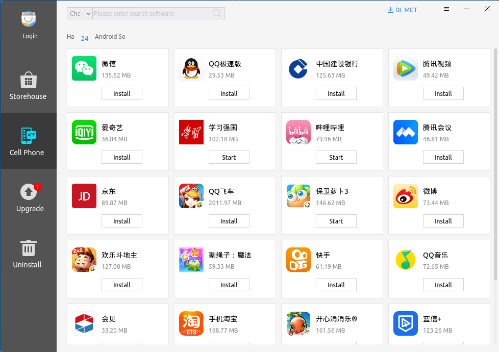
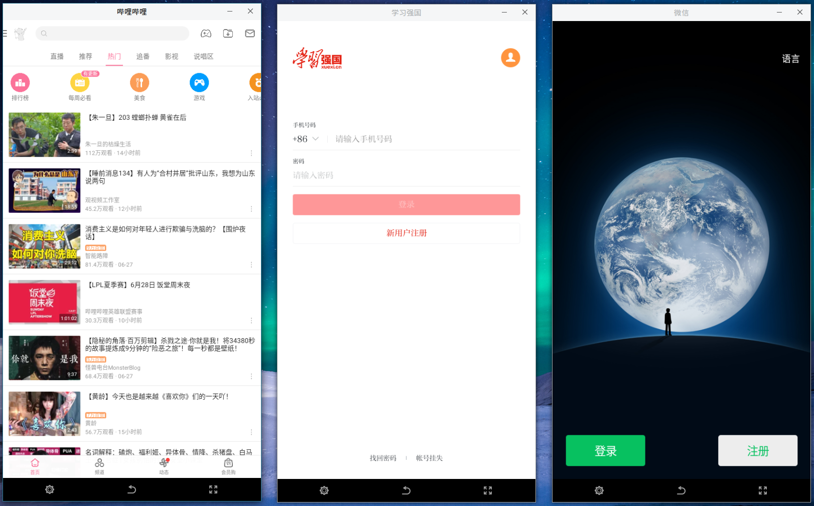
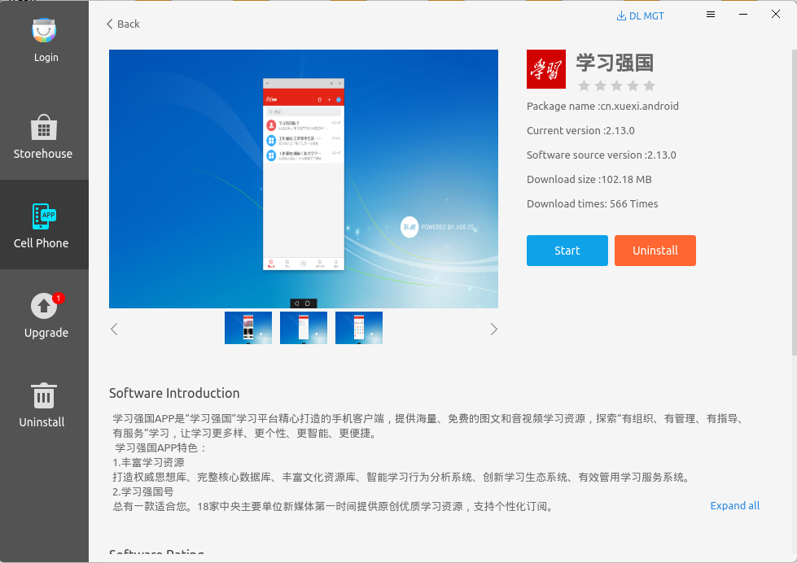

# Kydroid
## Overview
Kydroid provides an environment to install and run Android applications on the Kylin system such as Android games, QQ, etc..

Tips: Not all platforms support Kydroid.

 

## Start Android Application
- Click "Start Menu" > "All App" > "Android"

- Open Kylin software center, and select "Cell Phone".

If it's first time to start Kydroid, users need to wait for paperaring files, as shown below.

### Multiple Applications Running
Kydroid supports multiple applications running at the same time.

### Switch

- As shown in Fig 3, there are 2 button at the middle of the window bottom. Round button means return to the Kylin system

- Press Win in the Android application interface

- Press Alt + Tab

- Close all applications

### Install and Uninstall
- Install and upgrade: Click "Install" button in Fig 2 to install applications. 

- Unstall: Click the application to enter the detail page, and click "Uninstall", as shown in Fig 4.

## Q&A
To get a better use experience, we suggest:

1) The performance of SSD is much better than that of HDD.

2) Don't run more than 3 apps at the same time.

3) Custom window size may cause abnormality.

4) The memory is better more than 8G.

5) Domestic video cards, such as MWV, are not supported temporarily.
