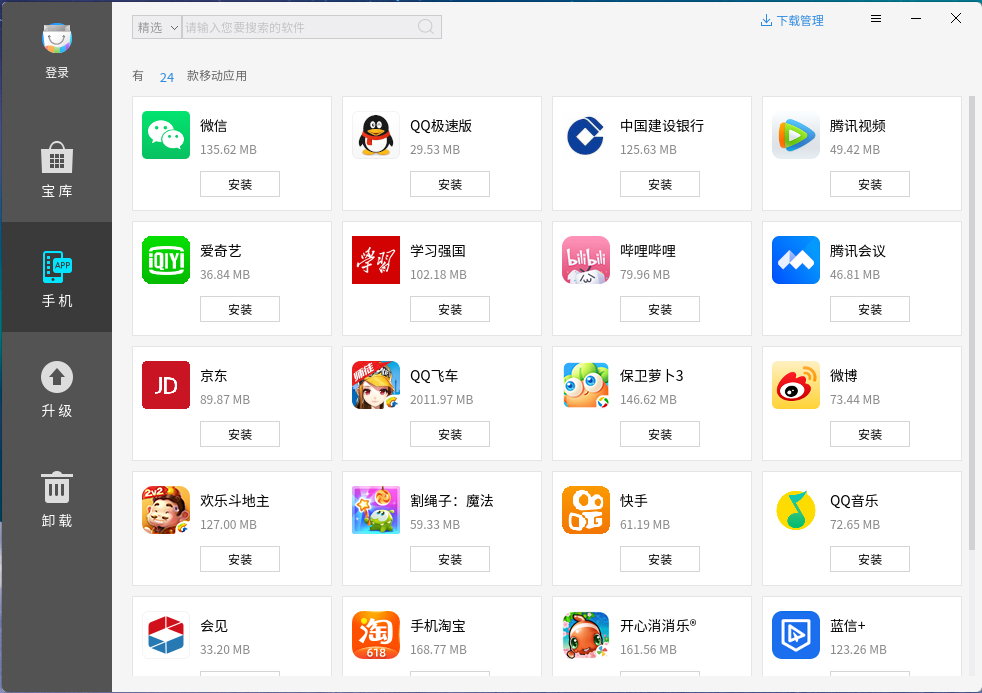
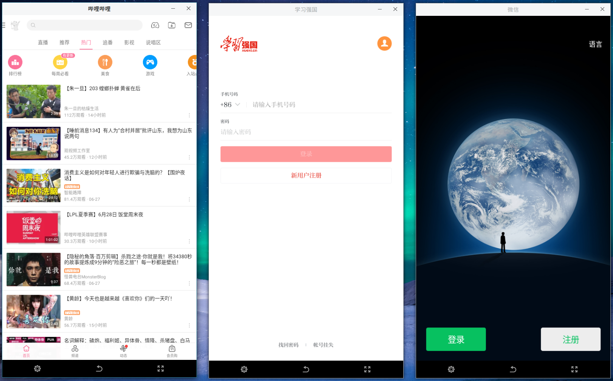
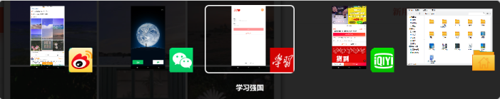
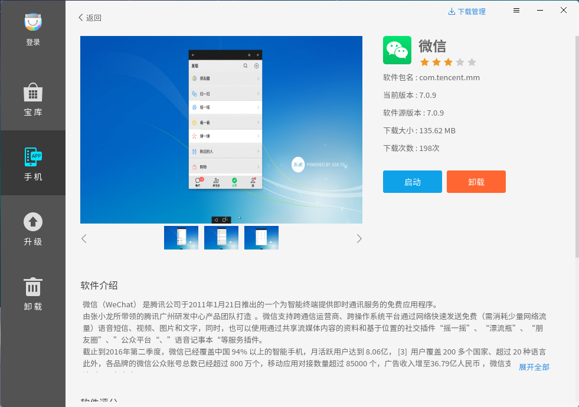
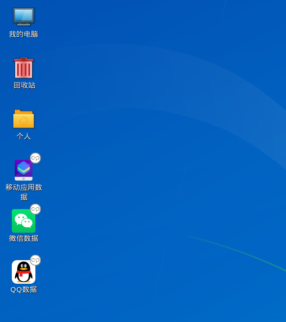
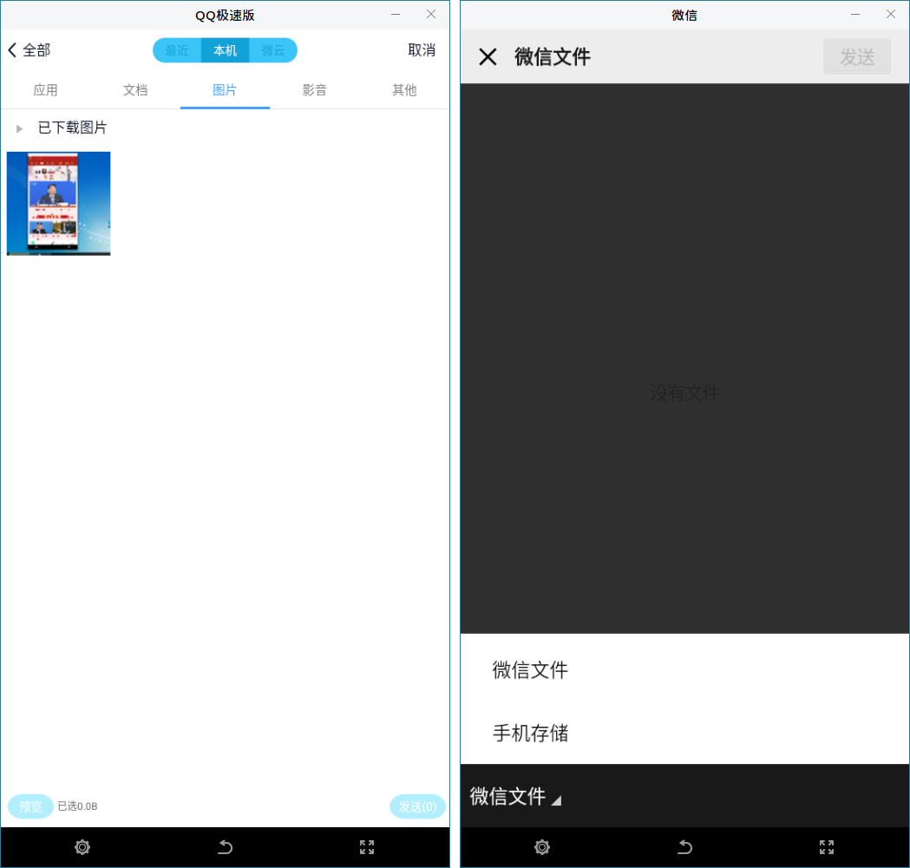

# 安卓兼容
## 概 述
麒麟安卓兼容环境Kydroid用于解决用户的多样化应用需求。Kydroid能够让用户在银河麒麟操作系统中安装和运行安卓系统的应用程序，比如安卓游戏、QQ等。

注：部分平台暂不支持安卓兼容。

### 技术特点
- 支持海量安卓App，一秒启动。

- 直接使用显卡硬件，无性能损失。

- 安卓App与Linux窗口显示融合。

- 多个App同时运行。

- App分辨率动态适应，横竖屏幕切换，高分辨率真全屏模式。

- 统一输入法，使用Linux输入法在安卓App中输入文字。

- 统一音频设备，支持语音聊天。

- 支持摄像头。

- 文件互通，文字剪切板互通，应用管理统一。

- 升级到安卓10，兼容性、安全性、稳定性大幅提升。

 

## 用前必读
因安卓系统本身技术设计，以及Kydroid与银河麒麟操作系统共用硬件资源的原因，为了达到较好的使用体验效果，建议用户仔细阅读以下注意事项和已知问题：

1）安卓App在使用固态硬盘时性能会相较于使用机械硬盘有较大提升（安卓操作系统为手机操作系统，其磁盘操作对机械硬盘支持较差）；

2）建议不要同时运行4个以上的App（安卓手机一般只会有一个App在前端活跃运行）；

3）电脑内存建议8G或以上；

4）目前支持的CPU：FT2000/4、FT1500A、KunPeng 920；

5）目前支持的显卡：radeon、amdgpu、jjw，暂不支持GP101显卡。在jjw显卡上，性能表现不佳，运行应用可能出现卡顿和闪退现象，甚至有些应用无法运行。在FT1500上对amdgpu显卡（如R7 340、RX 550)的支持存在问题，可能导致系统不稳定等问题；

6）Mobile QQ语音通话存在问题，通话会异常结束，（QQ极速版无该问题）；

7）在使用音视频通话软件时，需要暂停其他音频/视频的播放，否则音视频通话软件可能会遇到听不到对方声音的问题；

8）如果要使用摄像头，则需要在Kydroid环境启动之前插上摄像头，否则当环境启动成功后才插上摄像头，将无法正常使用摄像头；当前版本在有些机器上使用摄像头可能存在绿屏现象；

9）带有wifi设备的机器，如笔记本或者台式机插入了无线网卡，这类机器在启动Kydroid环境之前，需要保证wifi开关处于开启状态，否则如果wifi开关处于关闭状态时启动Kydroid环境，则Kydroid环境里的App都无法联网；

10）视频类应用调节屏幕亮度功能不会生效；

11）视频类应用不支持“画中画”功能；

12）不支持定位和传感器相关功能；

13）“钉钉”应用登录后，如在钉钉上使用到打卡等功能，需要先在Kydroid环境中登出账号，否则可能出现“虚拟定位软件打卡”问题；

14）“蓝信+”应用，需要在手机上登出账号后，语音通话功能才能成功呼出。

 

## 安卓应用启动
### 从软件商店启动
在开始菜单中启动麒麟软件商店，点击窗口左侧“手机”标签页。若为开机后第一次启动应用，则需等待安卓相关文件准备，该过程提示框如图1所示。待安卓环境准备完成后，提示框退出，切换至安卓app界面，如图2所示。

若启动安卓应用时安卓环境已经准备就绪，则直接切换至安卓应用界面。鼠标点击已安装应用上的“启动”按钮，打开应用。可同时打开多款安卓应用，如图3所示。

### 从开始菜单启动
当系统中有已安装的安卓应用时，用户可以通过“开始菜单” > “所有程序” > “移动应用”中的快捷方式打开移动应用。

 

## 应用界面
### 切 换
移动应用启动后，与麒麟系统应用一样，在任务栏有对应的标签，如图 4所示。

点击任务栏标签可以激活对应的应用，并且可以通过Alt + Tab键进行应用间的切换，如图 5所示。

### 全 屏
窗口工具栏有三个功能按钮，分别为设置（暂未开放设置功能）、返回和全屏，如图 6所示。

点击全屏按钮后，对应的应用将以全屏方式显示。在全屏模式下，鼠标移动时，将在屏幕的最右侧出现一个黑色的浮动工具栏，如图 7所示。

点击该浮动工具栏的按钮，将展现一个包括设置（暂未开放设置功能）、返回和全屏按钮的工具栏，如图 8所示。也可以通过按“F11”进行全屏与非全屏的切换，支持“Esc”退出全屏。

 

## 安装和卸载
- 安装和升级：在软件商店的“手机”标签页，选择需要安装的应用，点击安装即可。

- 卸载：点击想要卸载的应用，进入软件介绍界面，点击“卸载”按钮。

 

## 文件互通
Kydroid提供了麒麟与移动应用环境文件互通功能，在启动Kydroid环境后，当前用户桌面上会创建一个名为“移动应用数据”的文件夹，通过该文件夹可以访问到Kydroid环境内部的数据。针对已经安装的QQ或微信，当前桌面上也会创建应用对应的文件夹，用来访问应用的数据。共享文件夹如图 10所示。

* QQ：

1）保存的图片在 “QQ数据” > “QQ_Images” 中；

2）保存的视频在 “移动应用数据” > “Movies” 中；

3）下载的文件在 “QQ数据” > “QQfile_recv” 中。

* 微信:

1）保存的文件在 “微信数据” > “Download” 中；

2）保存的图片和视频在 “微信数据” > “WeiXin” 中。

如果想在Kydroid环境下访问麒麟系统下的文件，可以将想要共享的文件拷贝到“移动应用数据”中的文件夹下，应用可以通过访问移动应用环境内的内部存储访问文件。

例如，QQ中发送文件时，可以在对应文件夹中找到拷贝到Kydroid环境中的文件；微信中发送文件时，在选择文件界面，点击应用左下角菜单，在弹出的菜单中选择“手机存储”，然后在手机存储对应文件夹找到拷贝到移动应用环境中的文件。

