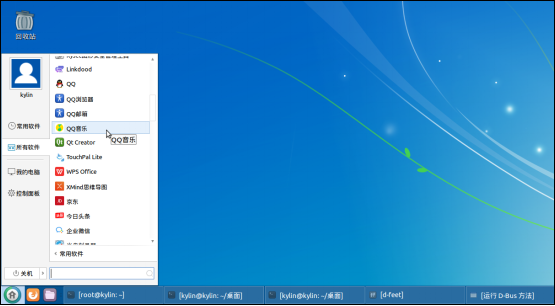
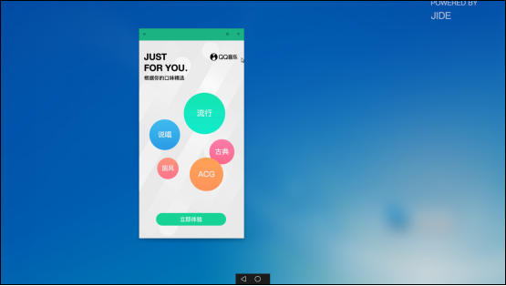
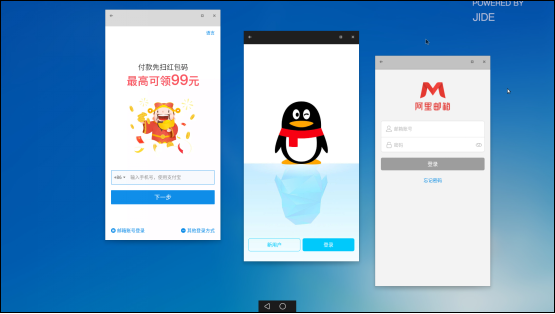
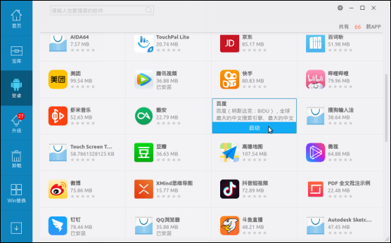
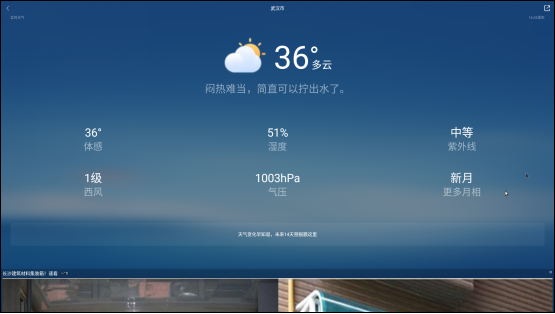
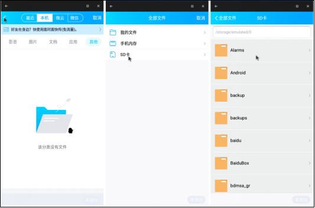
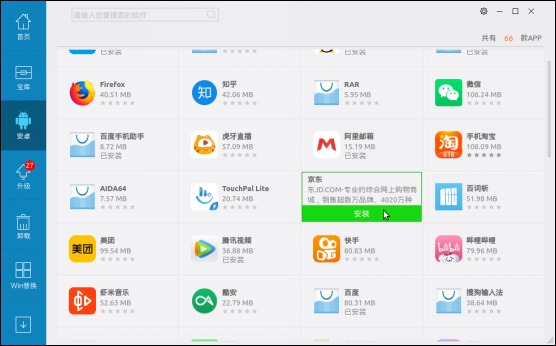
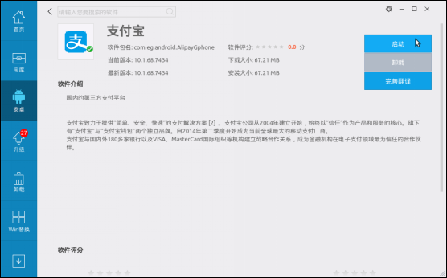
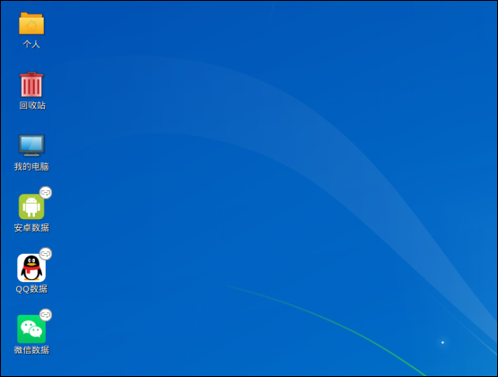
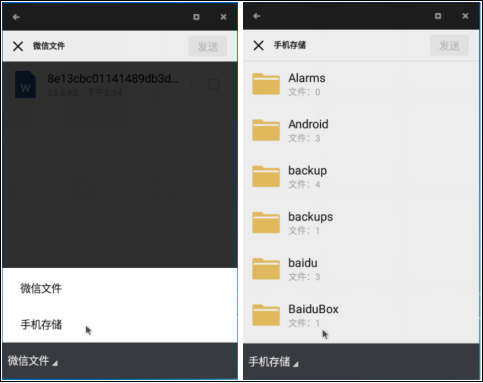

# 银河麒麟安卓兼容环境V2.0帮助手册

## 1.概 述
麒麟安卓兼容环境Kydroid是麒麟团队专为“银河麒麟操作系统”打造的一款安卓兼容运行环境，用于解决用户的多样化应用需求。Kydroid 能够让用户在银河麒麟操作系统中安装和运行安卓系统的应用程序，比如安卓游戏、QQ、股票等。
## 2.功能特性
原生性：使用完全原生模式实现，非虚拟机，非安卓模拟器。直接使用硬件资源如显卡硬件加速等，效率极高；
高兼容性：支持绝大多数普通APP和部分大型游戏APP，如：QQ、微信、棋牌小游戏、网易云音乐、炒股软件、大型3D游戏；
高融合性：体验一体化，安卓App的各项使用体验与银河麒麟桌面应用无差别。如：剪切板互通、通知互通、文件互通、App安装管理融合、任务栏开始菜单融合、Alt+Tab切换融合等；
多窗口同时运行：支持多个App同时运行、窗口自由缩放、全屏、横竖屏切换。
安卓App生命周期控制：解决App后台恶意自启、全家桶互相唤醒等安卓本身缺陷。
## 3.功能特性
### 3.1.安卓应用启动方式
#### 3.1.1.从开始菜单快捷方式启动安卓应用
点击桌面左下角开始菜单->所有软件->安卓应用快捷方式，如图1所示。

若为开机后第一次启动应用，则需等待安卓相关文件准备，该过程桌面右下角会弹出提示框，如图2所示。待安卓环境准备完成后，提示框退出，切换至安卓app界面，如图3所示。

若启动安卓应用时安卓环境已经准备就绪，则直接切换至安卓应用界面。可同时打开多款安卓应用，如图4所示。

#### 3.1.2.从银河麒麟软件商店启动安卓应用
点击左下角开始菜单->银河麒麟软件商店，如图5所示。软件商店打开后，点击窗口左侧安卓按钮，按钮右侧出现安卓应用列表。

若当时安卓环境未准备好，则需等待安卓环境准备。此时桌面右下角会弹出提示框，如图6所示。待提示框退出，表明安卓环境准备就绪。鼠标悬停在已安装应用上时，出现启动按钮，如图7所示，点击启动按钮启动安卓应用，如图8所示。

若打开银河麒麟软件商店前安卓环境已经准备就绪，则无需经过等待准备安卓相关文件的过程。
### 3.2.界面切换
#### 3.2.1.切 换
安卓应用启动后，麒麟应用与安卓应用之间的切换通过以下方法。
在安卓应用界面屏幕底部有两个按钮，如图8中底部所示。其中左侧三角按钮同手机返回按钮，仅对当前选中的安卓应用有效。点击右侧圆形按钮，可切换至麒麟界面。
在安卓应用界面按下键盘开始菜单键，可切换至麒麟界面；
当用户关闭所有安卓应用后，会自动切换至麒麟界面；
在麒麟界面启动安卓应用后，麒麟桌面任务栏会显示对应的应用，点击应用会切换至安卓应用界面，如图9所示。

可以在任何时候通过Alt+Tab键切换至麒麟或者安卓应用，如图10所示。

#### 3.2.2.最大化安卓应用窗口
普通大小的安卓应用窗口可点击右上角最大化按钮，使之最大化，见图11。
最大化状态时鼠标移动至屏幕顶部，在弹出的操作条上点击恢复按钮，使应用窗口变为普通窗口大小。

### 3.3.安装卸载安卓应用
安装和升级：麒麟软件商店打开后，点击左侧安卓按钮，在按钮右侧窗口出现安卓应用列表，鼠标移至预安装应用处，点击安装即可，如图12所示。安装过后，该应用在列表的位置处会出现“已安装”字样。

卸载：点击想要卸载的应用，进入软件介绍界面，鼠标移动至启动按钮，下方出现灰色卸载按钮，点击即可卸载，见图13。

### 3.4.文件互通
银河麒麟安卓兼容提供了麒麟与安卓环境文件互通功能，在启动安卓环境后，当前用户桌面上会创建一个名为“安卓数据”的文件夹，通过该文件夹可以访问到安卓的数据。针对已经安装了的QQ或微信，当前桌面上也会创建应用对应的文件夹，用来访问应用的数据。共享文件夹如图14所示。

QQ中保存的图片在“QQ数据”->“QQ_Images”文件夹中；QQ中保存的视频在“安卓数据”->“Movies”文件夹下；QQ中下载的文件在“QQ数据”->“QQfile_recv”文件夹下。微信中保存的文件在“微信数据”->“Download”文件夹中；微信中保存的图片和视频在“微信数据”->“WeiXin”文件夹下。
如果想在安卓环境下访问麒麟下的文件，则可以将想要共享的文件拷贝到“安卓数据”中的文件夹下，应用可以通过访问安卓环境内的内部存储访问文件。例如，QQ中发送文件时，在文件选择界面时先点击上方蓝色区域“<”按钮进入“全部文件”界面，在该界面中选择“SD卡”，再到对应文件夹找到拷贝到安卓中的文件。微信中发送文件时，在选择文件界面，点击应用左下角菜单，在弹出的菜单中选择“手机存储”，然后在手机存储对应文件夹找到拷贝到安卓中的文件。
选择过程如图15和图16所示。

## 4.常见问题
#### 4.1.使用安卓操作系统的注意事项？
因安卓操作系统本身技术设计，以及安卓兼容层与银河麒麟操作系统公用硬件资源的原因，为了达到较好的使用体验，我们建议用户注意以下几点：
1.安卓App在使用固态硬盘时性能会比机械硬盘有较大提升；（安卓操作系统为手机操作系统，其磁盘操作对机械硬盘支持较差）
2.建议不要同时运行3个以上的App；（安卓手机一般只会有一个App在前端活跃运行）
3.自由缩放App窗口大小可能出现异常现象；（安卓手机上的App形态一般都是全屏，部分App在开发时没有考虑过大小动态改变的情况）
4.电脑内存建议8G或以上；
5.暂不支持景嘉微等国产显卡。
