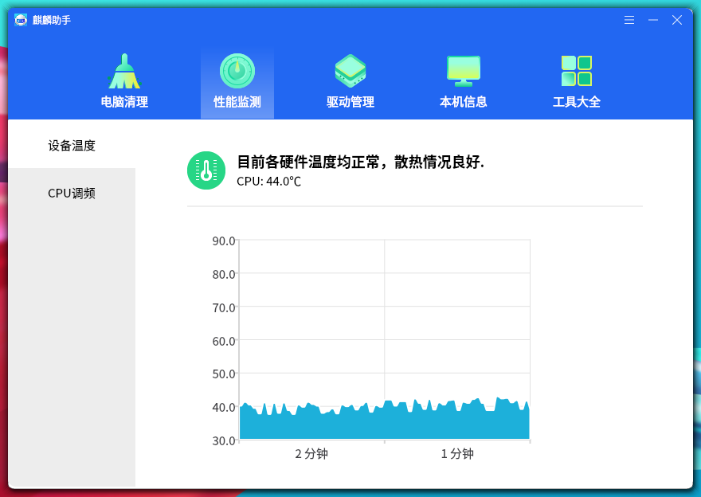
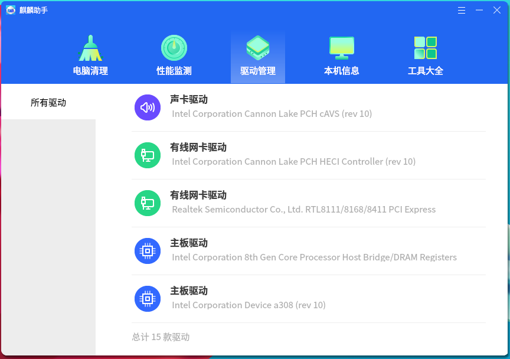
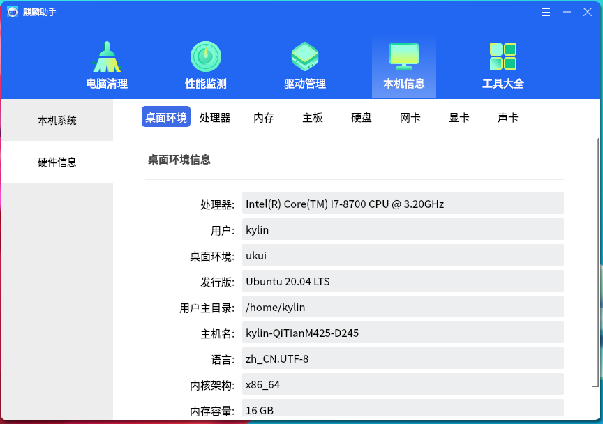
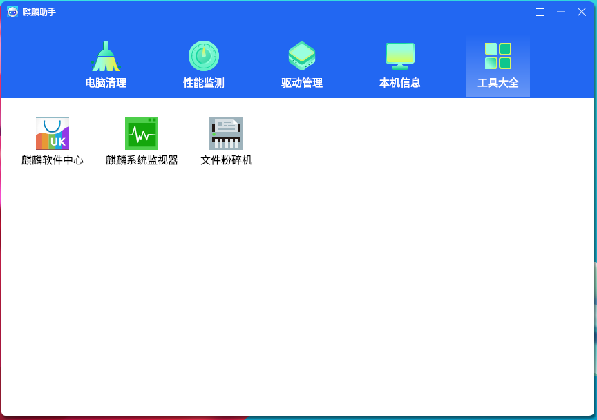

# Kylin Assistant
## Overview
Kylin Assistant provides some extended functions and users can query the hardware details of the current computer. The main interface as shown in Fig 1.

 

## Kylin Home
This page provides "Current Version Number" information, an entrance to "Toolkits", and a simple system clean function.

Click "Start Scan". After the process over: 
 

- "Start Cleanup": Execute cleaning

- "Back": Cancel cleaning and restore initial state

This clean function only scan the items which don't need too much time, such as histroy traces, browser cookies, software package caches.

 

## Cleanup
It provides "System Cache", "Cookies", and "Histroy Trace", as shown in Fig 3.
 

Click the corresponding icon and the popups as shown in Fig 4.
 

It only scan the checked items.

Click "Start Scan". If the scaned item exist garbages, it will show on the window.
 

Click "Custom" to see the details.
 

Click "Start Cleanup" and the authentication window will pop up, as shown in Fig 7.

The password is required to avoid operating by illegal users and leading to system crash. 
 

- Pass: Complete cleanup

- Failed: Pop up authentication window again and there are 3 chances

- If 3 times all failed, the cleanup process will be terminated

- Click "Back" to cancel cleaning

 

## Sysinfo
Obtain computer hardware details and system informations from the bottom of the system, as shown in Fig 8.

- Dynamic display accroding to the current hardwares composition. 

- The item won't be shown if this hardware doesn't exist or doesn't obtain its information.

- Clicking a item at the left of the window to switch to its details. Take "HD" for example:
 

 

## Toolkits
It's developed by the form of plugin, as shown in Fig 10.
 

