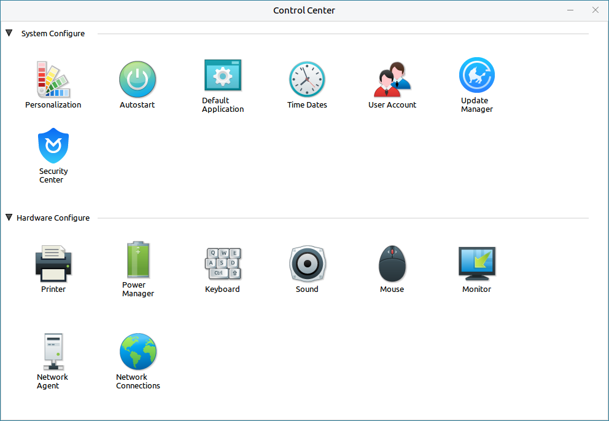
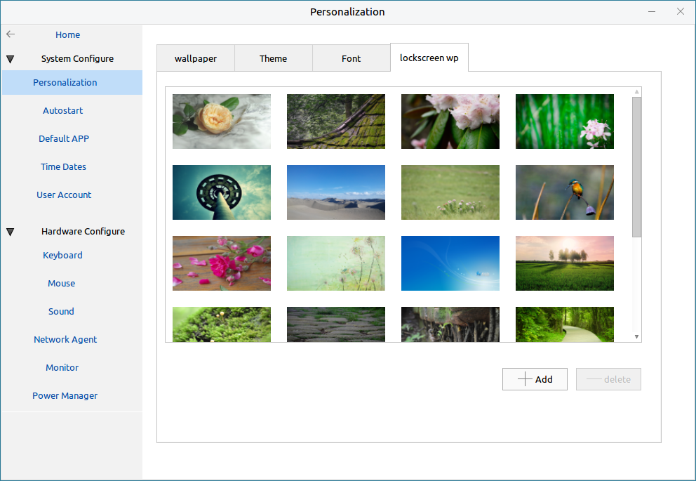
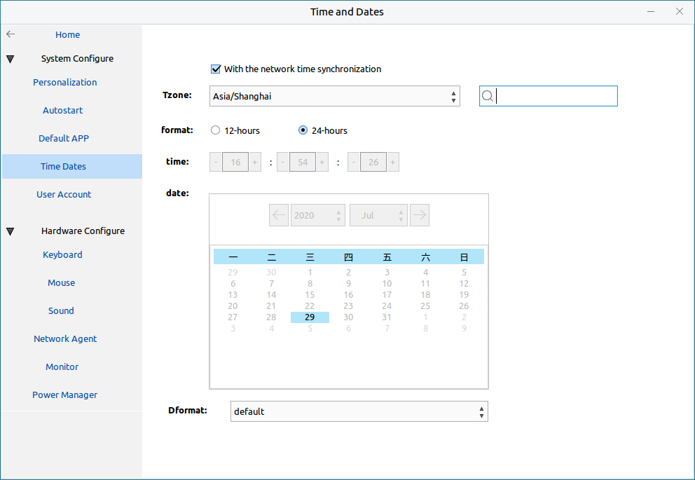
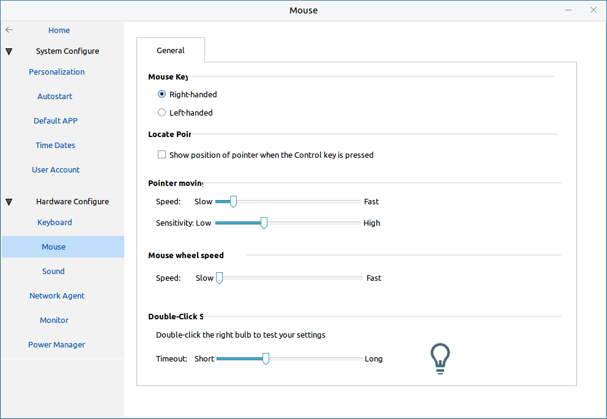
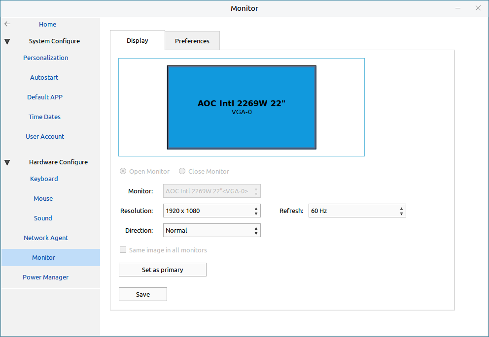
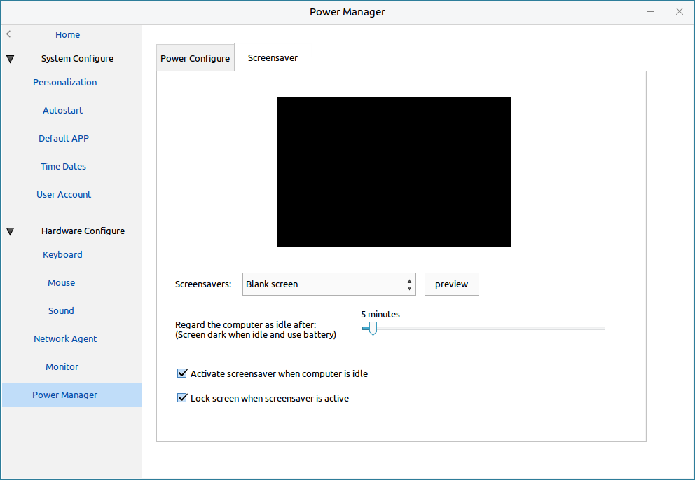
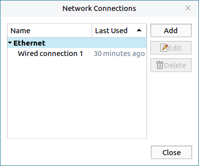

# Kylin Control Center
## Overview
Kylin Control Center provides a graphic interface to manage the system general settings.

It can be divided into two categories:

- **System Configuration** -- Including desktop environment and system level settings

- **Hardware Configuration** -- Including hardware devices settings
 

 

## System Configuration
### Personalization
#### Wallpaper
Set the background of the current desktop, the lay style, and add/delete wallpapers, as shown in Fig 2.
 

#### Theme
There provides two types to choose.
 

#### Font
Set the font and font size, as shown in Fig 4.
 

Click "Restore Defaults" to cancel the all changes.

#### Lockscreen Wallpaper
Choose lockscreen background from the list.

### Autostart
List the autostart softwares existed in the system already: left shows the name and right shows the status.
 

### Default App
Set the default app to open the corresponding files.
 

### Time Dates
There are two ways to synchronize time:

- Check "With the network time synchronization" -- Synchronize time with the network NTP server, and it's not allowed to modify time.

- Uncheck "With the network time synchronization" -- Synchronize time with the local computer's RTC.
 

### User Account
- Manage all users in the system.

- Allow administrators to create/delete users and modify user's informations.

- There must be a administrator at least.

 

## Hardware Configuration
### Keyboard
It provides three tabs: General, Layouts and Shortcut.
 

Include repeat keys, keyboard tips, other languages layouts, edit/add/delete shortcut, etc..

### Mouse
Include habitual hand, pointer moving speed, mouse wheel speed, etc..
 

### Sound
There're 5 tabs, and users can set the volume of output, alert, input, etc., the effects of sound, the devices of input/output, etc..
 

### Network Agent
There are 3 options to be selected, and only can choose one.

### Monitor
The interface as shown below.
 

- Open/Close Monitor only can be selected when there are more than 1 opening monitor.

- The resolution, refresh, direction are all for the current monitor.

- There only exists one primary monitor.

### Power Management
- The power interface as shown below.

(Tips: The options depend on the platforms, and the picture only for reference.)

- The screensaver interface as shown below.
 

### Network Connections
Click network icon on the tray bar > "Edit Connections" can also open the configuration interface.

Users can edit the existed connections or create new connections.

"Ethernet" tab -- Choose a net device

"IPv4  Settings" tab -- Configure IP, Gateway, etc.. And users can select the method, such as Automatic, Manual.

 

## Q&A
### No respond after clicking "Settings" on "Start Menu"
Press Ctrl + Alt + T to open terminal, and execute "kylin-control-center" to see the error informations.

### The status returns back immediately after modifing
Probably because of the permission problem.

Press Ctrl + Alt + T, and execute "rm ~/.config/dconf/user".

And then modify it again.
