# 麒麟控制面板
## 概 述
控制面板提供了一个友好的图形用户界面，用于对操作系统常用配置项进行管理。

常用配置归结为两个分类： 系统配置、硬件配置。

- **系统配置** —— 包含了桌面环境以及系统层面的配置项

- **硬件配置** —— 主要包含了计算机硬件及其相关的配置项目
 
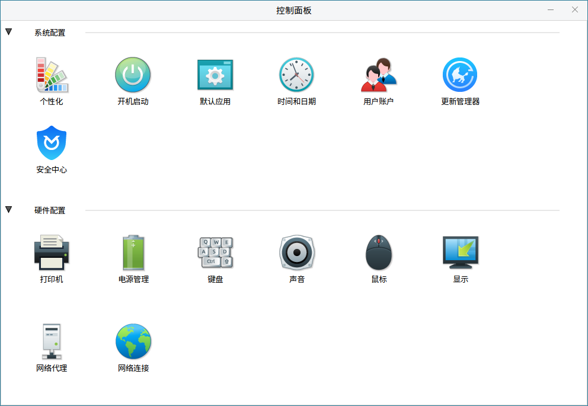
 

## 系统配置
系统配置模块包括个性化、开机启动、默认应用、时间和日期、用户账户五个功能。

### 个性化
“个性化”功能包括桌面背景、主题、字体和锁屏背景。

#### 桌面背景
对当前桌面背景进行设置，选择当前桌面背景的放置方式，对背景列表进行管理。主界面如图所示。
 

浏览背景列表中的缩略图，直接点击缩略图，桌面背景即设置成功。

当前桌面背景对应的缩略图会有明显的描边用于区分。

- 点击“图片放置方式”右侧的下拉列表，会有“平铺”、“缩放”、“居中”、“比例放大”、“伸展”、“适合宽度”6个图片放置方式可供配置，选择放置方式后直接对当前桌面背景生效。

- 点击“添加壁纸”弹出文件选择界面，选中期望添加的壁纸文件后，点击“打开”按钮，待添加壁纸即会被选择为当前桌面背景，并添加进背景列表中。

- 点击“删除壁纸”后，当前桌面背景会从背景列表中删除，下一张壁纸文件会作为新的桌面背景被设置。

#### 主 题 
从系统已有主题选择切换，主界面如图所示。直接点击主题即可。
 

#### 字 体 
提供系统字体及字体大小的配置项，主界面如图所示。
 
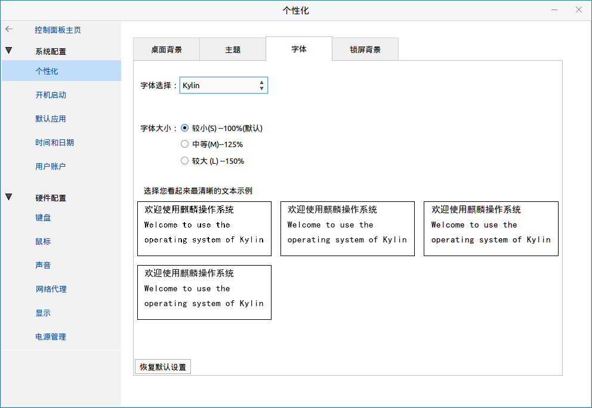

当前系统提供了三种字体可供选择，点击“字体选择”右侧的下拉列表，在弹出菜单中选择系统字体进行切换。

字体大小比例对应关系为：
 “较小” —— 1倍
 “中等” —— 1.25倍
 “较大” —— 1.5倍

文本示例中提供了4种文字特效，均有文字效果展示；点击示例框进行选择，选中的文本示例有特殊描边加以区分。

点击“恢复默认设置”按钮，则所有字体设置还原为系统默认状态。

#### 锁屏背景
用户可从提供的图片中，自行选择锁屏时的背景，如图所示。

### 开机启动
提供对开机启动软件的配置管理功能，主界面如图所示。
 

列表中显示了当前系统已存在的开机启动软件：左侧为软件名称，右侧为对应软件的开机启动状态。

列表右侧的勾选框：勾选代表该软件随开机启动；反之，代表开机不启动。可以通过点击勾选框来切换状态。

鼠标左键点击选中列表中任意一款软件，在选中状态下点击“属性”按钮，可查看所选软件的详细信息（应用类型、描述、位置、访问时间等）。

点击“添加”按钮，弹出添加窗口，如图所示。
 

添加有两种方式：

- 填写 “程序名称” 和 “执行命令”（注意保证命令合法有效）。

- 通过点击“浏览”按钮，在弹出文件选择界面，选择以“desktop”为后缀的文件，程序会自动解析并导出desktop文件中的命令数据。

“程序注释”作为可选项，可填可不填。

添加后，新的启动项即被创建并显示在列表中。新建的启动项默认为开机启动状态。

当需要删除启动项时，选中该项，点击“删除”。

### 默认应用
提供系统默认应用的配置项，可修改“网络浏览器”、“邮件阅读器”、“图像查看器”、“音频播放器”、“视频播放器”、“文本编辑器”五种类型的默认打开应用。如图所示。
 
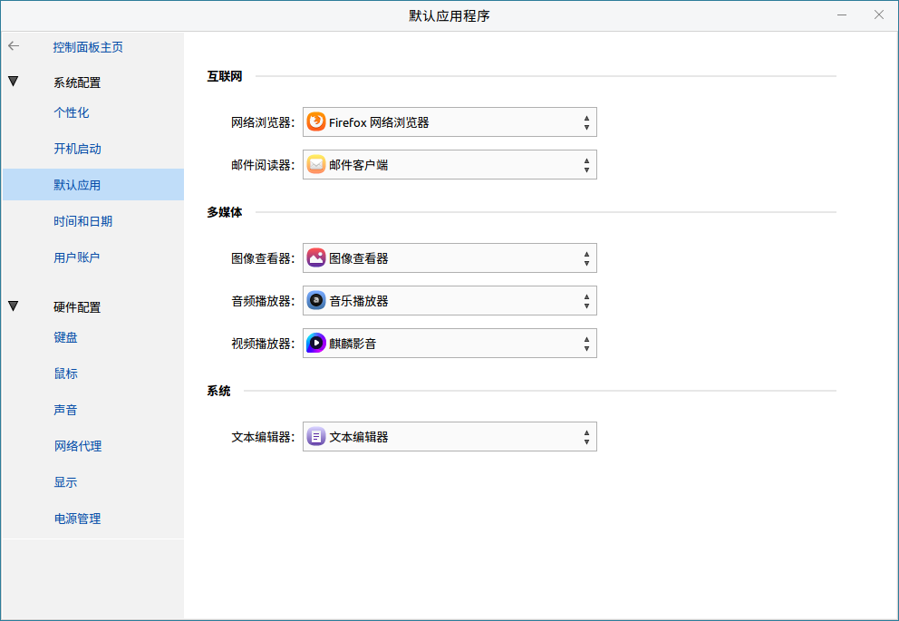

### 时间和日期
配置时间、日期、时区等相关设置。
 

当前的时间和日期同步状态分两种，“与网络时间同步”和“与本地计算机的时钟芯片时间同步”。

- 勾选“与网络时间同步”后，计算机的时间与网络NTP服务器时间同步，此状态下不再允许修改时间或日期。

- 取消勾选“与网络时间同步”后，计算机的时间与本地计算机的时钟芯片同步，此状态下可以修改时间或日期。

点击“时区”右侧的下拉列表，会显示所有的时区列表；中国境内默认使用“（UTC +8：00）北京，重庆，香港特别行政区，乌鲁木齐”。

时间格式分12小时和24小时，点击“格式”右侧相应的单选按钮即可立即生效。

日期格式提供多种显示格式可供选择，点击“日期格式”右侧的下拉列表选择后立即生效。

### 用户账户
提供对系统用户的管理配置，允许管理员创建用户、删除用户、修改用户信息。

用户以行为单位显示，一行代表一个用户。首先显示“当前用户”，之后显示“其他用户”。

当鼠标悬浮在用户所在行时，会显示出所在行用户的更多设置选项。

 
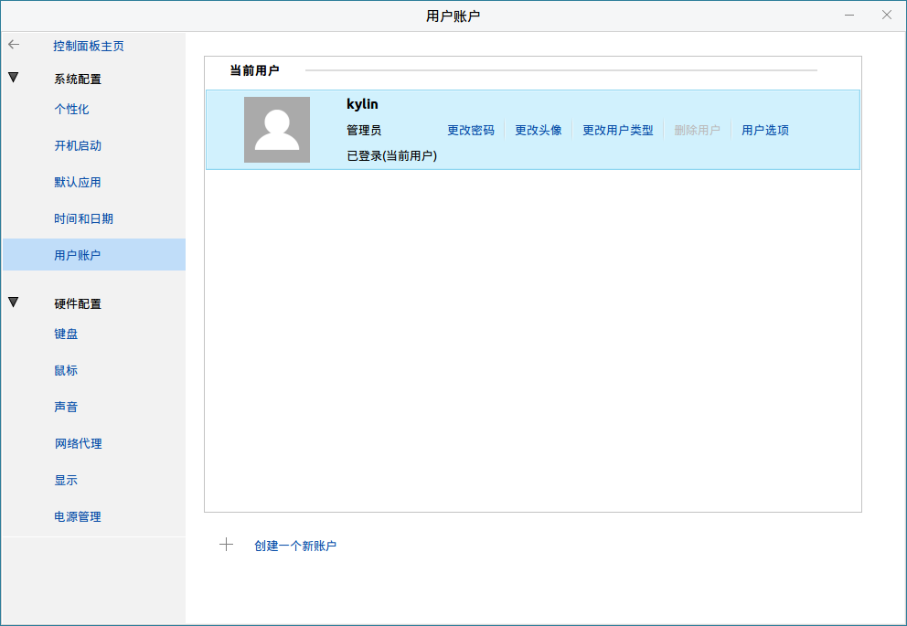

当前用户可以修改自己的所有信息。

#### 更改密码
弹出对话框如图所示。

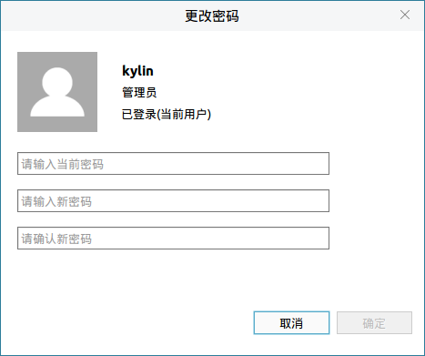

- 第一栏输入当前密码；第二栏输入新密码；第三栏重复输入新密码进行确认。

- 在所有输入合法的情况下，“确定”按钮被点亮，点击“确定”按钮更新当前用户的密码。

#### 更改头像
弹出头像选择界面如图所示。

- 选中头像列表中的图片后，左上角区域用户头像被更新，可以预览效果。

- 点击“确定”按钮，保存更新的头像设置。

- 点击“浏览更多图片”按钮，弹出本地文件选择界面；选择自定义头像文件后，点击“确定”按钮保存设置。

#### 更改用户类型
弹出更改用户类型界面，如图所示。

1）系统用户分为 标准用户 和 管理员。

2）管理员可以通过输入自己密码临时提升root权限；标准用户无法提升自己的权限。

3）系统至少需要存在一个管理员用户，因此：最后仅存的管理员用户无法修改用户类型至标准用户；标准用户切换至管理员需要知道系统任一管理员的密码才能被允许切换。

4）勾选“自动登录”后，每次开机进入该用户不需要输入密码，直接进入用户桌面。

5）点击“用户选项”按钮，弹出密码过期时间设置界面，如图所示。
 
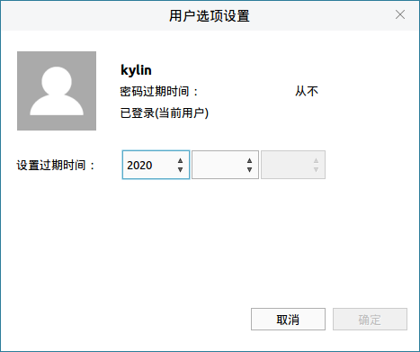

在三个下拉列表分别设置年、月、日为期望密码过期时间。

#### 删除用户
弹出界面如图所示。

- 当前用户无法删除自己。
 
- “保留文件” —— 用户从系统中被删除，但是保留其家目录及目录下的文件。

- “删除文件” —— 用户从系统中被删除同时其家目录及目录下的文件被全部删除。

#### 创建一个新账户
按钮位于最下方，点击后弹出创建账户界面。
 
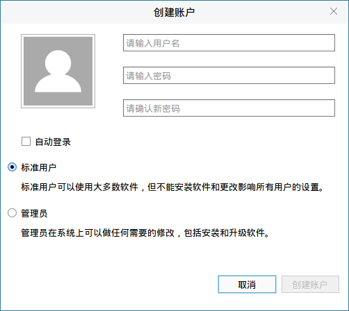

- 左上方为头像设置区域，显示系统默认头像，点击可更改。

- 右侧三个文本框分别对应新建用户的用户名、密码、重复密码。

- 选择用户类型后，点击“创建账户”按钮即可。

 

## 硬件配置
硬件配置包括键盘、鼠标、声音、网络代理、显示器、电源管理六个功能。

### 键 盘
#### 通用设置
设置键盘输入相关基础设置，如图所示。
 

勾选“按住某一键时重复该键（R）”后，激活重复按键功能，即按住某个按键不放，系统会将该行为作为重复不间断的键盘输入；反之，只作为一次键盘输入。

- 延时：设置按下按键后，到系统开始接收键盘输入之间的时间长短。

- 速度：设置按下按键后，重复输入之间的间隔。

- 输入字符来测试重复速度：测试设置后的效果；鼠标左键点击文本框使其获取输入焦点，按下某个按键实时查看效果。

勾选“文本域中的光标会闪烁（B）”后，激活光标闪烁功能，即当处于文本输入情况下，竖线光标会以闪烁状态提示用户位置；反之，竖线光标一直处于常亮状态。

- 速度：设置光标的闪烁速度。

#### 布 局
设置当前系统的键盘布局，如图所示。

- 中部区域显示的是已安装的键盘布局列表，最多可以添加4个键盘布局。

- “向上”、“向下”可以调节选中键盘布局的优先级，排在首位的键盘布局才是有效键盘布局。

1）点击“添加”按钮弹出添加键盘布局窗口，如图所示。
 

- 添加键盘布局提供了两种查找方式：按国家/地区 和 按语言。

- 删除键盘布局需要在已安装键盘布局数大于1时才能使用。

2）点击图18中的“显示”按钮，可显示键盘布局的预览效果，如图所示。
 
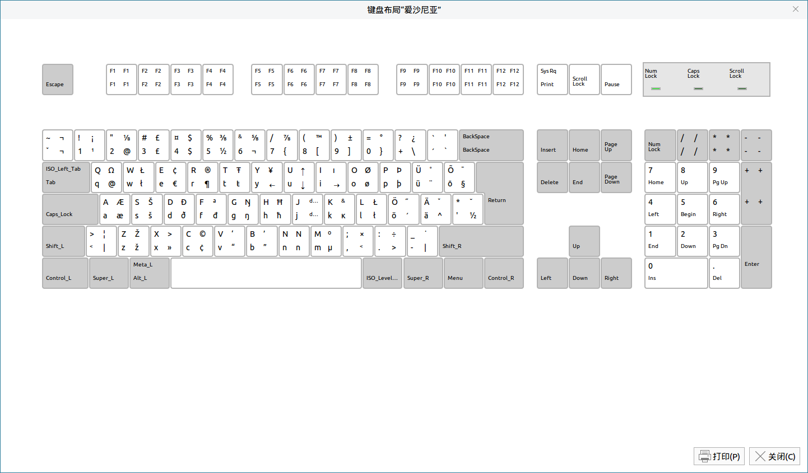

- 勾选“每个窗口独立布局”选项后，各个窗口分别有自己的键盘布局互不影响；取消勾选后，所有窗口拥有相同的键盘布局。

- 点击右下角的“恢复默认配置”后，所有设置重置为系统默认状态。

#### 快捷键
用户可对系统快捷键进行更改，添加或删除自定义快捷键，主界面如图所示。
 
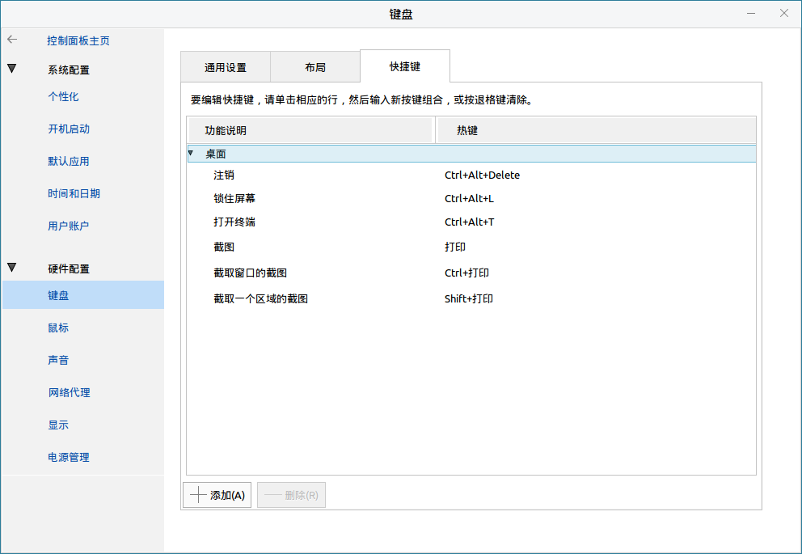

当前快捷键存在两种分类：

- “桌面”快捷键：系统快捷键，仅允许修改热键键值。

- “自定义”快捷键：用户快捷键，可以添加、删除、修改。

点击“添加”按钮，弹出快捷键添加界面，如图所示。
 
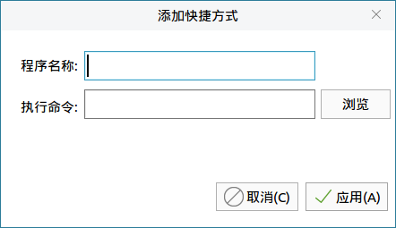

两种添加方式：

- 直接填写“程序名称”和“执行命令”（注意保证命令合法有效）。

- 通过点击“浏览”按钮，选择以desktop为后缀的文件，程序会自动解析并导出desktop文件中的命令数据。

点击“确定”按钮，新建快捷键被添加到快捷键列表的“自定义”分类，且热键值为“Disable”，如图所示。
 

点击“Disable”栏目，程序进入监听状态，开始监听键盘输入。

在键盘按下按键或组合按键后，程序验证键值是否合法：

- 验证通过：该行快捷键的按键值被更新。

- 验证不通过：弹出错误提示窗口。

在快捷键列表中，点击“桌面”分类中的任意一行快捷键，程序进入监听状态，开始监听键盘输入。

在键盘按下按键或组合按键后，程序验证键值是否合法：

- 验证通过：该行快捷键的按键值被更新。

- 验证不通过：弹出错误提示窗口，桌面快捷键的热键值被更新。

选中“自定义”分类中任意一行快捷键，点击“删除”，该行快捷键从系统中删除，且列表不再显示。

### 鼠 标
#### 通用设置
主界面如图所示。
 

- 惯用左手、惯用右手：可以配置用户是习惯左手还是右手使用鼠标，点击单选按钮后直接生效。

- 速度：右侧的滑动条，用来配置鼠标指针的移动速度。

- 灵敏度：右侧的滑动条，用来配置鼠标指针的灵敏度。

- 超时：右侧的滑动条可以设置，鼠标双击的时间间隔。

### 声 音
#### 应用程序
提供系统输出音量大小及应用程序输出音量的配置，如图所示。
 
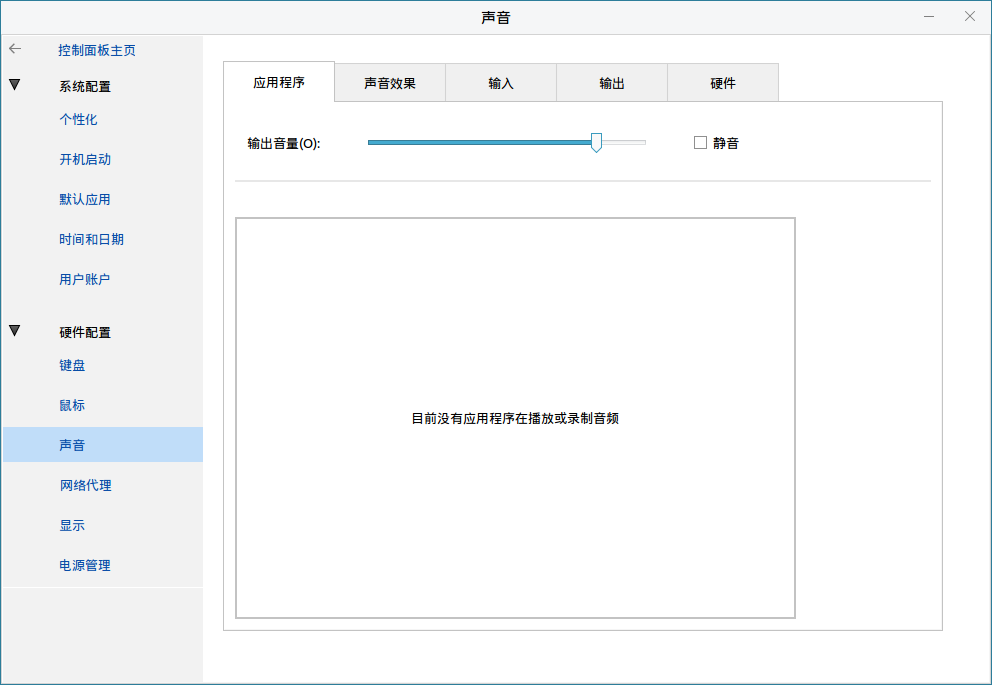

- 输出音量：右侧的滑动条用来控制系统输出音量的大小。勾选 “静音” 选项后，直接将系统输出音量设置为0；取消勾选“静音”选项后将系统输出音量恢复为勾选前的状态。

- 目前没有应用程序在播放或录制音频：代表当前无应用程序输出音频。当存在输出音频的应用程序时，列表会出现相应的条目。

设置应用程序的音频输出音量仅影响当前应用。

#### 声音效果
通过设置不同的声音主题实现不同的声音效果，主界面如图所示。
 

- 报警音量：设置声音效果的音量大小。

- 当前系统的声音主题仅有一种“默认”，所以可以设置为“默认”或者“无声音”（即关闭声音主题）。

- 选择报警声音仅在“声音主题”设置为“默认”时才允许配置；初始提供“默认”、“犬吠”、“雨滴”、“玻璃”、“声纳”五种效果，点击单选按钮进行切换。

#### 输 入
对输入设备进行相关配置。

其中：

- 输入音量：可以配置输入设置的输入音量大小；勾选“静音”选项后直接将输入音量大小置为0，取消后输入音量恢复为勾选前的大小。

- 选择声音输入设备：下方列表列出了当前的所有输入设备，通过点击单选按钮来选择输入设备。

#### 输 出
对输出设备进行相关配置。

其中：

- 选择声音输出设备：下方列表显示了当前系统的所有可用声音输出设备，通过点击单选按钮来切换输出设备。

- 所选设备的设置：下方的“平衡”可以对所选输入设备进行声道设置，靠近“左”方向为左声道，靠近“右”为右声道。

#### 硬 件
对系统所有音频设备进行配置。

其中：

- 选择要配置的设备：下方列表显示了系统当前的 输入/输出 设备列表

- 所选设备的设置：下方的“配置”可以对所选设备进行输入输出配置，例如可以将输出设备的声音输出到蓝牙耳机或者计算机的音响等。

### 网络代理
#### 代理服务器配置
代理模式通常分直接连接到互联网（即无代理）、手动配置代理、自动配置代理，且三种模式同时只能存在一种。主界面如图所示。
 
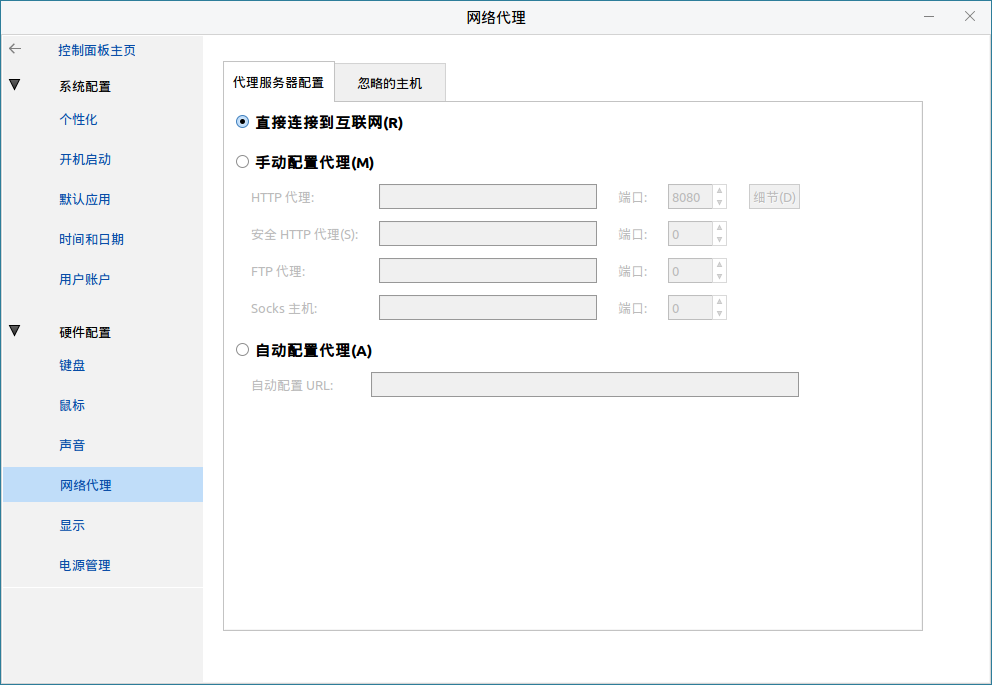

- 选择“直接连接到互联网”即当前系统不设置代理，直接访问互联网。

- 当有明确的代理协议情况下，比如需要使用Http代理、Https代理、Ftp代理、Socks代理，可以选择“手动配置代理”，将代理服务器的IP地址和端口号填入对应文本框即可。

- Http代理可以将代理认证配置在这里，从而免除了访问网络时弹出的认证窗口。点击“细节”按钮，弹出认证界面；勾选“用户认证”选项后，才可以填写“用户名”、“密码”，如图所示。
 

填写完成即可以免认证访问代理服务器。

- 选择“自动配置代理”后，将代理URL填入文本框即可自动实现代理访问。

#### 忽略的主机
“忽略的主机”可以配置忽略主机列表，即访问如下主机时不使用代理。主界面如图所示。
 
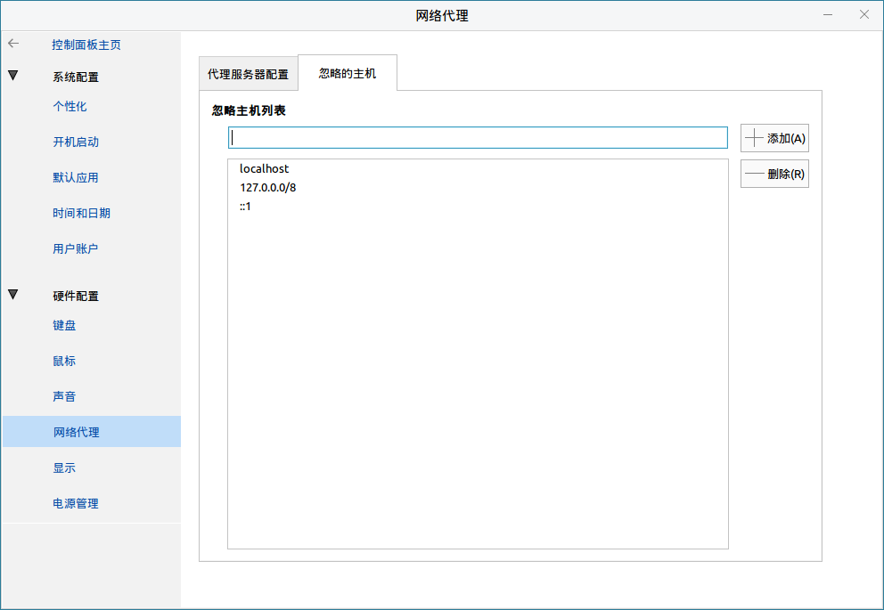

列表中显示的即当前已保存的忽略主机列表，在文本框中输入需要忽略的主机后，点击“添加”按钮，该主机即被添加进列表

选中列表中的主机后，点击“删除”按钮，选中主机将从忽略主机列表中删除。

### 显 示

配置显示相关的设置，界面如图所示。
 
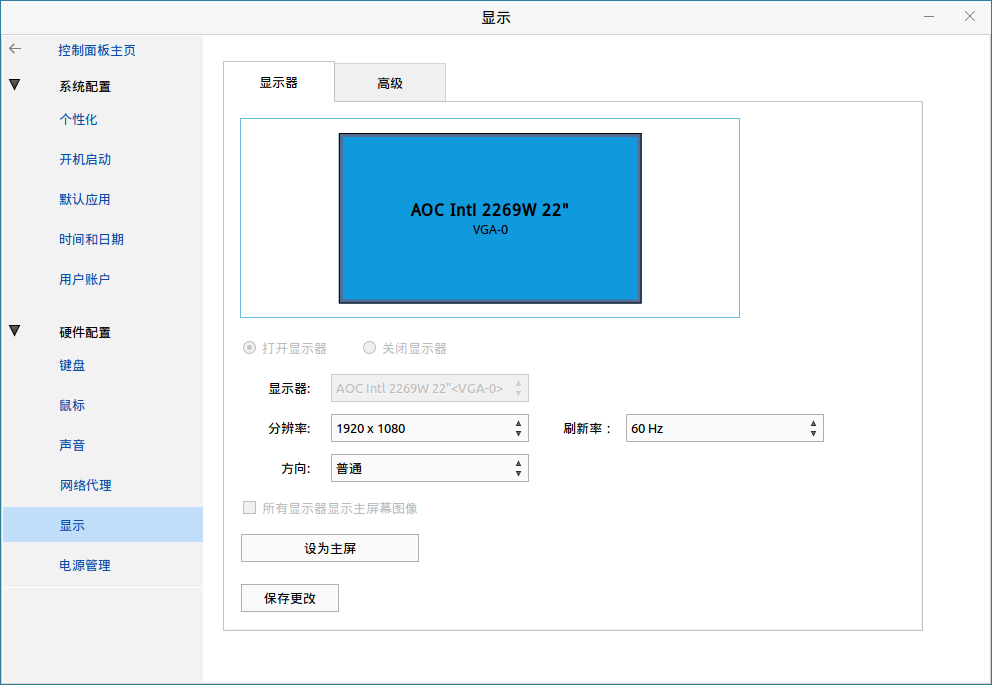

上方彩色矩形代表当前屏幕，中间显示了显示器名称及接口名。

1）“打开显示器”和“关闭显示器”仅当存在多个显示器的情况下才会被点亮，并且多个显示器在仅剩一个显示为打开状态时，不再允许关闭。

2）“显示器”右侧的下拉列表包含了当前所有的显示器，并且下拉框显示的显示器为当前活动显示器，分辨率、刷新率等所有配置的修改都是针对当前活动显示器。

3）“分辨率”右侧的下拉列表包含了系统及显示器支持的分辨率列表，可以通过下拉列表切换当前活动显示器的分辨率。

- 点击“保存更改”使更改临时生效，并且弹出更改确认窗口。

- 点击“恢复之前的配置”将会撤销更改，恢复到更改前的状态。

- 点击“保持当前的配置”将会使更改真实生效。

4）“刷新率”右侧下拉列表包含当前显示器在当前分辨率下支持的刷新率列表，切换刷新率后点击“保存更改”使更改生效，并且弹出更改确认窗口。

- 点击“恢复之前的配置”将会撤销更改，恢复到更改前的状态。

- 点击“保持当前的配置”将会使更改真实生效。

5）“方向”右侧下拉列表包含“普通”、“左”、“右”、“上下颠倒”4个选项，切换方向后点击“保存更改”按钮，屏幕方向即会相应临时改变，并且弹出更改确认窗口。

- 点击“恢复之前的配置”将会撤销更改，恢复到更改前的状态。

- 点击“保持当前的配置”将会使更改真实生效。

6）“所有显示器显示主屏幕图像”仅当存在多个显示器才会点亮，勾选“所有显示器显示主屏幕图像”，点击“保存更改”按钮，所有显示器全部显示主屏幕的图像，同样，弹出更改确认窗口。

- 点击 “恢复之前的配置” 将会撤销更改，恢复到更改前的状态。

- 点击 “保持当前的配置” 将会使更改真实生效。

7）多显示器情况下，如果当前显示器不是主屏幕，则 “设置主屏” 按钮被点亮，点击后当前显示器被设置为主屏幕。

8）同一时间有且仅有一个主屏幕。

### 电源管理
#### 电源设置
电源设置主界面如图所示。

（注：部分选项与硬件平台有关，与截图示例不一定完全相符。）

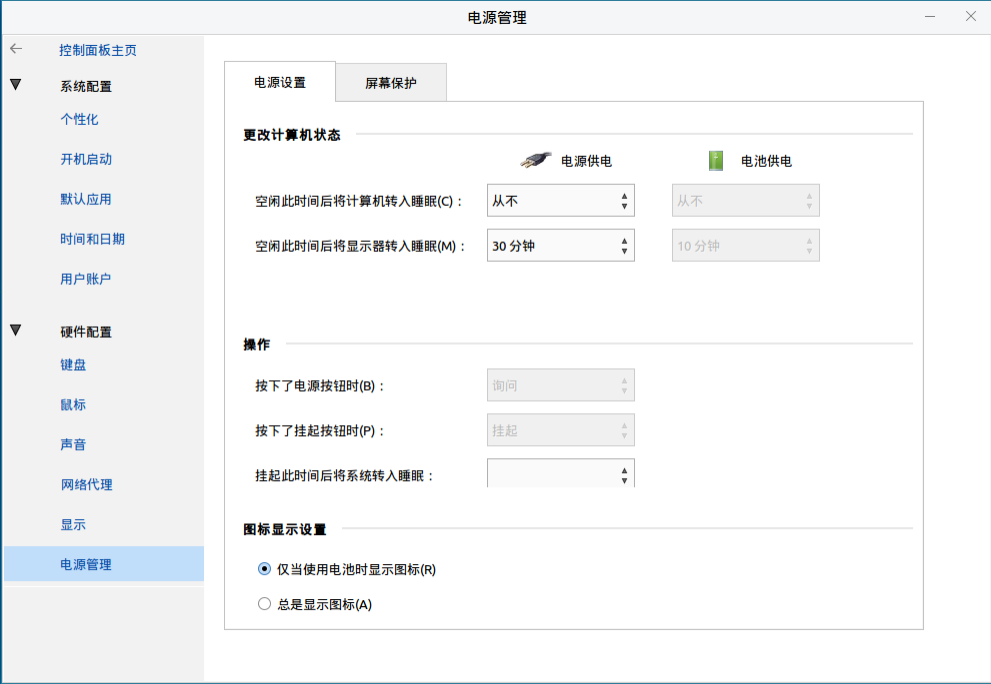

1）“空闲此时间后将显示器转入睡眠”分两种状态，电源供电或者电池供电。

- 在电源供电下方的下拉列表中选择1小时，代表在电源供电情况下，空闲1小时后系统将显示器关闭。

- 在电池供电下方的下拉列表选中30分钟，代表在电池供电的情况下，空闲30分钟后系统将显示器关闭。

2）“图标显示设置”指的是桌面任务栏右下角的电源图标的显示设置。

#### 屏幕保护
“屏幕保护”主要涉及屏幕保护程序的相关设置，主界面如图所示。
 
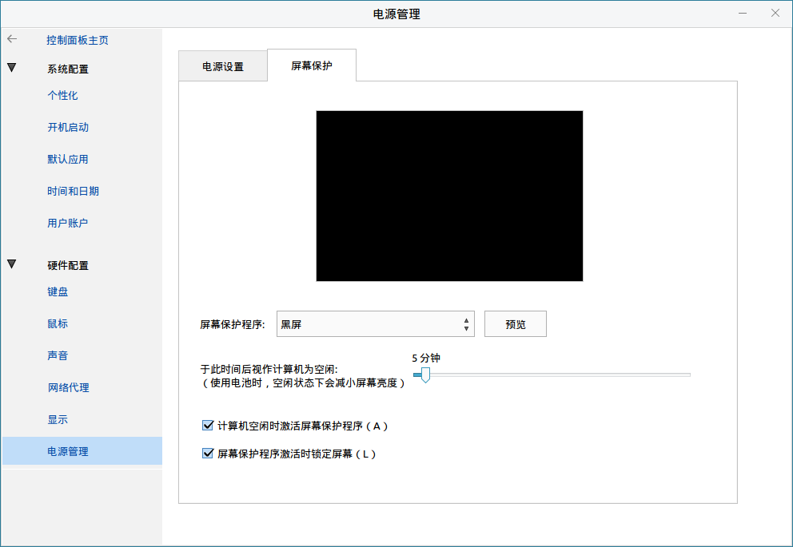

上方显示的是当前屏保的预览效果图。

- 屏幕保护程序：右侧下拉列表包含当前系统已安装的所有屏保程序，可以选择自己喜欢的屏保程序，切换后立即生效。点击“预览”按钮会弹出当前屏幕保护程序的全屏预览效果。

- 于此时间后视作计算机为空闲：配置系统空闲时间，最小1分钟，最大2小时；从停止操作电脑开始计时。

- 屏幕保护程序激活时锁屏屏幕：选项只有在“计算机空闲时激活屏幕保护程序”为勾选状态下才有效；在屏幕保护程序激活的同时，屏幕被锁定，需要输入当前用户的密码才能再次进入系统。

 

## 常见问题
### 点击“开始菜单”上的“控制面板”按钮无反应
在键盘上按下Ctrl + Alt + T组合键，打开终端，输入“kylin-control-center”后按下回车，查看错误输出。

### 修改控件状态后，控件立刻还原到修改前状态
出现上述问题的原因，大概率是因为权限问题。建议使用如下方法修复问题：

在键盘上按下Ctrl + Alt + T组合键，打开终端，输入“rm ~/.config/dconf/user”后按下回车，即可修复问题，重新修改配置。
