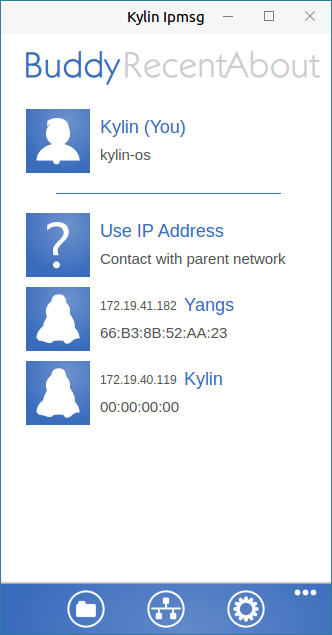
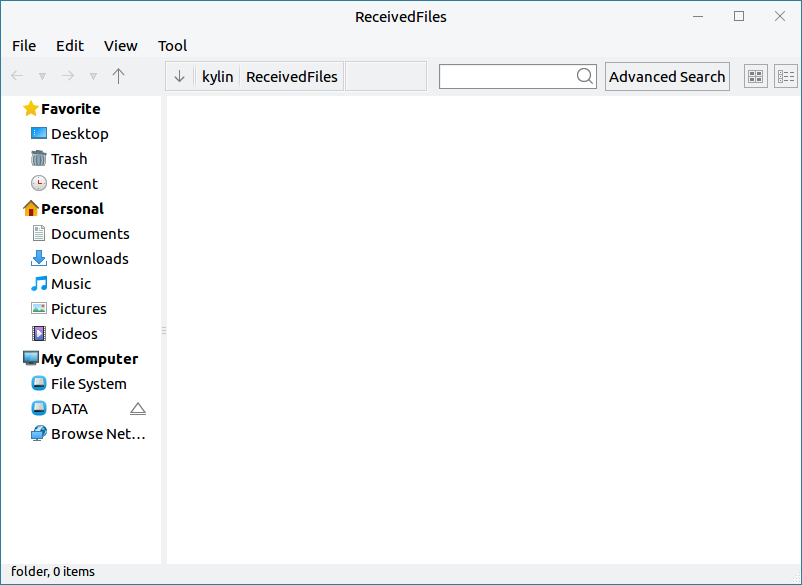
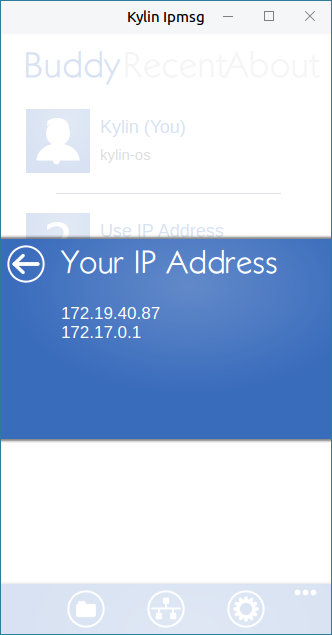
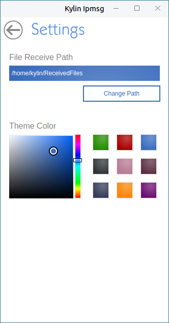
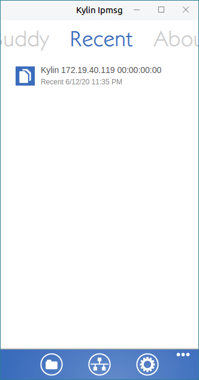
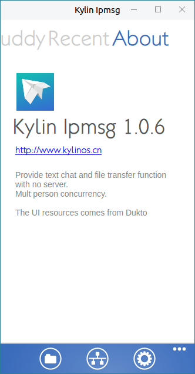

# 麒麟传书
## 概 述
在麒麟+QT4平台下，开发一个可定制、跨平台、高效的文字/文件传输工具，满足公司对办公通讯的需求，既要满足沟通需要，又要能够在此基础上，进行文件和文件夹的批量稳定传输，并且操作方便，界面美观。

麒麟传书还具有输入IP对上层网络传输的功能，并且在用户传输文件时与本地文件名相互比较，避免覆盖原有的文件，损失用户的重要信息。

麒麟传书穿透一层NAT，实现与上级网通信、文件传书，利用多种socket进行通信，文件传书使用TCP，消息通信和广播使用UDP。麒麟传书无服务器设计，所有功能通过客户端完成，并对用户实现HTML 文本样式控制，支持IP地址查看。

 

## 基本功能
主界面介绍：

图标及其功能介绍:

|图标	|图标功能说明	|图标	|图标功能说明
| :------------ | :------------ | :------------ | :------------ |
||	已接收文件||		本机IP地址
||	选项设置||	显示隐藏功能图标说明

 

### 查看已接收文件
用户通过点击“”图标，查看已接收文件，如图3所示。

### 查看本机IP地址
用户通过点击“”图标，查看本机IP地址。

### 查看本机IP地址
用户通过点击“”图标，进入选项设置，如图4所示。

### 软件启动
用户通过点击桌面左下角开始菜单 > 所有程序 > 麒麟传书，如图5所示。

### 好友页面
首次启动后，主界面如图1所示，默认显示“好友”页面。

#### 发送文字
在主界面上可以点击“使用IP地址”向其他用户发送消息，如图6和图7所示。

#### 发送文件/文件夹
在发送消息对话框的最下方，除了有发消息的按钮外，还有两个按钮：传文件和传文件夹，其中传文件时支持同时选择多个文件进行传送，发送文件时在对话框底部会有进度条和文件大小提示，如图8所示。

#### 接收文件与文件夹
在接收对方给自己发送的文件/文件夹时，消息对话框顶部会显示接收进度和文件大小，在文件/文件夹接收完成后，消息对话框中也会有相应的文字提示，如图9所示。

#### 尝试重连
若对方已经下线，此时若继续给对方发送消息，软件会尝试进行重连操作，如图10所示，若重连失败，则提示用户“连接失败，请确认好友在线，稍后再试”，如图11所示。

### 最近交谈消息管理器
在主界面最上方，有三个tab页面的按钮，分别为“好友”、“最近”和“关于”，其中默认显示为“好友”页面，鼠标点击“最近”按钮，则切换到最近交谈消息管理页面，如图12所示，点击消息列表记录中的某条记录，则弹出与该用户通信的消息对话框，并且在对话框中显示之前的交谈记录。

### 关于麒麟传书
用户通过点击主界面“关于”，可查看关于麒麟传输信息，如图13所示。

