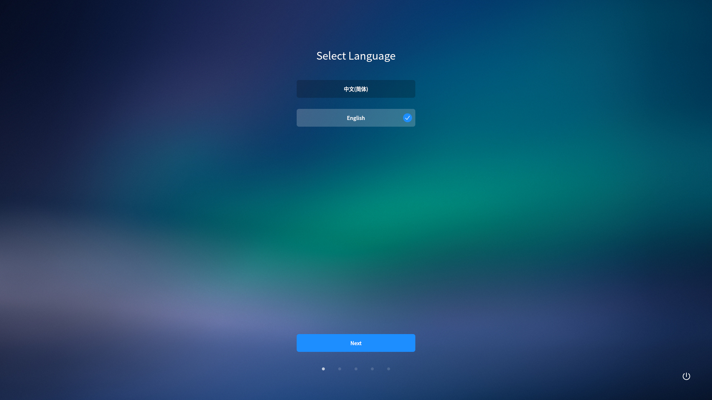
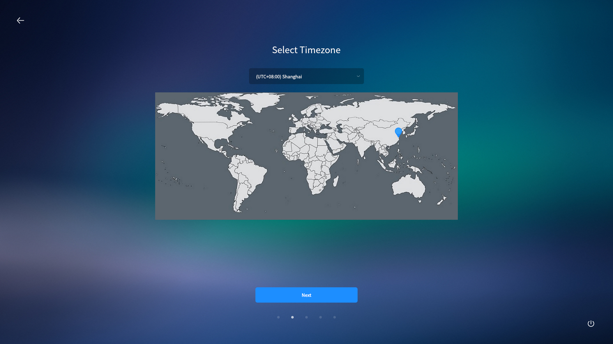
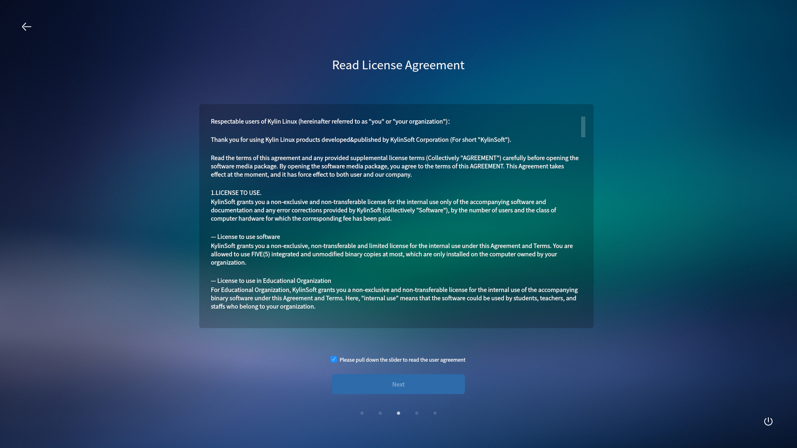
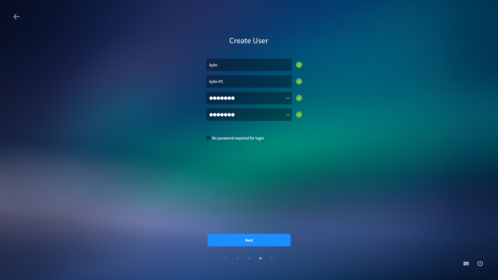
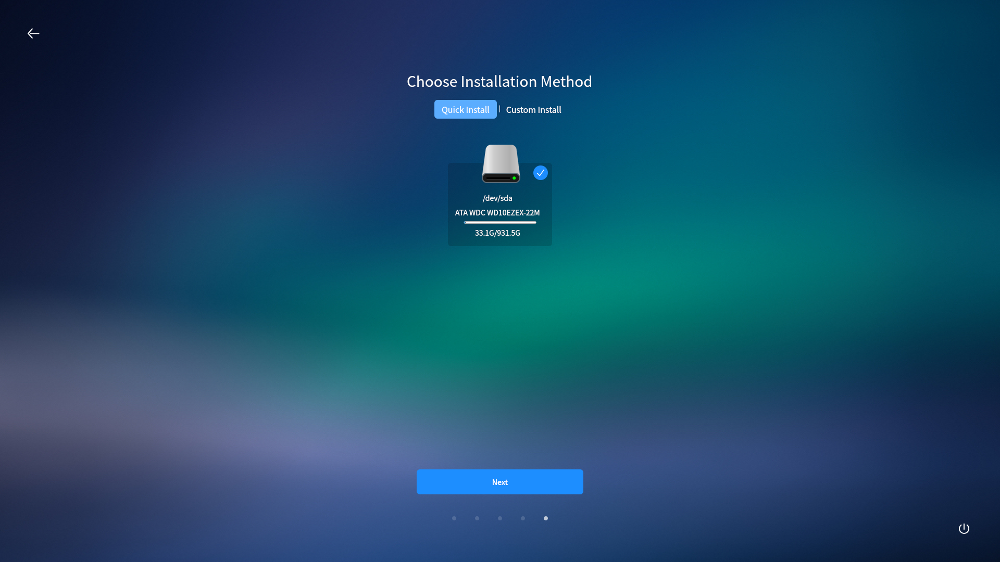
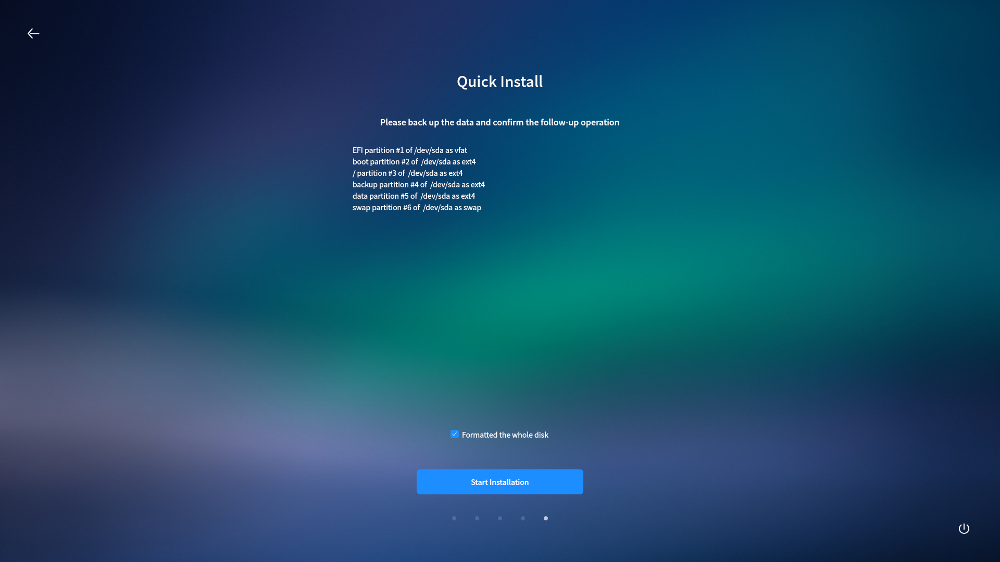
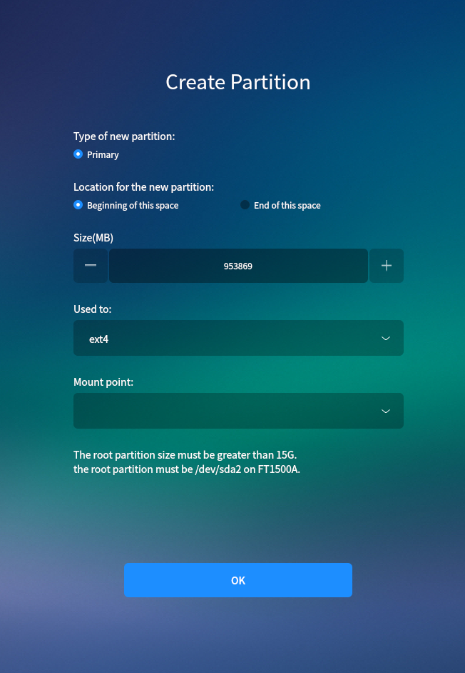

# System Installation
## Installation Preparation
* A hard disk can be divided into multiple partitions and they are independent of each other. So accessing different partition is like accessing different hard disk.

* Please backup the important data to other storage devices before installing system.

 

## Install Steps
### Boot Up
Insert the installation CD/U-disk and reboot.

According to the reminder at bootup, select to boot from installation device.

The system supports "Try without Installation" mode.

Tips: HW990 only supports direct installation mode currently.

### Installation
Double click the installation icon on the desktop.

Tips: HW990 will directly enter the installation program.

1) Select language.

2) Select time zone.

3) Check to agree the license.

4) User configuration

5) Installation method

- "Quick Install": Format the whole disk and partition it automatically.

- "Custom Install": Customize partitions. 

Select "Quick Install" here.

6) Click "Start Installation" to start copying files to the disk.

When installation completed, click "Restart" to reboot the system.

 

## Custom Install
Here will show all mounted disks by list. Click "Create partition table" and then start to create partition.

Select free space > click "add".

1) /boot partition & / partition: "Used to" - ext4, "Mount point" -- /boot, /.

2) /swap partition: 2x the size of memory, "Used to " - linux-swap

3) /backup partition & /data partition: "Used to" - ext4, "Mount point" -- /backup, /data.

