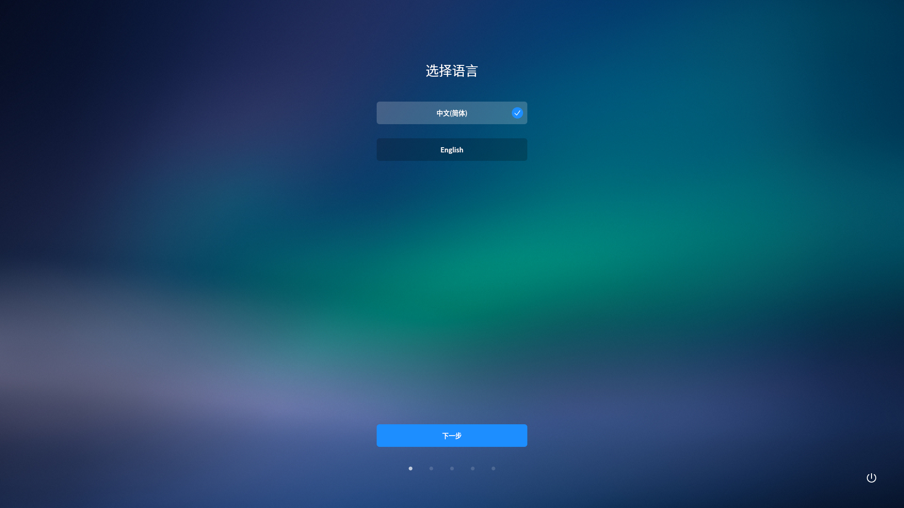
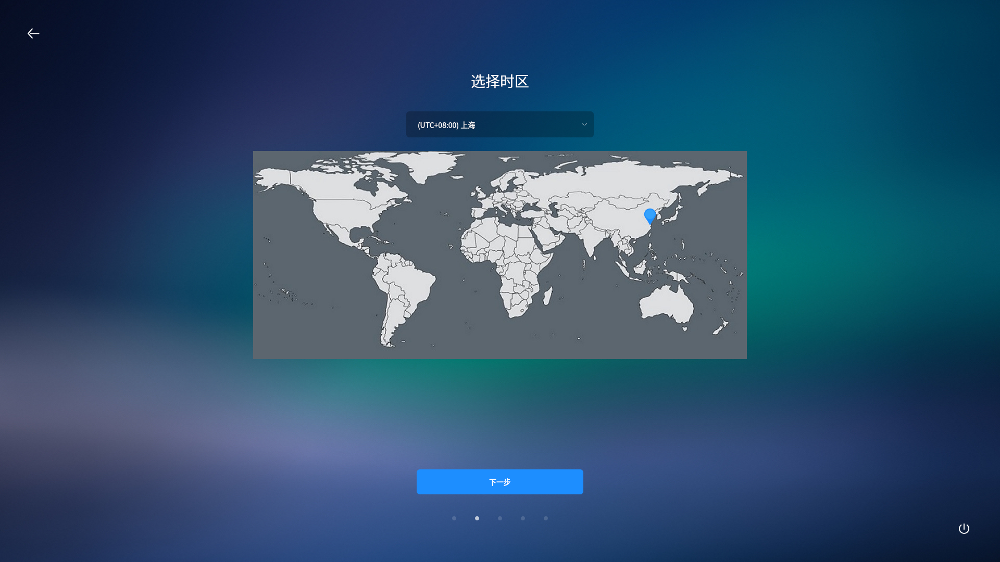
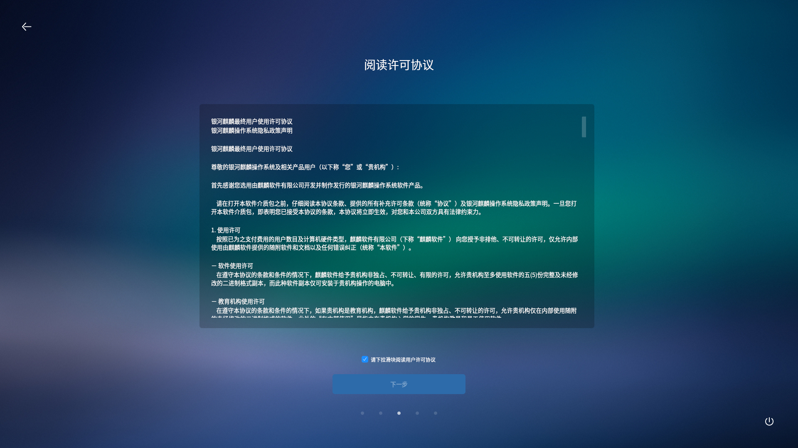
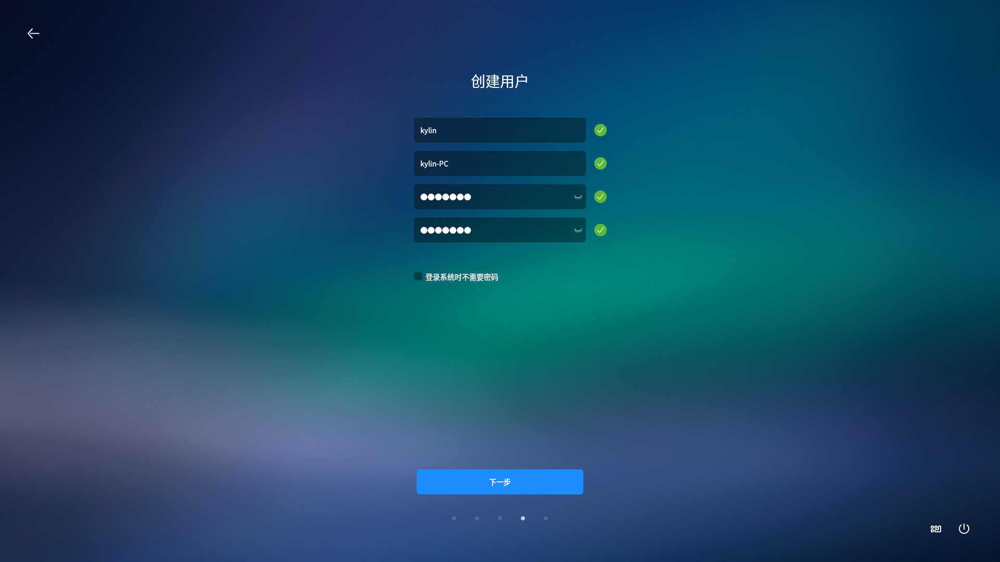
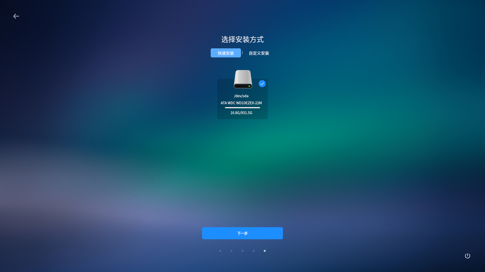
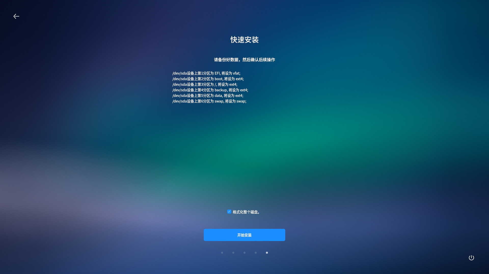
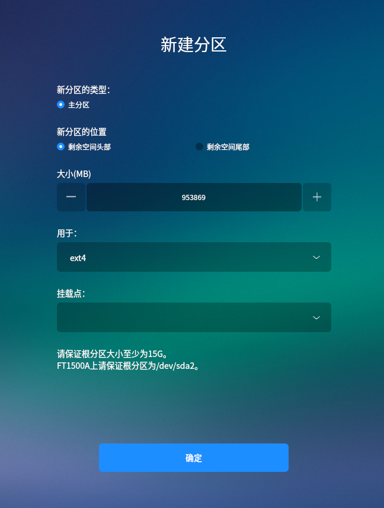

# 系统安装
## 安装准备
* 安装系统之前，请将硬盘上的重要数据备份到其他存储设备中。

* 一块硬盘可以被划分为多个分区，分区之间是相互独立的，访问不同的分区如同访问不同的硬盘。

 

## 安装步骤
### 启动引导
插入安装光盘/U盘，重启机器。

根据启动时的提醒，进入固件管理界面，选择从安装盘启动。

本系统支持体验模式，可试用一个全功能的操作系统而不安装。

### 系统安装
进入试用模式后，双击桌面上的安装图标，进入安装程序。

1）语言选择

2）时区选择

可通过下拉框，或者直接点击地图上的区域来选择。

3）许可协议

强制阅读，下拉到协议底部后，可进行下一步操作。

4）用户注册

用户登录密码需满足密码规则的要求，可选择自动登录或登录时需要密码。

5）安装方式

- 快速安装：格式化整个硬盘，并进行自动分区。

- 自定义安装：用户可根据实际需求，进行分区创建和分区大小分配。详细说明见后续。

此处选择“快速安装”。

6）点击“开始安装”按钮，将系统信息写入硬盘。安装成功后，会弹出提示窗口，点击“现在重启”按钮，系统会重新启动。

 

## 自定义安装
在安装方式界面选择“自定义安装”，界面将以列表形式显示所有挂载硬盘。点击“新建分区表”按钮，然后开始在硬盘上创建分区。

选中“空闲”所在行，点击“＋”，则弹出创建分区窗口。其中，逻辑分区的选项仅在legacy的安装方式下才会出现。

1）创建“/boot”分区和“/”分区时，“新分区的位置”默认为“空间起始位置”，“用于”选择“ext4”，挂载点选择/boot、/。

2）交换分区大小一般设置为内存的2倍大小，“新分区的位置”保持默认，“用于”选择“linux-swap”。

3）创建“/backup”分区和“/data”分区时，“新分区的位置”默认为“空间起始位置”，“用于”选择“ext4”，挂载点选择对应的/backup、/data即可。

4）若是中途需要改变已创建的分区，具体方式如下：

- 添加分区：选中空闲分区所在行，点击“+”按钮。

- 编辑分区：选中已创建的分区，点击“修改”按钮。

- 删除分区：选中已创建的分区，点击“-”按钮。
