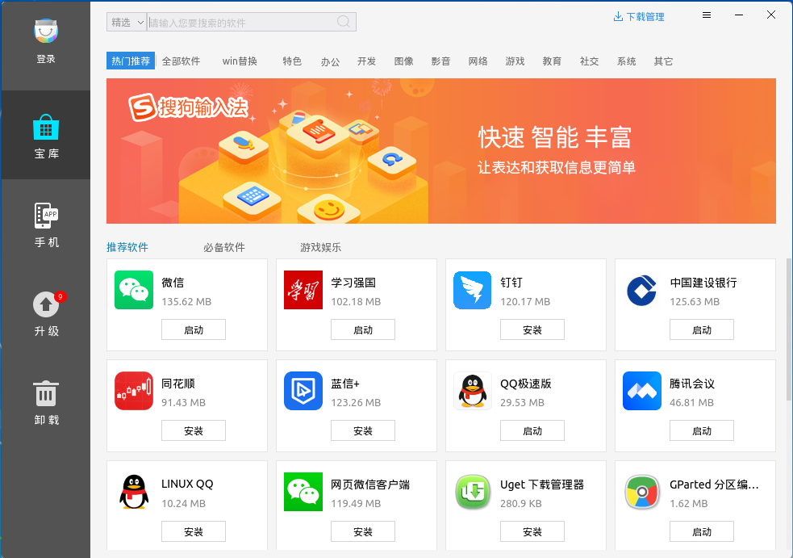
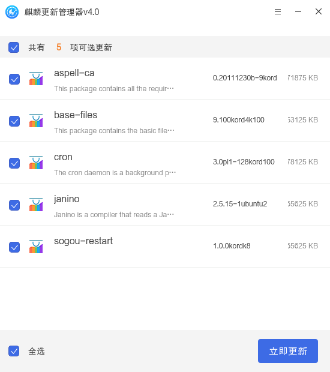

#  麒麟软件商店
## 概 述
麒麟软件商店提供了在线安装、一键卸载、应用搜索、应用升级和编辑软件源等功能。主界面如图 1所示。

 

## 基本功能
### 搜索软件
在搜索框中输入关键字，按下Enter键或点击搜索图标，则会显示包含关键字的应用。

搜索模式：

- 全局搜索：在软件源下搜索全部应用软件，搜索到的软件可能会有不可用或者其他质量问题。

- 精选搜索：在测试筛选过的软件中进行搜索；默认为精选搜索。

在手机、升级、卸载界面搜索，是搜索当前标签页类别下的软件。

### 下载管理
点击“”可查看下载窗口，如图 3所示。

### 宝 库
软件商店对软件进行了分类，可以在某个分类快速找到自己的应用。“全部软件”页面如图 4所示。

### 手 机
“手机”页面提供了安卓兼容的软件，用户可在这里安装安卓应用，比如QQ、微信等。

注：不是所有平台都支持该功能。

### 升 级
“升级”页面列出了可升级到新版本的应用。

### 卸 载
可以看到系统已经安装，并能卸载的软件列表，如图 6所示。

 

## 高级功能
### 登录和注册
点击左上角的登录图标，可注册账号，或是登录已有账号。

### 软件源
点击“”进入设置界面，可以对软件源进行编辑。

以图 8为例：

- 需要勾选的项保持默认即可，“deb-src”是用于获取软件源码。

- 示例中的 [series] 填写要使用的软件系列名。

完成后，“确定” > “更新软件源”。

### 密码修改找回
该功能页面如图 9所示。

### 软件详情
点击任意界面的任一款软件，可以进入软件详情界面，如图 10所示。

软件详情界面显示软件包名、当前版本、软件介绍、评分和用户评论。

 

## 麒麟更新管理器
更新管理器可用于软件、补丁、SP包(补丁包)更新、下载和安装。加载界面如图 11所示。

加载完成后，会显示更新项的具体信息，包括软件名、版本号和更新描述。用户可根据需求自行勾选。

点击右上角的“”图标，设置更新检测方式。

