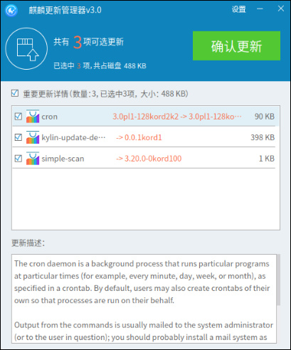
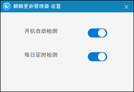
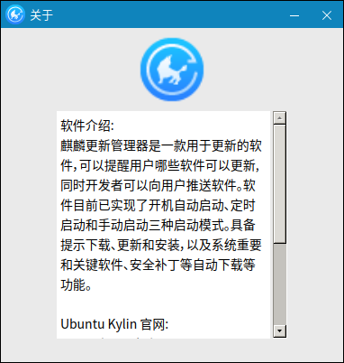
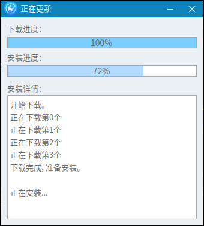
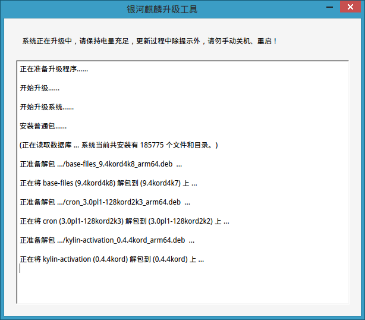
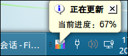

# 麒麟更新管理器
## 概 述
本手册包括更新管理器的功能介绍，以及功能模块的详细操作说明。

麒麟更新管理器是一款用于软件、补丁、SP包(补丁包)更新、下载和安装的工具。用户可以勾选自己想要安装的软件，同时用户也可以选择下载和安装开发者推送的软件。包含下载、更新和安装、开机自动启动、定时启动等功能。

麒麟更新管理器通过图形界面，显示用户可下载和更新的普通系统软件、补丁和第三方软件软件，用户可以根据自己的需求进行选择。系统重要和关键的系统软件、安全补丁等软件包放入源后，升级模块会自动识别并强制进行安装升级。麒麟更新管理器还为用户提供了开机自动启动、定时自动启动和手动启动三种启动方式。

## 基本功能
### 加载界面
在加载过程中，用户可以在加载界面看到正在进行的操作，如配置软件管理服务、从源中获取更新数据等。更新管理器的加载界面如图1所示：

### 选择更新界面
选择界面会显示设置、共有几项更新、已选中几项、选中的软件共占磁盘大小、更新详情、可更新和下载的软件名、可更新软件现在的版本和更新后的版本、确认更新按钮以及可更新软件的更新描述。

1）设 置

点击右上角的设置，进入设置界面。

2）最小化

右上角的—最小化图标，更新管理器将最小到任务栏。

3）关 闭

点击右上角的关闭图标，关闭更新管理器。

4）选择更新和安装软件

点击勾选框，勾选需要更新和安装的软件(默认是全选)。

5）确认更新

点击确认更新，将勾选了需要更新的软件进行更新和安装。

更新管理器的选择界面如图2所示：

### 设置菜单界面
- 1) 点击设置，进入设置界面。

点击开机自动检测滑块，设置为允许开机自动启动更新管理器。开机后会自动启动升级模块相关服务并对源进行检测。

点击每日定时检测滑块，设置为允许每日定时启动更新管理器。（时间默认为9点5分），设置界面如图3所示：

- 2) 点击关于，进入关于界面。

显示更新管理器的简介、团队、Ubuntu Kylin官网以及维护人，关于界面如图所示4：

### 下载与安装界面
点击选择界面的确认更新，会进入到下载安装界面。下载更新界面会显示下载进度、安装进度以及安装详情，下载更新界面如图5所示：

### SP包升级、安装界面
SP包是指每隔一段时间所有的补丁包升级，是所有最新升级包的集合，会弹出SP包升级确认窗口和升级过程显示的窗口，时间相对前两种更长。

SP包升级、安装界面会显示安装提醒、安装流程和安装进度等，升级过程显示窗口如图6所示：

### 静默强制升级
系统重要和关键的系统软件、安全补丁等软件包放入源后，升级模块会自动识别并强制进行安装升级。静默强制升级会显示更新进度等，如图7所示：

 

## 常见问题
### 注意事项
客户端使用时，需保持网络通畅。
