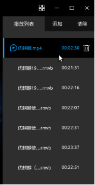
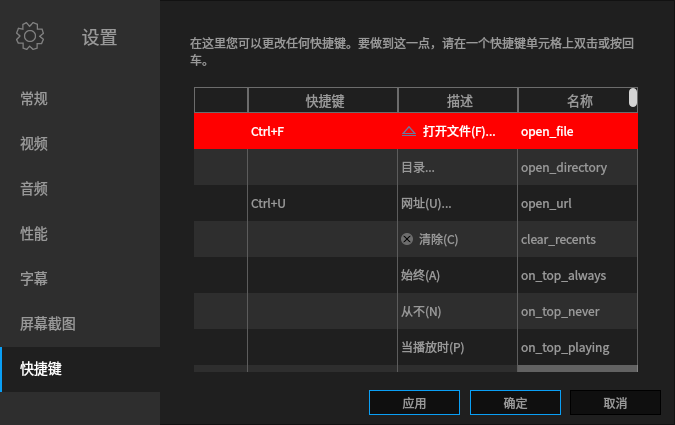

# Kylin Video
## Overview
Kylin Video is a video player developed by Kylin Team, and its simple & easy-to-use interface provides users with a convenient video experience for leisure and entertainment.

Kylin Video is a graphical front-end desktop product based on MPlayer and MPV. The main interface is simple and intuitive, including title bar (advanced function list, minimize, maximize and close) and playback window (play, previous, pause, next, volume, full screen, playlist).

During playback as shown in figure below.

Kylin Video supports multiple audio and video and subtitle formats, as shown below.

| Category | Format |
| :------------ | :------------ |
| Video |(*.avi *.vfw *.divx *.mpg *.mpeg *.m1v *.m2v *.mpv *.dv *.3gp *.mov *.mp4 *.m4v *.mqv *.dat *.vcd *.ogg *.ogm *.ogv *.ogx *.asf *.wmv *.bin *.iso *.vob *.mkv *.nsv *.ram *.flv *.rm *.swf *.ts *.rmvb *.dvr-ms *.m2t *.m2ts *.mts *.rec *.wtv *.f4v *.hdmov *.webm *.vp8 *.bik *.smk *.m4b *.wtv *.part )
| Audio |(*.mp3 *.ogg *.oga *.wav *.wma *.aac *.ac3 *.dts *.ra *.ape *.flac *.thd *.mka *.m4a *.opus )
| Subtitle |	(*.srt *.sub *.ssa *.ass *.idx *.txt *.smi *.rt *.utf *.aqt *.vtt )

 

## Basic Function
Main interface as shown in figure below.

Icons and Functions:

| Icon | Decsription | Icon | Decsription |
| :------------ :| :------------ | :------------ | :------------ |
||	Advanced Function List||Minimize
||	Maximize||Close
||	Play	||Previous 
||	Pause ||Next
||	Volume ||Full Screen 
||	Open Playlist	||||	

### Full Screen
Userc can click the icon "" at the bottom right corner or double-click the screen to open full screen mode.

### Playlist
Uses can click the icon "" at the bottom right corner to view the playlist, add or remove files.

#### Pull-down Menu
Right-clicking in the playlist will pop up a pull-down menu, and the descriptions as shown below. 

| Bottom |Description|
|:------------|:------------|
|Play|	Play videos in the selected list|
|Delete（S）| Delete videos in the selected list|
|Delete from Disk（D）|	Delete videos both in the selected list and the disk|

 

#### Add
Users can click "Add" in the play list or the icon "" > "Open Files" to go to the window of choosing files. First to choose the path; Second to select the files (multiple choices by clicking Ctrl and mouse-left-bottom at the same time); And then click "Open". For example, open the folder on desktop to view the videos.

#### Delete
- Way 1: Click "Delete" in the playlist to pop up the window as shown below. Select "Yes" will clean the playlist immediately, otherwise select "No".

- Way 2: The position where the mouse hovers (the background color of the list darkens) will appear the icon "", and then click to delete.

- Way 3: Based on Way 2, right-click and select "Delete" or "Delete form Disk".

 

## Advanced Setting
Users can click the icon "" to make basic settings for the software. Click the four-panel icon at the top right corner of the main interface, and select the pull-down menu options.

Main interface description:

Icons and Functions:

| Icon | Description | Icon | Description |
| :------------ | :------------ | :------------ | :------------ |
||	Open Files||Screen Shot
||	Settings||Help
||	About Kylin Video||Quit 

 

### Screen Shot
Users can take a screenshot of the current video scene and save it locally by "Screen Shot" option. And users also can customize the save path and image format, as shown bleow.

| Option | Detail|
|:-------|:--------|
|Default Path|/home/kylin/Pictures/kylin_video_screenshots |
|Default Format|png、ppm、pgm、pgmyuv、tga、jpg、jpeg |

 

### Settings
Users can personalize the General, Video, Audio, Performance, Subtitles, Screenshot, Shortcut by "Settings" option.

Descriptions as shown below.

| Option | Detail |
| :------------ | :------------ |
|General|Player Engine: MPlayer or MPV; Customize: Pause during minimization and preview during video play|
| Video Setting |Enable post-processing by default, use software video equalizers, direct rendering, double buffer (√), draw video using slicing method; Output driver is default mode|
| Audio Setting | Customize volume, sync, and channel; Output driver is default mode|
| Performance Setting | Customize caching and decoding |
| Subtitle Setting |Load subtitle files automatically in format of *.srt, *.sub, etc.; Default subtitle encoding; Automatic language detection |
| Screen Shot |Set up saving path and image format |
| Short-cut Key | Customization |

 

#### General
Users can choose player engine: MPlayer or MPV. And accroding to the needs, customize that if pause during minimization, preview during video play or not.

#### Video Setting
Output driver is default mode, and others options can be customized by users' needs: enable post-processing by default, use software video equalizers, direct rendering, double buffer, draw video using slicing method. As shown in Fig. 11.

#### Audio Setting
According to users needs, it can customize volume including global volume set, use software volume control, default volume normalization, maximum amplification, and select automatic audio/video synchronization also.

Output driver is default mode.

Default Chanel: 2(Stereo), 4(4.0 surround), 6(5.1 surround), 7(6.1 surround), 8(7.1 surround), 8.

#### Performance Setting
According to users needs, it can customize caches (local file caches KB, stream caches KB) and decoding (MPEG1/2 and H.264 decoding threads only, hardware decoding).

Hardware decoding's formats as shown below.

||Detail
| :------------ | :------------ |
|Hardware decode	|no, automatic, vdapu, vaapl, vaapl-copy

 

#### Subtitle Setting
It can load subtitle files automatically in format of *.srt, *.sub, and so on, which name is same as (or is contained to) the video's name. 

Default subtitle encoding is UTF-8, and automatic language detection can be attempted, such as Chinese (zh), Russian (ru).

#### Screen Shot
Interface as shown in Figure below.

#### Short-Cut Key
It allows users to change majority of the current short-cut keys.

Users can double-click or press Enter to modify the short-cut key.

- If the capture button is enabled, then you just need to press the new keys for this action. (It doesn't apply to all buttons)

- If the capture button is disabled, then you can input the full name of the key.

### Help
Though "Help" option, users can view the videos'/audios'/subtitles' formats that Kylin Video supports.

### About Kylin Video
It shows the product information, version, and related links in "About Kylin Video", as shown in Fig. 19. Contributor related Information.

### Quit
Qiut the application.

 

## FAQ
### Video can not be played
Try to switch player engine MPlayer or MPV in general setting.

 

## Appendix
### Shortcut Key
The parts without no short-cut key can be customized by users' needs.

| Short-cut Key |Description|	Name
| :------------ | :------------ | :------------ |
|Ctrl+F|	Open File |open_file
|	| Open Directory |	open_directory
|Ctrl+U	|Clear|clear_recents
||	Always（A）|	on_top_always
|	|Never（N）|	on_top_never
|	|Playing（P）	|on_top_playing
|Left,Ctrl+Shift+B|	-10s|	rewind1
|Down	|-1min	|rewind2
|PgDown	|-10min	|rewind3
|right,Ctrl+Shift+F	|+10s|	forward1
|Up	|+1min|	forward2
|PgUp|	+10min|	forward3
|Ctrl+J	|Jump to（J）|	jump_to
|Backspace|Normal Speed|normal_speed
|{|	Halve Speed|halve_speed
|}	|Double Speed|	double_speed
|[|	Speed-10%|	dec_speed
|]	|Speed+10%|inc_speed
||	Speed-4%	|dec_speed_4
||	Speed+4%	|inc_speed_4
||	Speed-1%	|dec_speed_1
|	|Speed+1%	|inc_speed_1
|<,Mesia Previous	|Previous	|play_prev
|>,Media Next	| Next	|play_next
|	|Order Play	|order_play
|	|Random Play |random_play
|	|List Loop Play|list_loop_play
|	|Automatic（A）	|aspect_detect
|	|1:1	|aspect_1:1
|	|5:4|	aspect_5:4
|	|4:3|	aspect_4:3
|	|11:8|	aspect_11:8
|	|14:10|	aspect_14:10
|	|3:2|	aspect_3:2
|	|14:9|	aspect_14:9
|	|16:10|	aspect_16:10
|	|16:9|	aspect_16:9
|	|2.35:1|	aspect_2.35:1
|	|Disabled（D）|	aspect_none
|	|Off（O）|	rotate_none
|	|Rotate 90 degrees clockwise and flip（R）	|rotate_clockwise_flip
|	|Rotate 90 degrees clockwise（C）	|rotate_clockwise
|	|Rotate 90 degrees counterclockwise（W）|	rotate_counterclock
|	|Rotate 90 degrees counterclockwise and flip（F）|	rotate_counterclockwise_flip
|	|Flip（P）|	flip
|	|Mirror（O）|	mirror
|	|Stereo（S）|	channels_stereo
|	|4.0 Surround（4）	|channels_surround
|	|5.1 Surround（5）|	channels_ful51
|	|6.1 Surround（6）|	channels_ful61
|	|7.1 Surround（7）	|channels_ful71
|M,Volume Mute|	mute（M）|	mute
|	|Extrastereo（E）|	extrastereo_filter
|	|Karaoke（K）	|karaoke_filter
|	|Volnorm（N）|	volnorm_filter
|	|Earwax（h）|	earwax_filter
|9	|Volume-|	dec_volume
|0	|Volume+|	inc_volume
|-	|Delay-|	dec_audio_delay
|+	|Delay+|	inc_audio_delay
|Y	|Set Delay（Y）|	audio_delay
|	|Load outside file（L）|	load_audio_file
|	|Unload outside file（N）	|unload_audio_file
|	|Equalizer（Q）	|audio_equalizer
|	|Reset audio equalizer|reset_audio_equalizer
|	|Stereo（S）	|stereo
|	|Left channel（L）	|left_channel
|	|Right channel（R）|	right_channel
|	|Mono channel（M）	|mono
|	|Revers channel（v）|	revers_channels
|S	|Screen shot（S）|	screenshot
|	|Loading…|	load_subs
|	|Sub visibility（V）|	sub_visibility
|Shift+I	|Show informations in OSD（i）|	lshow_info_osd
|Shift+U	|Size+|	inc_osd_scale
|Shift+Y	|Size-|	dec_osd_scale
|	|OSD FRACTIONS	|osd_fractions
|	|OSD NONE（Y）	|osd_none
|	|OSD SEEK（S）|	osd_seek
||	OSD TIMER（T）|	osd_timer
|	|OSD TOTAL（O）|	osd_total
|Ctrl+P	|Setting |	show_preferences
|Ctrl+I	|Media Information（I）|	show_file_properties
|Ctrl+H	|Help |show_help
|Ctrl+A|	About Kylin Video|	chout_kulin_video
|Ctrl+Q	|Quite|	quit
|F3|	Playlist	|platlist_open_close
|Space	|Play / Pause|	play_pause
|Media Stop	|Stop|	stop
|Ctrl+Return|	Fullscreen|	fullscreen
|	|Open main window|	open_window
|	|Open screen shots folder |	open_shots_dir

