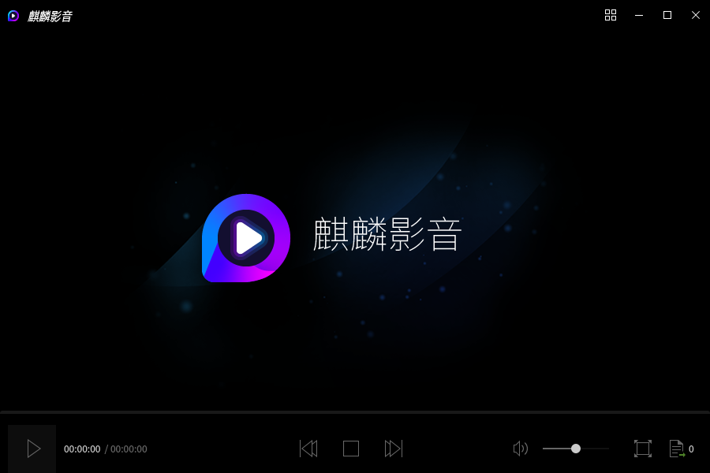
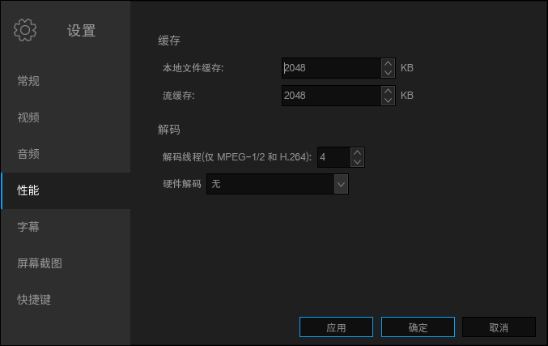

# Kylin Video
## Overview
Kylin Video is a video playing application based on MPlayer and MPV. The main interface as shown in Fig 1.

The supported formats as shown below.

| Category | Supported Formats |
| :------------ | :------------ |
| Video	| *.avi *.vfw *.divx *.mpg *.mpeg *.m1v *.m2v *.mpv *.dv *.3gp *.mov *.mp4 *.m4v *.mqv *.dat *.vcd *.ogg *.ogm *.ogv *.ogx *.asf *.wmv *.bin *.iso *.vob *.mkv *.nsv *.ram *.flv *.rm *.swf *.ts *.rmvb *.dvr-ms *.m2t *.m2ts *.mts *.rec *.wtv *.f4v *.hdmov *.webm *.vp8 *.bik *.smk *.m4b *.wtv *.part |
| Audio | *.mp3 *.ogg *.oga *.wav *.wma *.aac *.ac3 *.dts *.ra *.ape *.flac *.thd *.mka *.m4a *.opus |
| Subtitle | *.srt *.sub *.ssa *.ass *.idx *.txt *.smi *.rt *.utf *.aqt *.vtt |

 

## Basic Function
Icon and function:

| Icon | Function | Icon | Function |
| :------------ :| :------------ | :------------ | :------------ |
|| Advanced function || Play |
|| Previous || Stop |
|| Next || Volume |
|| Full screen |||

### Full Screen
Click the icon ”” at the bottom right corner or double-click the screen to open full screen mode.

### Playlist
Click the icon “” at the bottom right corner to view the playlist, add or remove files, as shown in Fig 2.

#### Right-click Menu
Right click a selected file in the playlist, and the options as shown in Fig 3.

#### Add
Click “Add” in the play list to select files, as shown in Fig 4. Multiple choices by pressing Ctrl at the same time.

#### Clear
- Way 1: Click "Clear" and select "Yes" to empty the playlist. As shown in Fig 5.

- Way 2: The mouse hovers on a file in the playlist, and then click the appeared icon, as shown in Fig 6.

- Way 3: Remove from right-click menu.

 

## Advanced Function
Click the icon "" at the top right corner of the main interface, and select "Preferences".

### General
Select playback engine: MPlayer or MPV. And accroding to the needs, customize that whether pause when minimized, preview when video is playing. As shown in Fig 7.

### Video
Set output driver and other options, such as postprocessing, video equalizer, rendering, etc.. As shown in Fig 8. 

### Audio
According to users needs, it can customize volume (global volume, volume control, default volume normalization, etc.), synchronization (audio/video synchronization, factor), output driver and channel.

### Performance
Customize cache (local files, streams) and decode, as shown in Fig 10.

Hardware decoding formats including None, Auto, vdapu、vaapi、vaapi-copy.

### Subtitles
Set autoload subtitles files (*.srt, *.sub, etc.) -- same name as movie, all subs containing movie name, all subs in directory.

Dedault encoding is UTF-8, and users can check autodetect for this language.

### ScreenShot
Customize the saving path and image format, as shown in Fig 12.

### Shortcut Key
It allows users to change majority of the current shortcut keys, as shown in Fig 13.

Users can double-click or press Enter to modify them, as shown in Fig 14

- If the capture button is enabled, then you just need to press the new keys for this action. (It doesn’t apply to all buttons)

- If the capture button is disabled, then you can input the full name of the key. 

 

## Q&A
### Video can not be played
Try to switch playback engine MPlayer or MPV in general setting.
