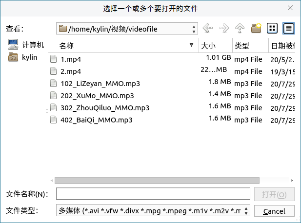
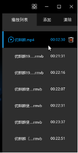
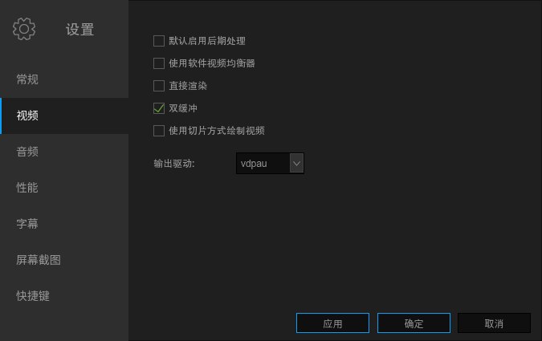
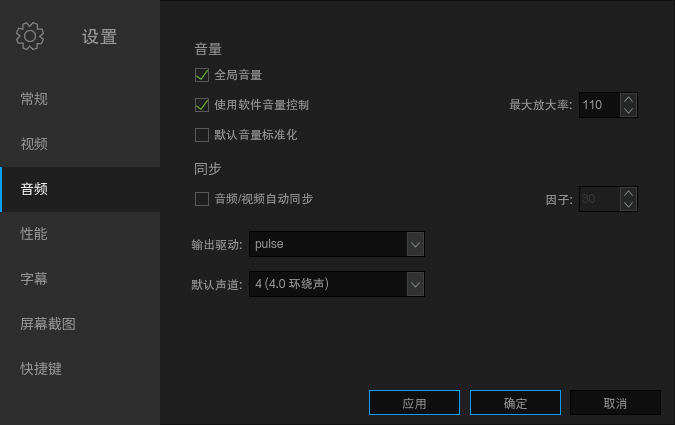
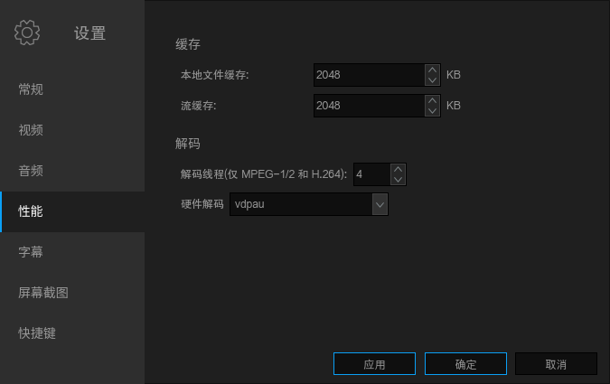
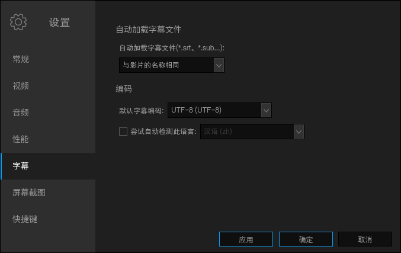
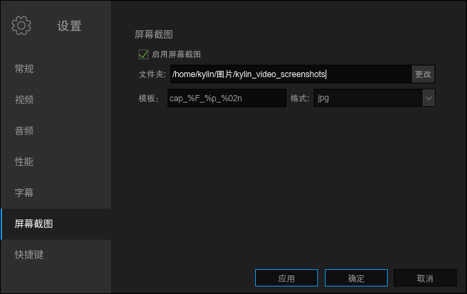
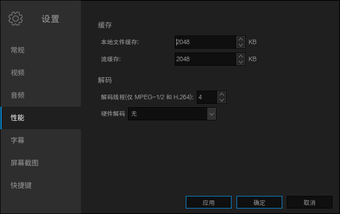
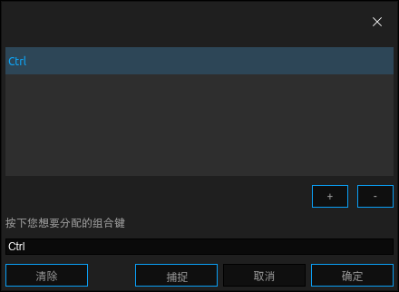

# 麒麟影音
## 概 述
麒麟影音是是一款基于MPlayer和MPV的视频播放软件，主界面简约、直观，如图 1所示。

麒麟影音支持的音视频、字幕格式如下。

|类目|	支持格式
| :------------ | :------------ |
|视频	|(*.avi *.vfw *.divx *.mpg *.mpeg *.m1v *.m2v *.mpv *.dv *.3gp *.mov *.mp4 *.m4v *.mqv *.dat *.vcd *.ogg *.ogm *.ogv *.ogx *.asf *.wmv *.bin *.iso *.vob *.mkv *.nsv *.ram *.flv *.rm *.swf *.ts *.rmvb *.dvr-ms *.m2t *.m2ts *.mts *.rec *.wtv *.f4v *.hdmov *.webm *.vp8 *.bik *.smk *.m4b *.wtv *.part )
|音频	|(*.mp3 *.ogg *.oga *.wav *.wma *.aac *.ac3 *.dts *.ra *.ape *.flac *.thd *.mka *.m4a *.opus )
|字幕|	(*.srt *.sub *.ssa *.ass *.idx *.txt *.smi *.rt *.utf *.aqt *.vtt )

 

## 基本功能
图标及其功能：

|图 标|	图标功能说明	|图 标	|图标功能说明
| :------------ :| :------------ | :------------ | :------------ |
||	高级功能 | | 播放按钮 |
|| 上一个 || 暂停 |
|| 下一个 || 音量调节 |
||	全屏 || 播放列表 |	

### 全 屏
点击右下角的“”图标，或双击屏幕，即可开启全屏。

### 播放列表
点击右下角的“”图标，查看播放队列、添加及清除文件，如图 2所示。

#### 右键菜单
右键单击列表中的一个文件，弹出的菜单选项如图 3所示。

#### 添 加
点击播放列表中“添加”，选择要加入到列表中的文件。一次可选多个文件。

#### 删 除
- 方式一：点击播放列表上的“清除”，并选择“是”，则会清空列表。

- 方式二：鼠标悬停在列表中的某个文件上，点击出现删除图标，如图 6所示。

- 方式三：从右键菜单中删除。

 

## 高级功能
点击右上角的“”图标，并选择“设置”，如图 7所示。

### 常 规
选择播放引擎：MPlayer或MPV；以及自定义最小化是否暂停，播放时是否进行预览。如图 7所示。

### 视 频
设置输出驱动以及其他选项，比如使用后期处理、视频均衡器、渲染等。如图 8所示。

### 音 频
自定义音量（全局音量，音量控制，默认音量标准等），同步（音频/视频自动同步，因子），输出驱动和默认声道。

### 性 能
自定义缓存（本地文件缓存、流缓存）和解码。

### 字幕设置
设置可自动加载字幕文件（*.srt、*.sub等格式）并且“与影片的名称相同”，“所有包含影片名称”，“目录中所有的字幕”。

默认字幕编码UTF-8，可勾选尝试自动检测此语言。

### 屏幕截图
自定义保存路径和图片格式，如图 12所示。

#### 快捷键
快捷键设置表格允许用户更改大多数现有快捷键，如图 13所示。

用户可双击或按Enter修改快捷键。

- 如果捕捉按钮已启用，那么只需按下指派给此动作的新按键或组合键。（不适用于所有按键）

- 如果捕捉按钮已关闭，可输入按键的完整名称。

 

## 常见问题
### 视频源无法播放
尝试在常规设置中切换播放引擎MPlayer或MPV。

