# Kylin Security Manager Tools
## Overview
Kylin Security Manager Tools is developed to protect the integrality of system applications and files, and make sure the system is safe and reliable. It supports to control the execution rights of each application, protect system files change and kernel driver modules uninstallation. 

There are the security modes: Strict, Warning, Record. The main interface as shown in Fig 1.

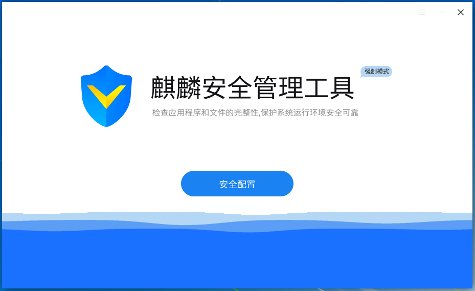
 

## Basic Function
### Security Modes
**Strict Mode**

- The procedures and dynamic libraries without safety certification will be prevented from executing automatically.

- Prevent users from modifying, deleting or renaming protected files.

- Prevent users from loading kernel driver modules without safety certification.

 

**Warning Mode**
The prompt window will pop up when execute a procedure without safety certification, and users can choose "Allow" or "Forbid".

If timeout, the execution will be forbidden, as shown below.

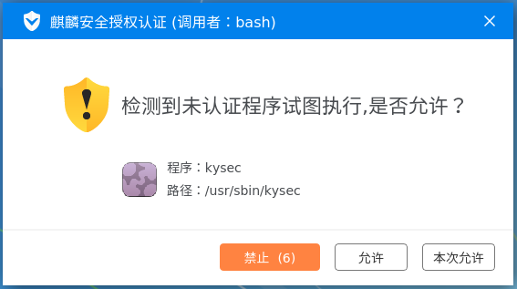
 

**Record Mode**

It's called "Maintenance Mode" also.

System won't prevent or prompt any opearation without authentication and just record them in system log.

 

Only administrators have rights to set and configure the security mode by kylin security manager.

Ordinary users only can view the running status and configurations of security modes. 

When it's 3-adm mode, only security administrators can configure the security mode.

### Status Settings
Enter the status settings window through the way as shown in Fig 3.

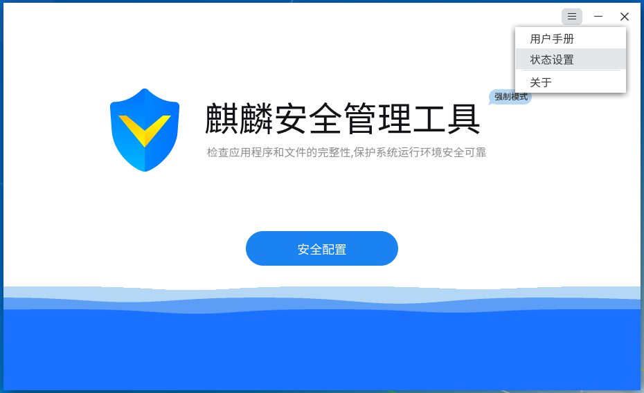

It can switch the security mode and open/close the 3 security functions, as shown in Fig 4.

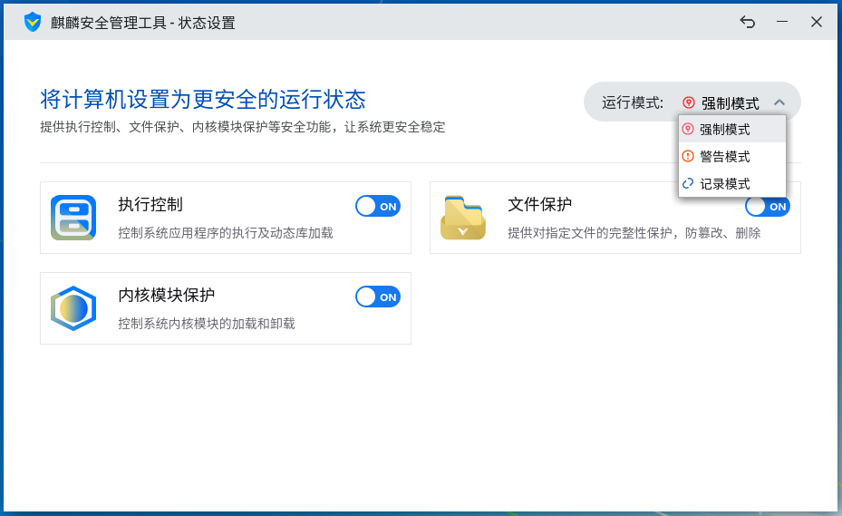

## Adavanced Function
Click "Security Configure" at the main interface to open the detail settings for 3 security functions.

### Execution Control
The main purpose is to put an end to the possible damages to the system caused by trojan or unknown type of applications' execution.

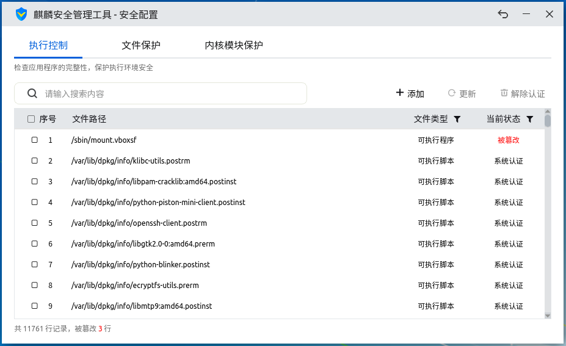

- Open: The new creation of executable files, scripts and sharing libraries (generated by copying, building and downloading from network) can't run directly. It has to get the certification or be added to the white list.

- Close: The new creation of executable files, scripts and sharing libraries can run directly, and any opearation for the white list is forbidden.

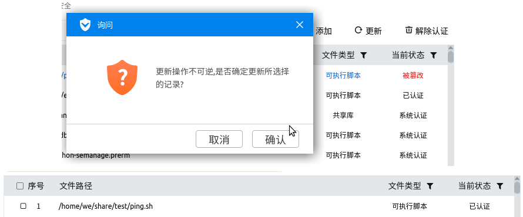

Click "Add" to select the files and add them to white list, as shown below.

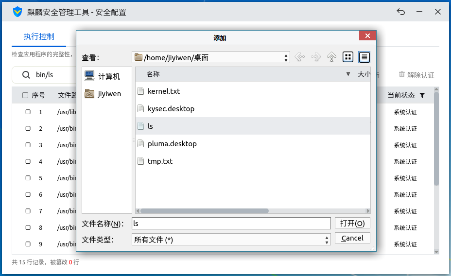

When the file in white list has been modified, its status will change to "Modified" and unexecutable. Users can select this file and click "Update" to restore its certified status. As shown below.

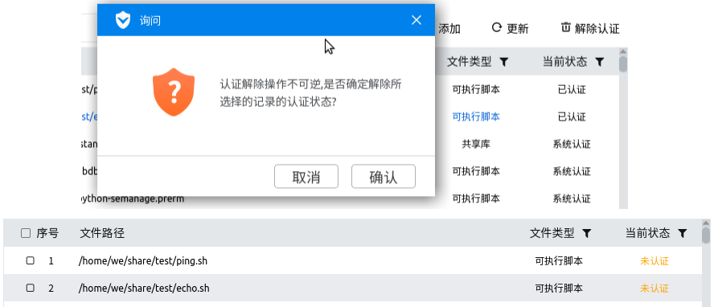

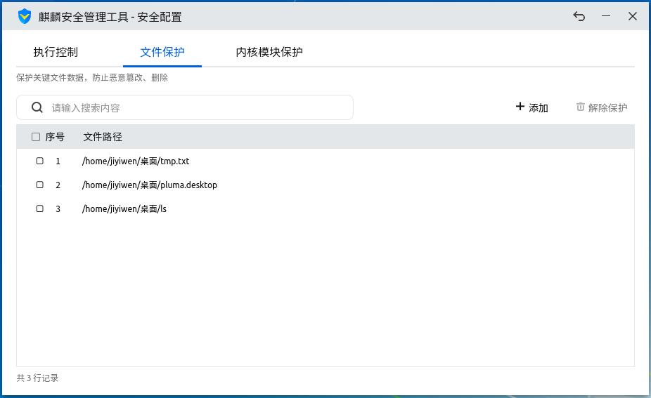

To make it convient for searching file, users can input the keywords in the search box. After pressing Enter, the results will show up.

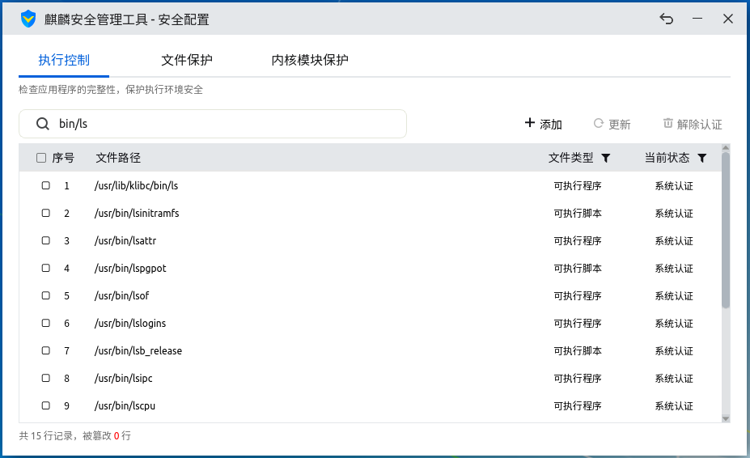

Selecting the files don't need certification anymore and choosing "Dissolution", its status will reset to "Unauthorized", as shown below.

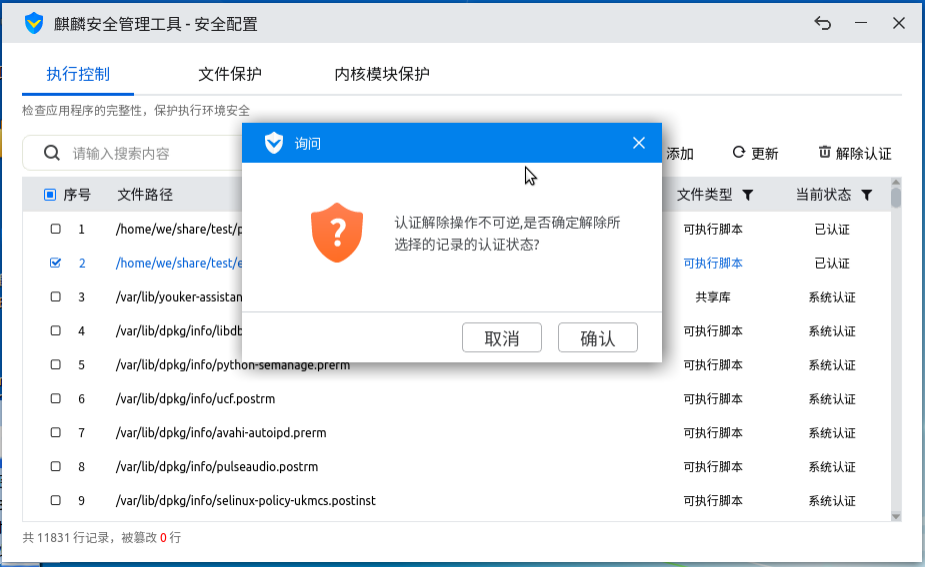

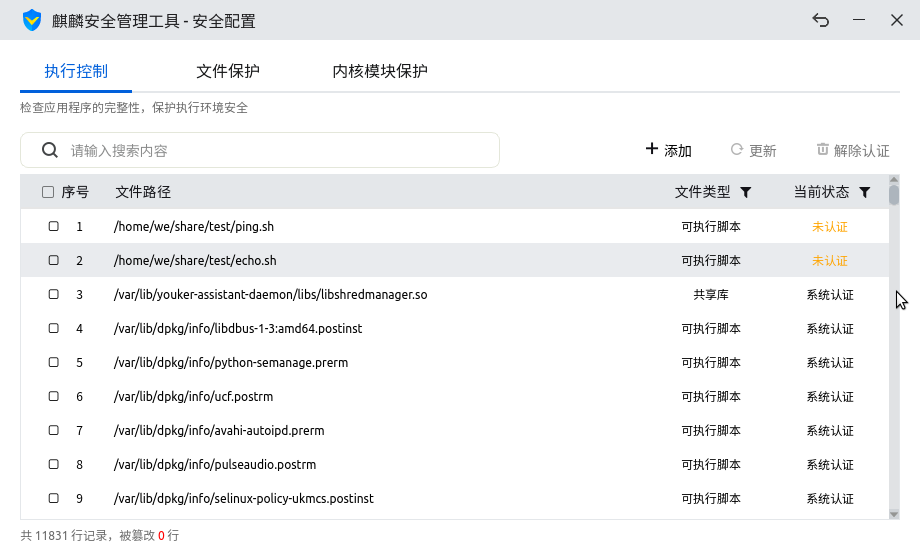

### Files Protection
- Open: The files in the list will get a full protection, so all opearations for them are forbidden, including copy, delete, move, etc..

- Close: The corresponding records for files in list will be delete at the same time.

Other functions are similar to execution control.

### Kernel Modules Protection
It can be divided into loading control and unloading control.

Only the certified kernel modules can load, while the modules with unloading protection mustn't unload.

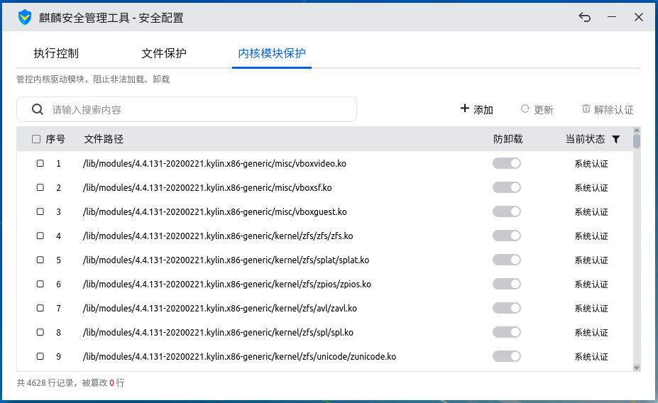

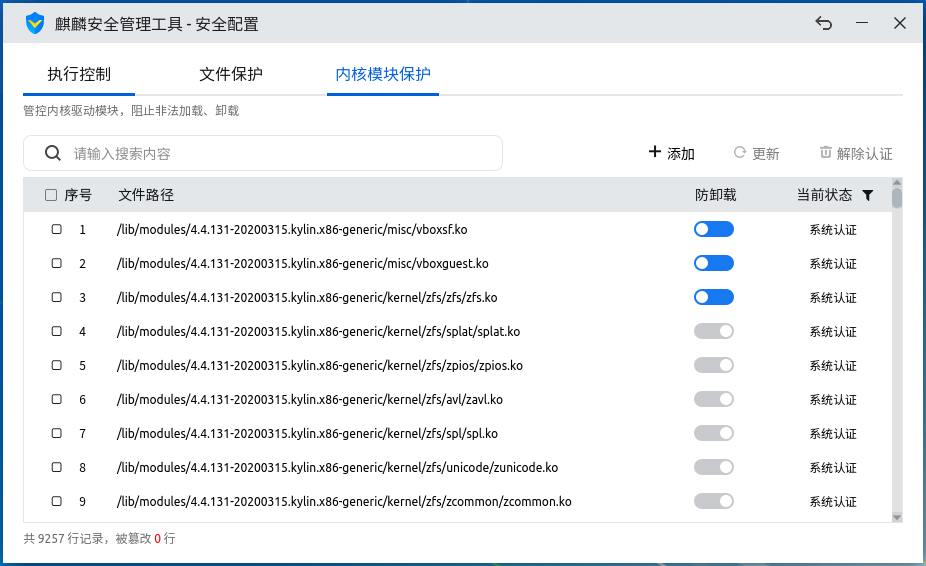

Other functions are similar to execution control.
