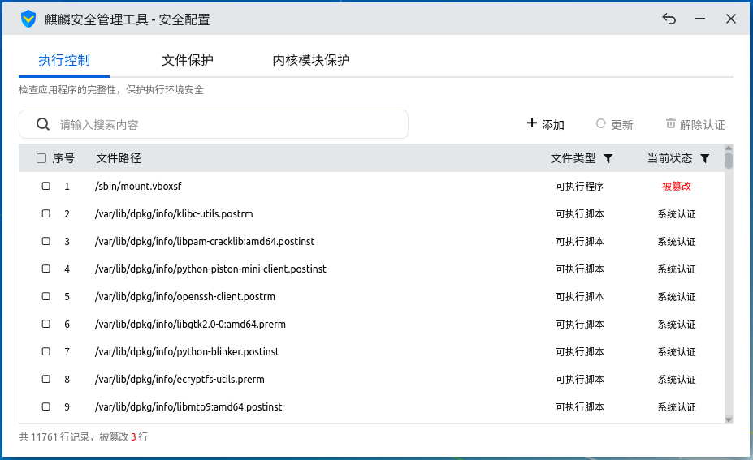
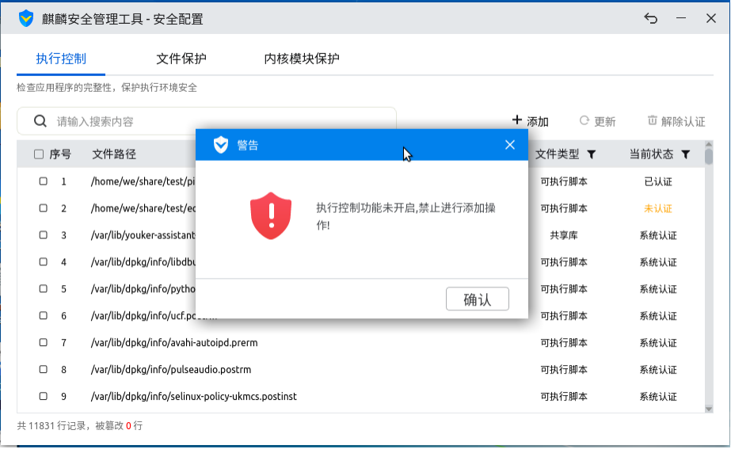
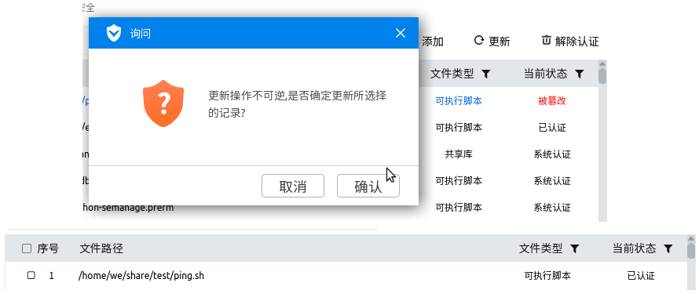
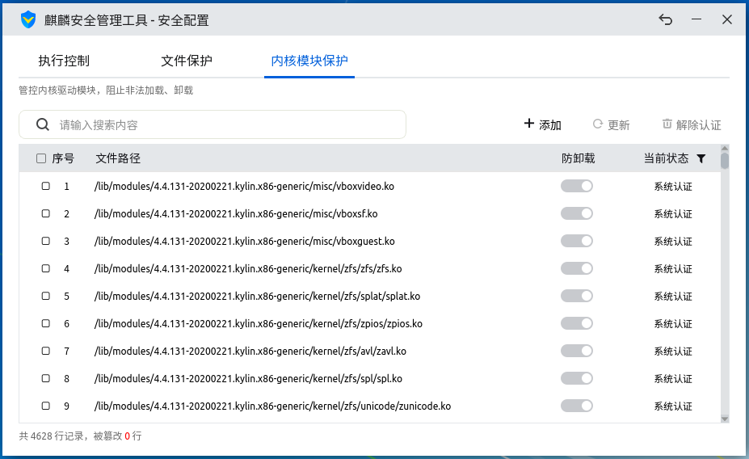

# 麒麟安全管理工具
## 概 述
麒麟安全管理工具是基于麒麟系统安全机制，实现保护系统应用程序和文件的完整性，确保系统运行环境的安全可靠。该机制支持对应用程序的执行权限控制，对系统文件的防篡改保护，对内核驱动模块的防卸载保护。

主界面如图 1所示。

麒麟安全管理工具分为安全状态设置和安全配置两部分：

- 安全状态设置：查看和设置系统安全机制的运行模式，设置安全机制子模块执行控制、文件保护和内核模块保护功能开启状态。

- 安全配置：实现对安全机制子模块控制项的添加、更新和移除配置设置。

 

## 基本功能
### 运行模式
麒麟系统安全机制分为两种运行模式：

- 强制模式：系统自动阻止没有安全认证的程序、动态库的执行，阻止用户篡改、删除、覆盖或重命名受保护文件，阻止用户加载未授信的内核驱动模块。

- 记录模式：也叫做“维护模式”；系统不会阻止或提示用户和程序的未授权行为，只在日志中进行记录违规行为。

在通常情况下，系统管理员（root和sudo权限的用户）可以使用麒麟安全管理工具对系统进行配置；普通用户只能查看。

当系统启用三权分立时，仅有安全管理员（secadm）可以使用麒麟安全管理工具对系统进行配置。

### 状态设置
点击主界面右上角“”图标，并选择“状态设置”，可切换系统安全机制运行模式，同时还可对执行控制、文件保护、内核模块保护三大子功能模块的运行状态进行设置。

 

## 高级功能
在主界面点击“安全配置”按钮进入设置窗口，可进行详细设置。

### 执行控制
主要目的是禁止系统外来文件和被篡改后的系统应用程序运行，在应用程序执行前检查应用的完整性，可有效阻止木马病毒或未知类型的应用执行，以杜绝对系统可能造成的侵害。

- 开启状态：系统新创建的可执行文件、脚本、共享库（包括拷贝，编译，网络下载等方式生成的）无法直接运行，只有经授权认证或加入白名单后，才可以运行。

- 关闭状态：系统新创建的可执行文件、脚本、共享库（包括拷贝，编译，网络下载等方式生成的）可以直接运行，执行控制白名单则禁止各种更改操作。

#### 添 加
点击“添加”按钮，选择待认证的执行程序、脚本、动态库加入执行控制白名单，工具会从用户选择的目录和文件中自动筛选出满足要求的文件，添加至白名单。

当白名单列表中的文件被修改后，其对应的当前状态变为“被篡改”，此时该执行程序、脚本或动态库将不能执行；用户可通过勾选该文件，然后点击“更新”按钮恢复其“已认证”状态。

#### 查 找
为方便用户从执行控制白名单查找文件，工具提供了搜索功能。

在搜索框输入关键词后，点击搜索图标或者按Enter，即可查到文件路径含有关键词的记录。

#### 解除认证
勾选列表中不再需要执行授权的记录，点击“解除认证”按钮，可以将其状态重置成“未认证”。

### 文件保护
用于保护系统关键文件不被篡改、移动、删除、覆盖等，保证关键数据的完整性。

启用文件保护功能后，保护列表中的文件将得到全面保护，禁止所有用户对其进行修改、删除、移动等操作。

文件保护解除时，会同时从列表中删除文件对应记录；其他功能与执行控制基本一致，在此不再赘述。

### 内核模块保护
分为加载控制和防卸载保护，主要对系统加载的内核模块进行认证管控：只有经过认证的内核模块才允许加载，已开启防卸载保护的模块则禁止卸载。

启用内核模块保护功能后，通过拷贝、编译，网络下载等方式新生成的内核模块未经认证，无法加载，只有加入白名单或更新认证状态，才可以正常加载至系统内核。

如果内核模块保护功能关闭，系统新创建的内核模块可以正常加载。

设置防卸载保护的内核模块，加载后不能被卸载。

内核模块保护的其他功能与执行控制一致，在此不再赘述。

