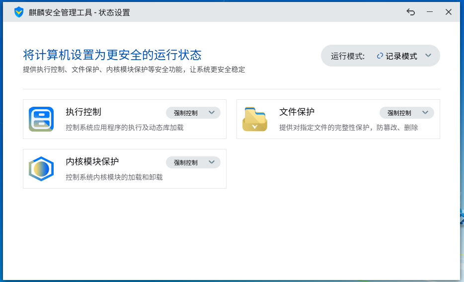
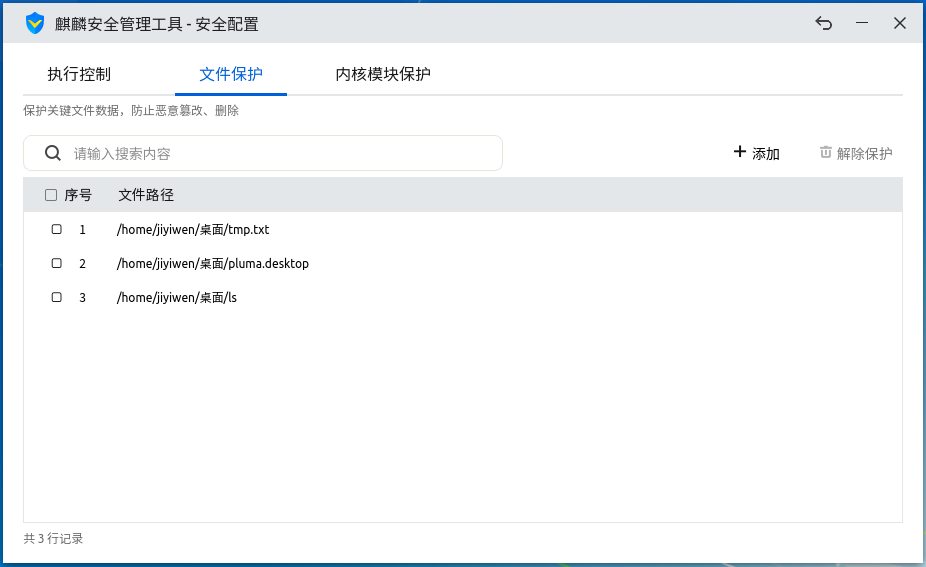

# 麒麟安全管理工具
## 概 述
麒麟安全管理工具是由麒麟安全团队开发的一款系统安全防护工具，界面简单明了，旨在为用户提供快捷、便利的系统安全防护体验。

麒麟安全管理工具位置：菜单 > 所有软件 > 麒麟安全管理工具

软件打开后，如下图所示：

麒麟安全管理工具可查看和设置当前系统KYSEC安全状态及其子功能（执行控制、文件保护、内核模块保护）状态；可对KYSEC安全模式进行设置；还可以对执行控制、文件保护、内核模块进行开关设置和文件列表配置。

KYSEC安全只有在安全模式为“强制模式”时，才可进行KYSEC控制；同时执行控制、文件保护、内核模块只有为“开”的状态时，才可进行相应功能的控制。

当系统启用三权分立时，仅有secadm安全管理员可以使用麒麟安全管理工具对系统进行安全配置；当系统未启动三权分立时，系统管理员可以使用麒麟安全管理工具对系统进行安全配置，普通用户也可启动麒麟安全管理工具查看KYSEC状态和配置，验证管理员密码进行授权后，普通用户才可对KYSEC状态和配置进行修改。

 

## 基本功能
### 麒麟系统设置
麒麟系统的KYSEC安全机制包括“强制模式”和“记录模式”两种运行模式。

当处于“强制模式”时，系统能够阻止未被安全标记的程序、动态库的执行；阻止用户篡改、删除受保护文件；阻止用户加载未授信内核模块。

“记录模式”模式也叫做“软模式”，该模式下，系统不会用户上述操作的执行，只会在日志中记录用户的上述操作行为。

在麒麟安全管理工具主界面点击“麒麟系统设置”按钮后，可对KYSEC运行模式进行切换，同时还可对执行控制、文件保护、内核模块保护三大功能进行控制，如下图所示：

## 高级功能
在麒麟安全管理工具主界面点击“麒麟安全配置”按钮后，可对KYSEC系统执行控制、文件保护、内核模块保护进行详细配置。

### 执行控制
执行控制主要目的是禁止系统外来文件（木马病毒或未知类型）和被修改后的系统文件运行，以杜绝对系统可能造成的侵害。

执行控制处于开启状态时，系统新创建的可执行文件、脚本、共享库（包括拷贝，编译，网络下载等方式生成的）无法直接运行，只有通过授权认证或加入白名单后，才可以正常运行。

执行控制处于关闭状态下时，系统新创建的可执行文件、脚本、共享库（包括拷贝，编译，网络下载等方式生成的）就可以直接运行，而不需要进行白名单配置。

用户可通过添加按钮，将需要认证的执行程序、脚步、动态库加入执行控制白名单，工具会从用户选择的目录和文件中自动筛选出满足要求的文件，添加至执行控制白名单，如下图所示：

当文件被篡改后，程序会用红色文字将其标注为“已篡改”，此时该执行程序、脚步或动态库将不能执行，用户可通过勾选该文件，然后点击更新按钮恢复其“已认证”状态，如下图所示：

为了方便用户查找文件，工具提供搜索功能，在输入框输入所需搜索的关键字后，点击搜索图标或者按回车键，工具即可列出文件路径中包含关键字的所有可执行程序白名单记录，如下图所示：

在表格中对不需要进行授权执行的记录进行勾选后，点击删除按钮，可以讲白名单记录进行删除，如下图所示:

### 文件保护
文件保护用于保护系统关键文件不被篡改，保证关键数据的完整性。

文件保护处于开启状态时，被添加至文件保护列表的文件将得到全面保护，不允许对文件进行任何改动。

文件保护的添加、删除、搜索功能与执行控制一致，在此不再赘述。

### 内核模块保护
内核模块保护分为加载控制和防卸载保护，主要对系统加载的内核模块进行控制，只有经过验证的内核模块才允许加载，特定系统模块禁止卸载。

内核模块保护处于开启状态时，新拷贝或新编译，网络下载等方式新生成的内核模块将无法被系统加载，只有通过授权认证或加入白名单后，才可以正常加载至系统内核。

内核模块保护处于关闭状态下时，系统新创建的可执行文件、脚本、共享库（包括拷贝，编译，网络下载等方式生成的）就可以直接正常加载至系统内核。

添加至内核模块保护的内核模块还可设置其防卸载状态，设置防卸载后，该内核模块被加载至内核后，将无法被卸载，如下图所示：

