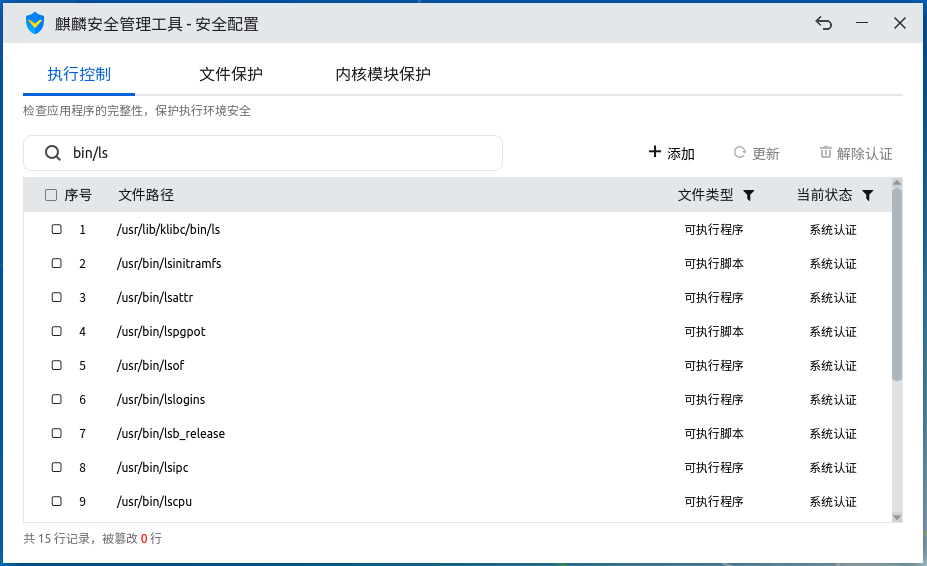

#   麒麟安全管理工具帮助手册

## 1. 概 述
麒麟安全工具是由麒麟安全团队开发的一款系统安全防护工具，界面简单明了，旨在为用户提供快捷、便利的系统安全防护体验。
麒麟安全管理工具位置：菜单 > 所有程序 > 麒麟安全管理工具
麒麟安全管理工具可查看当前系统kysec安全状态和三权分立状态；可对kysec安全模式进行设置；还可以对执行控制、文件保护、内核模块进行开关设置和文件列表配置，如图1所示。

Kysec安全只有kysec安全状态为“已启用”，安全模式为Normal模式时，才可进行kysec控制；同时执行控制、文件保护、内核模块只有为“开”的状态时，才可进行相应功能的控制。
当系统启用三权分立时，仅有secadm安全管理员可以使用麒麟安全管理工具对系统进行安全配置；当系统未启动三权分立时，系统管理员可以使用麒麟安全管理工具对系统进行安全配置，普通用户验证管理员密码进行授权后，也可使用，如图：

正式打开工具后，如图：

注：不同安全模式下，除了打开麒麟安全管理工具的用户不同外，其他麒麟安全管理工具的操作和功能都是一样的。
## 2. 基本功能
### 2.1. Kysec安全模式设置
银河麒麟系统的Kysec安全机制包括“Normal”和“Softmode”两种运行模式。
“Normal”模式也叫做“强制模式”，当处于该运行模式下时，系统能够阻止未被安全标记的程序、动态库的执行；阻止用户篡改、删除受保护文件；阻止用户加载未授信内核模块。
“Softmode”模式也叫做“软模式”，该模式下，系统不会用户上述操作的执行，只会在日志中记录用户的上述操作行为。
在麒麟安全管理工具主界面点击kysec安全模式行后面的向下箭头，可看到“Normal”和“Softmode”两个选项，点击选择一个，然后点击“应用”按钮，即可修改kysec安全模式，如下图所示：

## 3. 高级功能
### 3.1. 执行控制
执行控制主要目的是禁止系统外来文件（木马病毒或未知类型）和被修改后的系统文件运行，以杜绝对系统可能造成的侵害。
点击执行控制后面的“开”按钮，然后点击“应用”按钮，即可将执行控制保护关闭。如图：

关闭状态下，系统新创建的可执行文件、共享库（包括拷贝，编译，网络下载等方式生成的）就可以直接运行，而不需要进行白名单配置。所以后面的“配置”按钮为灰色，不可点击。
再将执行控制设为“开”状态，然后点击执行控制后面的“配置”按钮，即可打开执行控制配置窗口，如图：

如上图所示，工具可添加可执行程序白名单和共享库白名单。例如，点击“添加”>“添加文件”，弹出如图：

选择要添加的文件，然后点击“Open”，即可添加成功。但是可执行程序白名单只能添加可执行程序文件，共享库白名单只能添加共享库文件。如果添加的不是相应的文件类型，则会提示添加失败，如图：

文件添加成功后，执行控制配置窗口界面则会列出添加成功的文件，如图：

如图，可执行程序成功添加。添加成功后，该文件可安全执行。
为了方便用户查找文件，工具提供搜索功能，在输入框输入所需搜索的关键字后，点击搜索按钮，工具即可列出文件路径中包含关键字的所有可执行程序白名单记录，如下图所示：

在表格中对不需要进行授权执行的记录进行勾选后，点击删除按钮，可以讲白名单记录进行删除，如下图所示:

点击刷新按钮，可以重新载入白名单所有记录。
共享库白名单的功能和操作与可执行程序白名单一致，在此不在赘述。
### 3.2. 文件保护
文件保护用于保护系统关键文件不被篡改，保证关键数据的完整性。
点击文件保护后面的“开”按钮，然后点击“应用”按钮，即可将文件保护关闭。文件保护关闭后，文件保护白名单中的文件就不能受到安全保护。

将文件保护的状态恢复为开，然后点击文件保护后面的“配置”按钮，弹出如图：

如上图，文件保护配置可添加、删除、刷新、搜索受保护的文件，添加受保护的文件可添加所有类型的文件。受保护的文件添加成功后，该文件不可以被篡改、移动、删除。
文件保护添加后，如下图所示：

### 3.3. 内核模块保护
内核模块保护分为加载控制和防卸载保护，主要对系统加载的内核模块进行控制，只有经过验证的内核模块才允许加载，特定关键系统模块禁止卸载。
点击内核模块保护后面的“开”按钮，然后点击“应用”按钮，即可将内核模块保护关闭。内核模块保护关闭后，新拷贝或新编译，网络下载等方式新生成的内核模块，可不进行内核模块保护配置而直接被系统加载。
将内核模块保护的状态恢复为开，然后点击内核模块保护后面的“配置”按钮，弹出如图：

如上图，内核模块保护配置可添加、删除、刷新、搜索受内核模块。但是只能添加内核模块，不能添加其他类型文件。如果添加非内核模块文件，则会提示文件添加失败，如图：

成功添加内核模块白名单后，该内核模块即可被系统加载，如下图所示。

