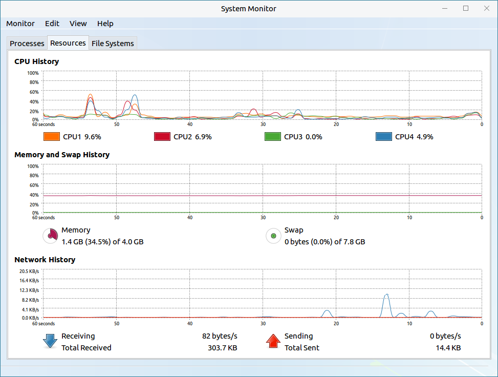
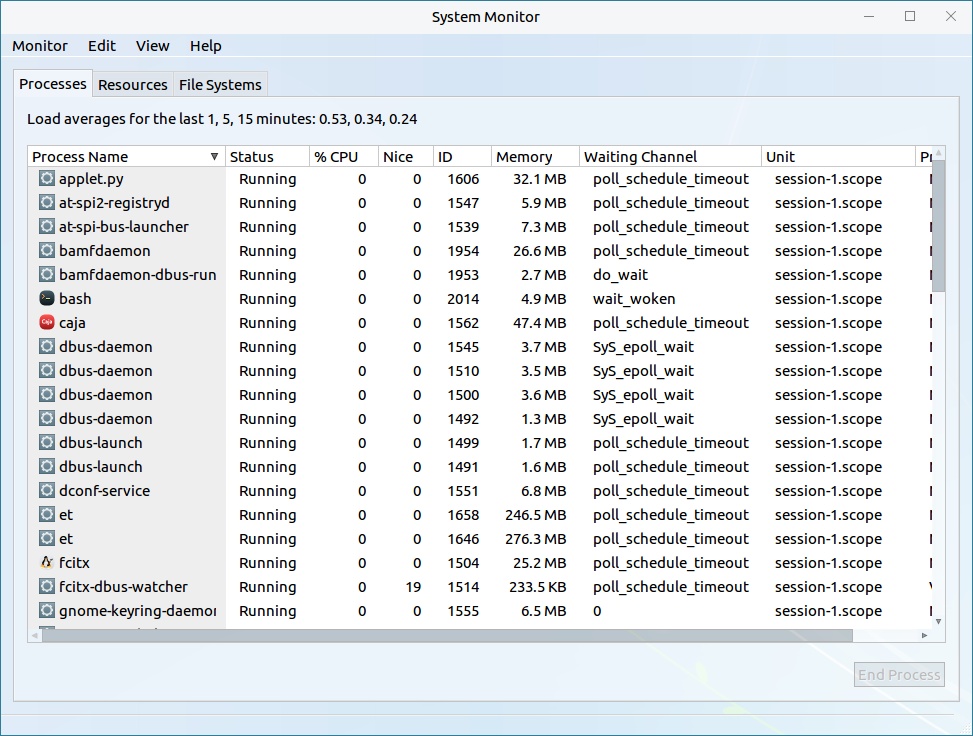
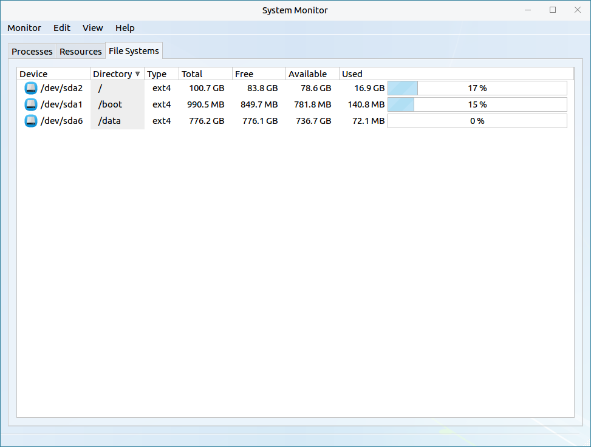
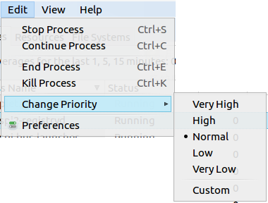
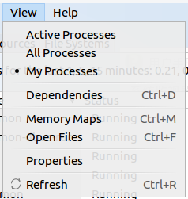
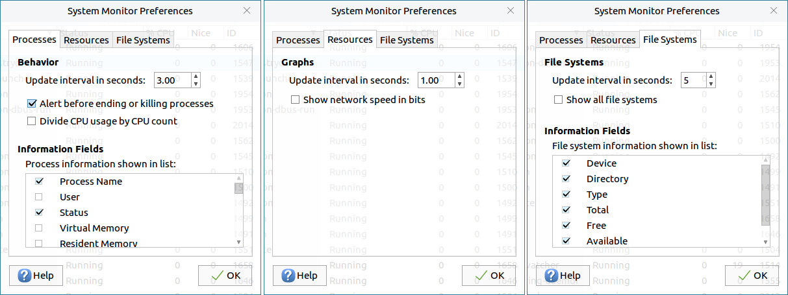
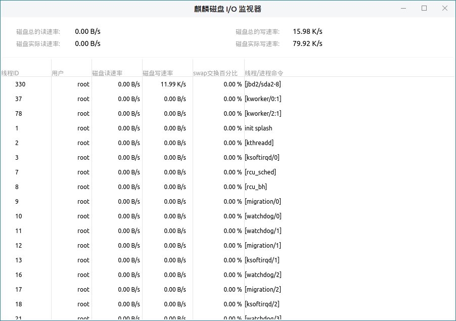
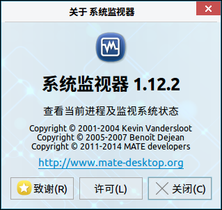
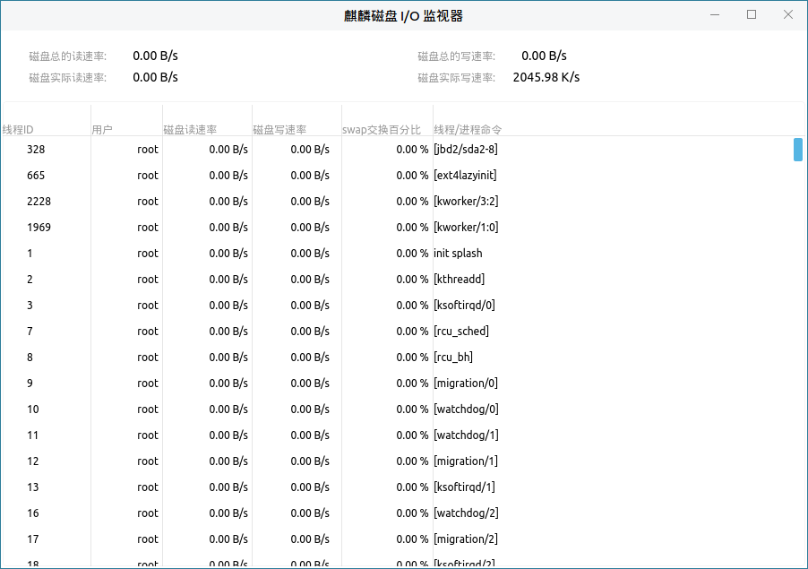

# 系统监视
## 系统监视器
系统监视器是一款可以查看进程、资源、文件系统的图形化系统应用工具，能动态地监视系统的使用情况，主界面由标题栏、菜单及监视显示区构成，如图1所示。

 

### 基本功能
主界面介绍：

#### 进 程
用户通过点击监视显示区的“进程”即可查看当前系统所运行的进程信息，如图1所示。

#### 资 源
用户通过点击监视显示区的“资源”即可动态地查看当前系统运行时，所使用的资源信息，如图3所示。

#### 文件系统
用户通过点击监视显示区的“文件系统”即可查看文件系统信息，如图4所示。

 

### 高级功能
用户可以通过菜单的监视器、编辑、查看、帮助选项，对系统监视器进行相关操作。

主界面介绍：

图标及其功能介绍：

|图标|	图标功能说明	|图标|	图标功能说明
| :------------ | :------------ | :------------ | :------------ |
||退出系统监视器||对系统监视器进行相关设置
||刷新系统监视器||	查看用户手册
||关于系统监视器||||
	
 

#### 监视器
用户通过点击：菜单 > 监视器，可选择退出系统监视器。

#### 编 辑
用户通过点击：菜单 > 编辑，可对进程进行停止、继续、结束、杀死等操作。

##### 更改优先级
用户通过点击：菜单 > 编辑 > 更改优先级，可对进程进行优先级更改，如图6所示。

##### 首选项
用户通过点击：菜单 > 编辑 > 首选项，可对进程、资源、文件系统进行设置，如图7所示。

#### 查 看
用户通过点击：菜单 > 查看，可查看相应进程、进程间的依赖关系、选中进程的内存映像、属性等。

#### 帮 助
##### 目 录
用户通过点击：菜单 > 帮助 > 目录，可查看用户手册。

##### 关 于
用户通过点击：菜单 > 帮助 > 关于，可查看关于系统监视器的信息，如图8所示，

### 附 录
#### 快捷键

|选项	|快捷键	|操作内容
| :------------ | :------------ | :------------ |
|退出（Q）	|Ctrl+Q|	退出系统监视器
|停止进程（S）|	Ctrl+S|	停止当前选择进程
|继续进程（C）|	Ctrl+C|	继续当前选择进程
|结束进程（E）|	Ctrl+E|	结束当前选择进程
|杀死进程（K）|	Ctrl+K|	杀死当前选择进程
|依赖关系（D）|	Ctrl+D|查看进程间的依赖关系
|内存映像（M）|	Ctrl+M	|查看当前内存影响
|打开的文件（F）|	Ctrl+F|	打开当前进程文件
|刷新（R）|	Ctrl+R|	刷新进程

 

## 麒麟磁盘I/O监视器
用户可通过“开始菜单” > “所有程序” > “麒麟磁盘I/O监视器”打开该应用。磁盘I/O监视器提供了对当前磁盘读写速率的显示，主界面如图所示：

- 在窗口顶部，实时显示了当前磁盘的总读/写速率和实际读写速率。

- 下部信息显示区包含了线程ID，所属用户，磁盘读、写速率，swap交换百分比和线程/进程的命令。

