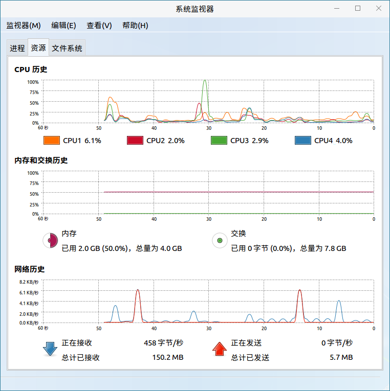
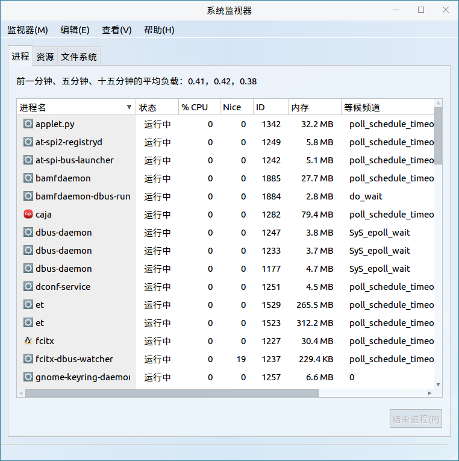
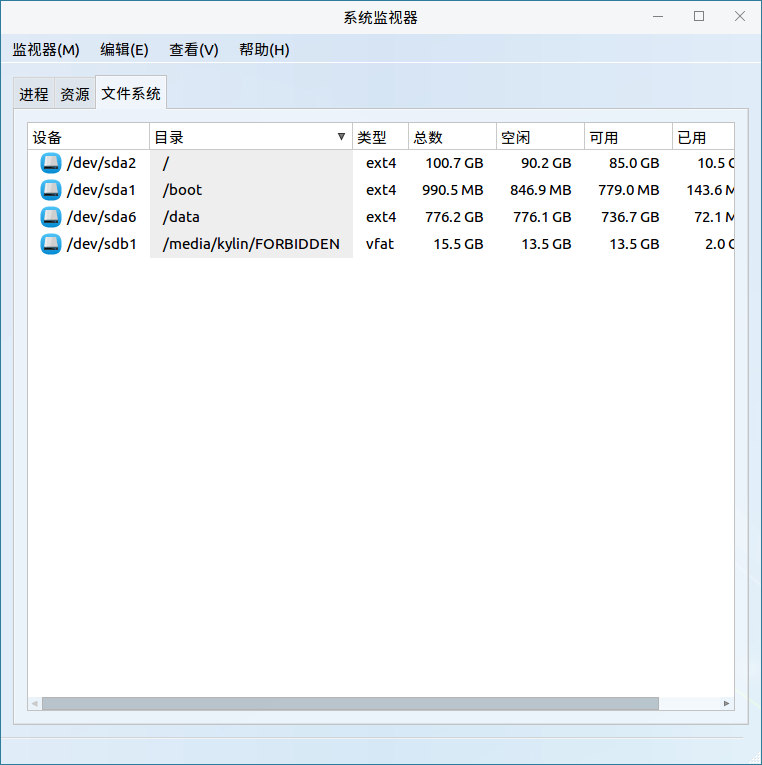
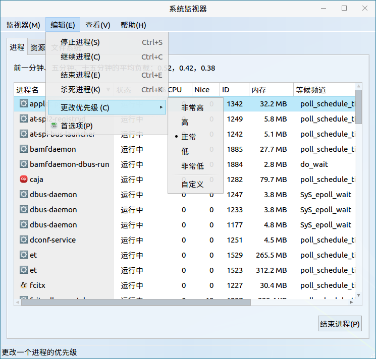
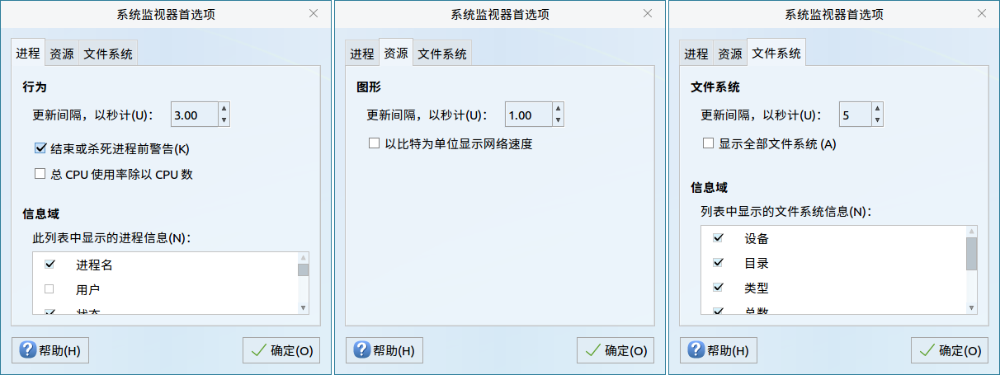
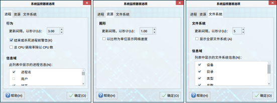

# 系统监视
## 系统监视器
系统监视器是一款可以查看进程、资源、文件系统的图形化系统应用工具，能动态地监视系统的使用情况，如图 1所示。

 

### 基本功能
#### 进 程
查看当前系统所运行的进程信息，如图 2所示。

#### 资 源
动态地查看当前系统运行时，所使用的资源信息，如图 1所示。

#### 文件系统
查看挂载的文件系统信息，如图 3所示。

 

### 高级功能
#### 编 辑
点击菜单栏上的“编辑”，可停止/继续/结束/杀死进程，修改进程进行优先级，如图 4所示。

#### 首选项
点击“编辑” > “首选项”，可对进程、资源、文件系统进行设置，如图 5所示。

#### 查 看
点击菜单栏上的“查看”，可查看相应进程、进程间的依赖关系、选中进程的内存映像、属性等。

### 附 录
#### 快捷键

| 快捷键 | 功能 |
| :------------ | :------------ |
|Ctrl + Q| 退出
|Ctrl + S| 停止进程
|Ctrl + C| 继续进程
|Ctrl + E| 结束进程
|Ctrl + K| 杀死进程
|Ctrl + D| 查看进程间的依赖关系
|Ctrl + M| 查看当前内存映像
|Ctrl + R| 刷新进程

 

## 麒麟磁盘I/O监视器
用户可通过“开始菜单” > “所有程序” > “麒麟磁盘I/O监视器”打开该应用。磁盘I/O监视器提供了对当前磁盘读写速率的显示，主界面如图 6所示：

- 在窗口顶部，实时显示了当前磁盘的总读/写速率和实际读写速率。

- 下部信息显示区包含了线程ID，所属用户，磁盘读、写速率，swap交换百分比和线程/进程的命令。

