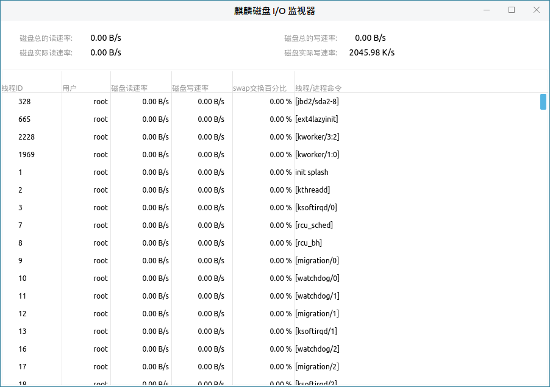

# 系统监视器帮助手册

## 1. 概 述
系统监视器是一款可以查看进程、资源、文件系统的图形化系统应用工具，能动态地监视系统的使用情况，主界面由标题栏、菜单及监视显示区构成，如图1所示。

 

## 2. 基本功能
基本功能图标及其功能介绍：

 

### 2.1. 进 程
用户通过点击监视显示区的“进程”即可查看当前系统所运行的进程信息，如图1所示。
### 2.2. 资 源
用户通过点击监视显示区的“资源”即可动态地查看当前系统运行时，所使用的资源信息，如图3所示。

 

### 2.3. 文件系统
用户通过点击监视显示区的“文件系统”即可查看文件系统信息，如图4所示。

 

## 3. 高级功能
用户可以通过菜单的监视器、编辑、查看、帮助选项，对系统监视器进行相关操作。
高级功能图标及其功能介绍：

 

|图标|	图标功能说明	|图标|	图标功能说明
| :------------ | :------------ | :------------ | :------------ |
||退出系统监视器||对系统监视器进行相关设置
||刷新系统监视器||	查看用户手册
||关于系统监视器||||
	

##### 表 1 高级功能图标及其功能介绍
 

### 3.1. 监视器
用户通过点击：菜单>监视器，可选择退出系统监视器。
### 3.2. 编 辑
用户通过点击：菜单>编辑，可对进程进行停止、继续、结束、杀死等操作。
#### 3.2.1. 更改优先级
用户通过点击：菜单>编辑>更改优先级，可对进程进行优先级更改，如图6所示。

 

#### 3.2.2. 首选项
用户通过点击：菜单>编辑>首选项，可对进程、资源、文件系统进行设置，如图7所示。

 

### 3.3. 查 看
用户通过点击：菜单>查看，可查看相应进程、进程间的依赖关系、选中进程的内存映像、属性等。

### 3.4. 帮 助
#### 3.4.1. 目 录
用户通过点击：菜单>帮助>目录，可查看用户手册，如图8所示，

 

#### 3.4.2. 关 于
用户通过点击：菜单>帮助>关于，可查看关于系统监视器的信息，如图9所示，

 

## 4. 常见问题
（待补充）
## 5. 附 录
### 5.1. 快捷键

|选项	|快捷键	|操作内容
| :------------ | :------------ | :------------ |
|退出（Q）	|Ctrl+Q|	退出系统监视器
|停止进程（S）|	Ctrl+S|	停止当前选择进程
|继续进程（C）|	Ctrl+C|	继续当前选择进程
|结束进程（E）|	Ctrl+E|	结束当前选择进程
|杀死进程（K）|	Ctrl+K|	杀死当前选择进程
|依赖关系（D）|	Ctrl+D|查看进程间的依赖关系
|内存映像（M）|	Ctrl+M	|查看当前内存影响
|打开的文件（F）|	Ctrl+F|	打开当前进程文件
|刷新（R）|	Ctrl+R|	刷新进程
|目录（C）|	F1	|查看用户手册

 
