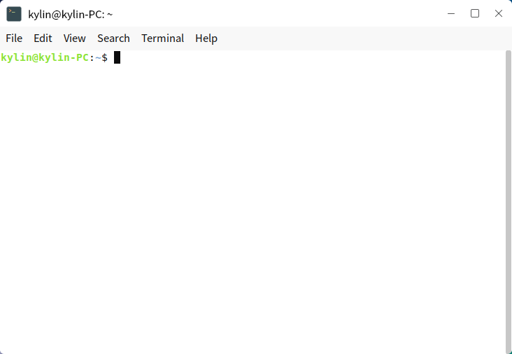
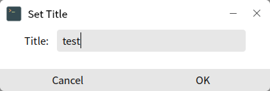
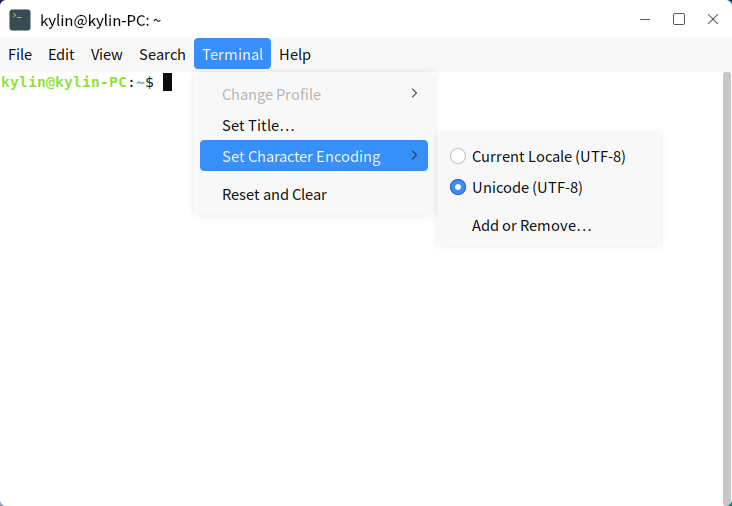
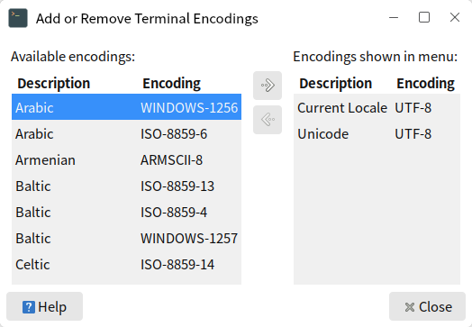
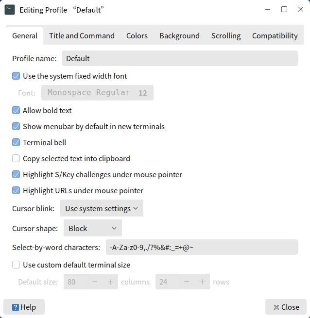
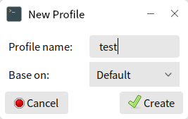

# Mate Terminal
## Overview
Mate Terminal provides a graphic interface of charaters system. The main interface as shown in Fig 1.

 

## Basic Function
- Charaters system

- Execute commands and scripts

- Use the applications/services only running in terminal

 

## Advanced Function
### Single Settings
Only effective in the current window, and invalid after closing.

- Title

Click "Terminal" > "Set Title" to modify the current window's name, as shown in Fig 2.

- Charater Encoding

Click "Terminal" > "Set Charater Encoding" to adjust it.

It provides multiple encodings in "Add or Remove".

- Window Size

Click "View" to set the current window "Full Screen", "Zoom In", "Zoom Out". And the words in this window will zoom in/out together.

### Profile Preferences
The settings in profile are permanent and apply to all new windows. There exist a profile "Default", and users can select "Edit" > "Profile Preferences" to modify it.

Click "File" > "New Profile" or "Edit" > "Profiles" to create a new configuration based on a existed profile. 

 

## Q&A
#### The output content is too much to view them completely through scrolling
It caused by a limit on the number of columns rolled back.

Click "Edit" > "Profile Preferences" and check "Unlimited" in "Scrolling" tab.

 

## Appendix
### Shortcut Key

| Shortcut | Function |
| :------------ | :------------ |
| Ctrl + Alt + T  |  Open a new ternimal window |
| Ctrl + Shift + T | Open a new tab in the current terminal window |
| Ctrl + D  | Close the current window/tab |
| F11 | Fullscreen/Quit Fullscreen |

More shortcuts can be seen or modified by "Edit" > "Keyboard Shortcuts".

