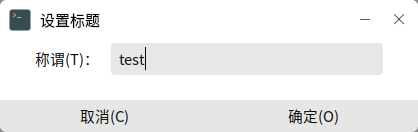
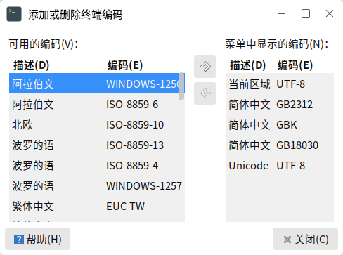
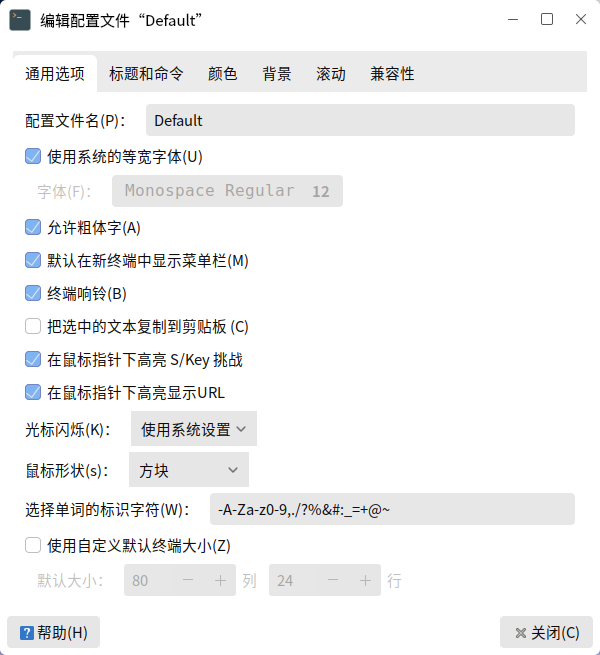

# 终 端
## 概 述
终端提供了在图形界面下的字符系统窗口，用户可通过开始菜单 > 终端打开应用，主界面如图1所示。

 

## 基本功能
- 字符系统

- 执行各种命令、脚本

- 使用仅在终端运行的应用/服务

 

## 高级设置
### 单项设置
仅对当前窗口产生影响，窗口关闭后立即失效。

- 窗口标题

点击菜单栏上的终端 > 设置标题，即可修改终端窗口的名称。如图2所示。

- 字符编码

字符编码也称字集码，是把字符集中的字符编码作为指定集合中的某一对象，以便文本在计算机中显示和传递。

点击菜单栏上的终端 > 设定字符编码，用户可对编码进行调整。

在“添加或删除”中，可看到更多的编码选项。

- 调整窗口大小

点击菜单栏上的“视图”，可设置当前窗口全屏、放大、缩小。此处的放大/缩小，会连带着窗口中的文本一起放大/缩小。

### 配置文件
配置文件中的设置是永久生效的，并适用于所有新建窗口。应用自带了Default配置文件。用户可通过编辑 > 配置文件首选项，修改配置。

也可通过文件 > 新建配置文件，或编辑 > 配置文件，基于某个配置文件创建新配置。

 

## 常见问题
#### 输出内容过多时，滚动查看不完全
这是对回滚的列数做了限制导致的。

选择编辑 > 配置文件首选项 > “滚动”标签页，在“回滚”处勾选“不限制”，这样就可以回滚到开头，完整查看。

 

## 附 录
### 快捷键

|  快捷键 |  功能|
| :------------ | :------------ |
| Ctrl + Alt + T  |  打开新终端窗口 |
| Ctrl + Shift + T | 在终端窗口中打开新标签页  |
| Ctrl + D  | 关闭当前窗口/标签页  |
| F11  |  全屏显示/退出全屏 |

更多快捷键可通过编辑 > 键盘快捷键查看或修改。

