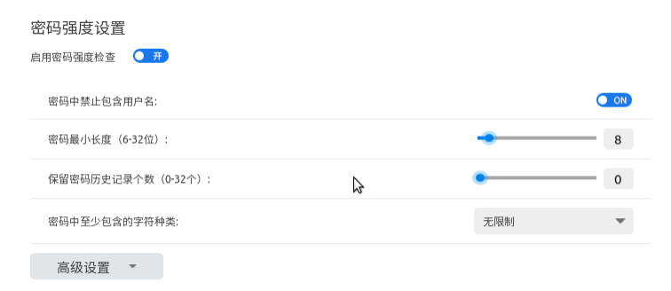
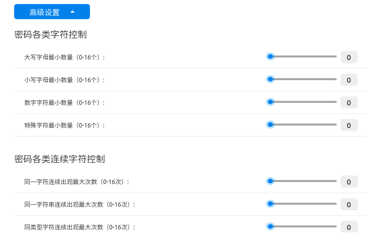
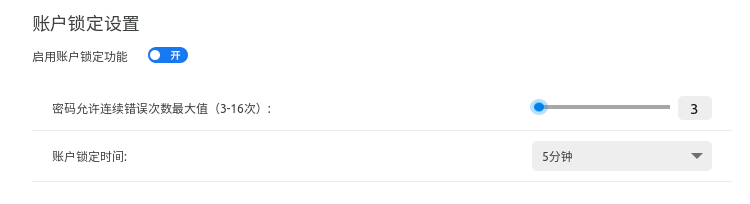
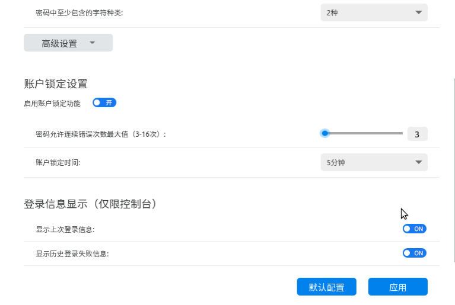

# 麒麟账户安全配置工具
## 概 述
麒麟账户安全配置工具是由麒麟安全团队开发的一款程序，界面简洁，旨在为用户提供高效的系统账户安全策略定制手段。通过可视化交互，给用户提供友好的交互体验。

麒麟账户安全配置工具位置：开始菜单 > 所有软件 > 麒麟账户安全配置

软件打开后，界面如下图所示：

点击麒麟账户安全配置工具启动窗口中间的“策略配置”按钮，即可进入策略配置主窗口，其中包括密码强度设置、账户锁定设置和登录信息显示三个功能模块。

- 密码强度设置：支持用户自定义系统账户的密码强度。

- 账户锁定设置：启用该功能后，同一账户连续登录失败次数超过限定值，会被锁定一段时间，在此期间，该账户不能再次登录系统。

- 登录信息显示：此功能只对终端登录情况有效（即通过命令行方式登录系统），用户可选择需要显示的历史登录信息。

 

## 基本功能
### 密码强度
可以对系统账户密码复杂度进行设置，基础密码强度设置包含密码长度设置、密码字符种类设置等，如下图所示：

密码强度高级设置允许对密码强度做更复杂的设置，如限定密码包含各种字符最小、最大数量，同一字符在密码中连续或累计出现最大数量，界面如下图所示：

### 账户锁定
用户可选择是否启用账户锁定功能，开启该功能后，需设置密码错误阈值与锁定时间，如下图所示：

### 登录信息显示
该功能仅在终端登录环境中有效（即通过命令行方式登录），能够设置是否在终端上显示账户上次的登录信息，上次成功登录后累计失败次数，如下图所示：

除了自定义各项策略，还可以通过点击策略配置窗口右下方“默认设置”按钮，导入配置工具的默认策略。

更改账户安全策略后，需点击策略配置窗口右下方“应用”按钮，所做更改即可生效。

