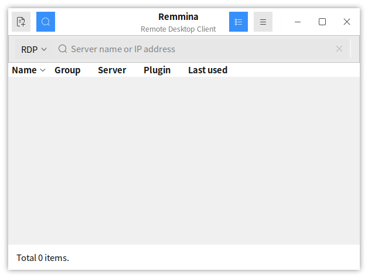
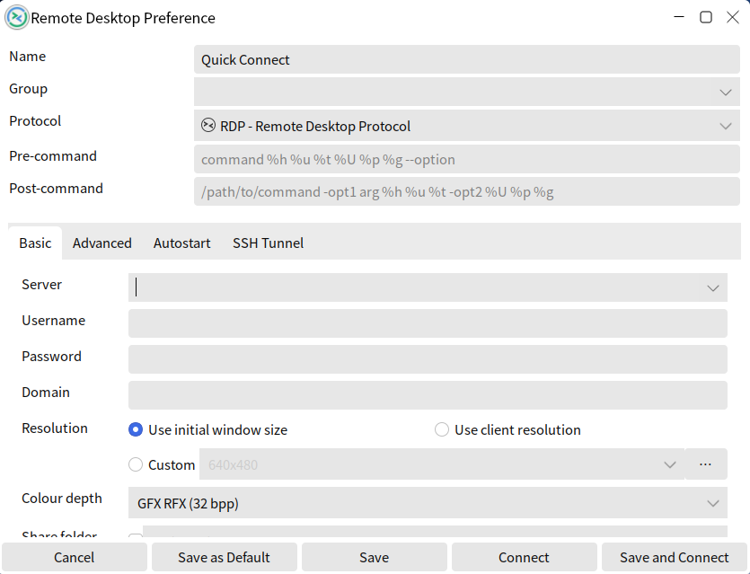
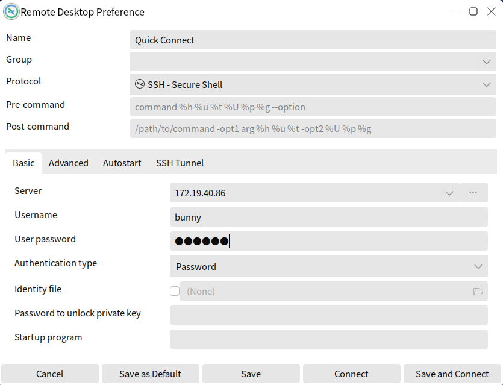
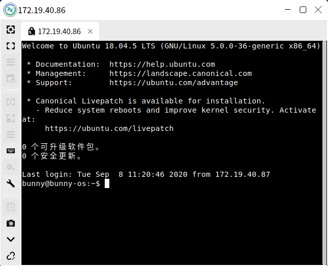
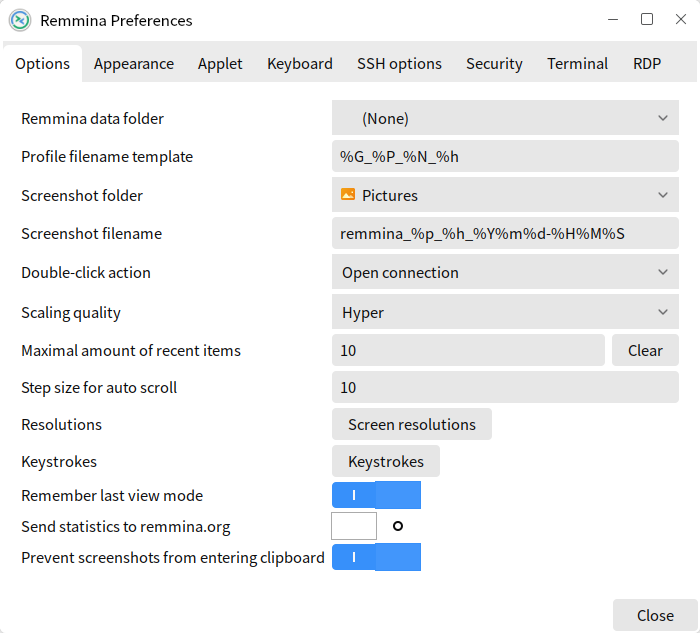

# Remmina
## Overview
Remmina can connect to other computers by VNC, SSH or RDP. The main interface as shown in Fig 1.

 

## Basic Function
### Create New Connection
Take SSH, and connect to IP: 172.19.40.86 for example.

1) Click "" to pop up a setting window, as shown in Fig 2.

2) Select SSH protocol, and input the ip "172.19.40.86" in the server box, "Username" and "User password" are the remote computer's name and password. And then click "Connect".

3) The connected interface as shown in Fig 4.

#### Preferences
Click "" and select "Preferences" to get more settings options, as shown in Fig 5.

 

## Advanced Function
Here are some tools:

| Icon | Function | Icon | Function |
|:-----|:-----|:-----|:-----|
|| Fullscreen |  | Grab all keyboard events |
|| Copy/Paste/Select all/Keystrokes || Screenshot |
|| Minimize |  |  Disconnect |

