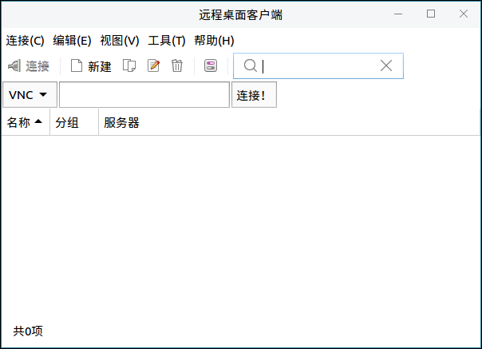
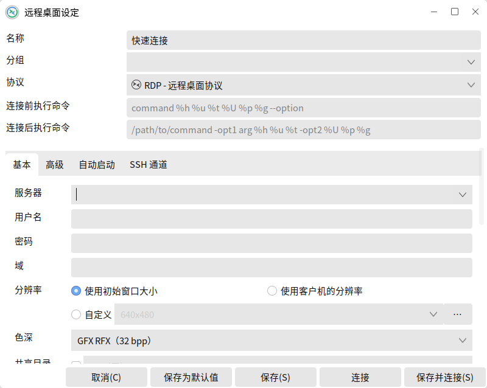
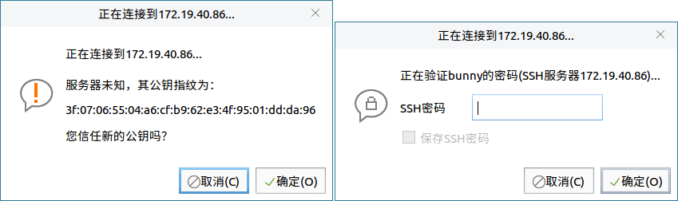
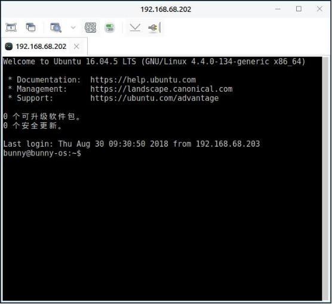
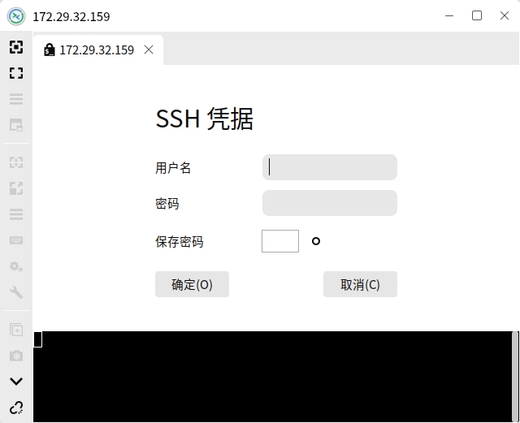
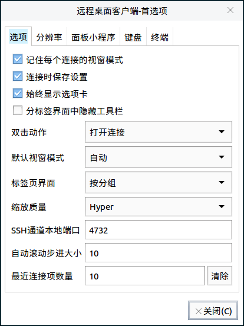

# 远程桌面客户端
## 概 述
远程桌面客户端可通过VNC，SSH，RDP远程协议连接计算机。主界面如图1所示。

 

## 基本功能
### 新建远程连接
以SSH协议，连接 172.29.35.116 的计算机为例。

1）点击“”，弹出远程桌面设定界面，如图2所示。

2）选择SSH协议,“服务器”框中输入目标计算机IP地址：172.29.35.116，“用户名”和“用户密码”为目标计算机的名称和密码。完成后，点击“连接”。

3）连接上的界面如图4所示。

4）或是直接在主界面上选择SSH，并输入目标计算机的IP，在弹出窗口填写信息。

#### 首选项
点击“”，选择“首选项”，可对远程桌面客户端进行设置，如图6所示。

 

## 高级功能
在已连接的窗口，提供了一些工具。如下表所示，为部分说明。

| 图 标 | 功能说明 | 图 标 | 功能说明 |
|:-----|:-----|:-----|:-----|
|| 全屏 |  | 俘获所有键盘事件 |
|| 复制/粘贴/全选/键盘监听 || 截屏 |
|| 最小化窗口 |  |  断开连接 |

