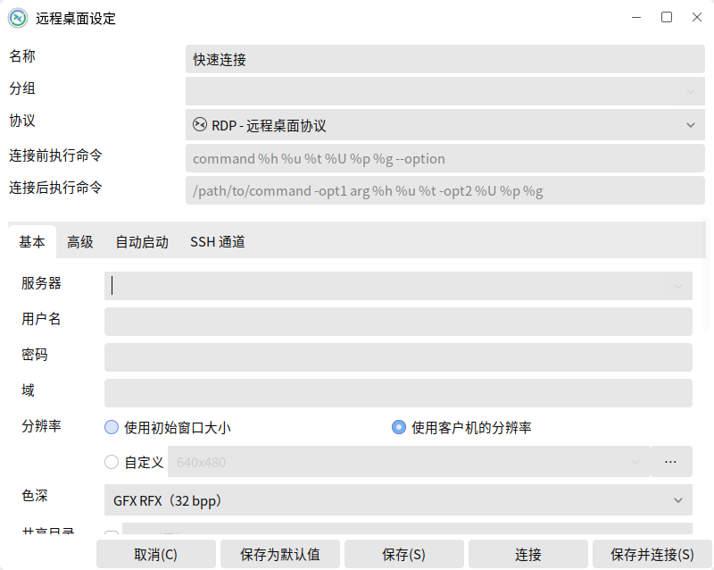
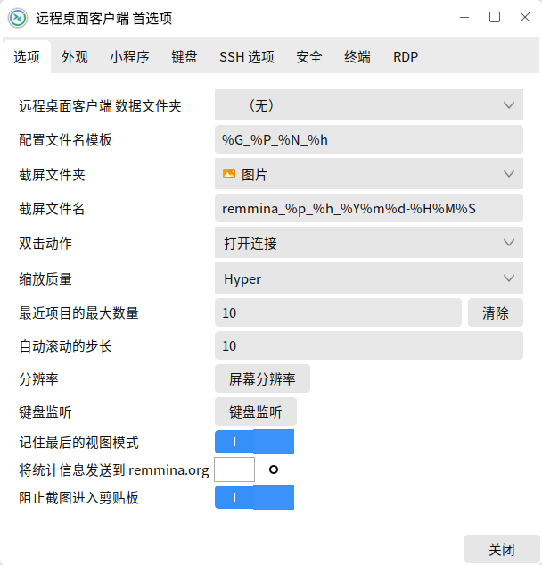
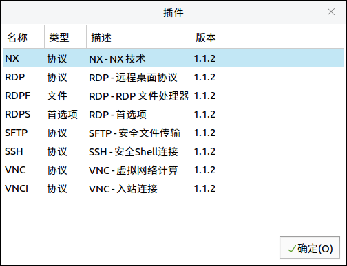

# 远程桌面客户端
## 概 述
远程桌面客户端可以通过VNC和SSH协议远程连接计算机。主界面如图 1所示。

 

## 基本功能
图标功能介绍:

| 图标 | 功能说明 | 图标 | 功能说明
| :------------ | :------------ | :------------ | :------------ |
||打开选定的远程桌面文件的连接 ||新建一个远程桌面文件
||为选定的远程桌面文件建立副本 ||编辑选定的远程桌面文件
||删除选定的远程桌面文件 ||打开首选项对话框

 

### 新建远程连接
以SSH协议为例,连接172.19.40.86的计算机。

1）首先确认这两台计算机的sshd服务都是运行的。

点击“”图标，或点击“连接” > “新建”。

“服务器”框：输入IP地址 172.19.40.86

“SSH验证” - “用户名”：输入被连接计算机的名称

2）点击“连接”，并输入SSH密码（若首次连接目标机器，需要信任新公钥）。

3）验证通过后，界面如图 4所示。

### 首选项
用户通过点击“”图标，或点击“编辑” > “首选项”，进入设置界面，如图 5所示。

 

## 高级功能
### 视 图
点击“视图”设置显示在主界面上的条目，如图 6所示。

### 导入 & 导出
点击“工具” > “导入”，导入一个其他连接文件；点击“工具”/“导出”，生成一个连接的配置文件，如图 7所示。

### 插 件
点击“工具” > “插件”可查看当前插件的信息，包括名称、类型等，如图 8所示。

 

## 附 录
### 快捷键

| 快捷键 | 功能 |
| :------------ | :------------ |
|Ctrl + O | 连接
|Ctrl + N | 新建
|Ctrl + C | 复制
|Ctrl + E | 编辑
|Ctrl + D | 删除
|Ctrl + X | 关闭
|Ctrl + P | 首选项
