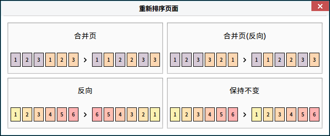

# 扫描易帮助手册
## 概 述
扫描易是一款简易的用于文件扫描的工具软件，其主界面由标题栏、菜单、功能控制区及显示区四部分构成，如图1所示。

 

## 基本功能
主界面介绍：

图标及其功能介绍：

|图标	|图标功能说明	|图标|	图标功能说明|
|:-----|:-------|:---------|:----------|
||	开始一个新的文档	||	从扫描仪扫描一个单页
||	保存	||	左旋页面（逆时针）
||	右旋页面（顺时针）	||	裁剪选中的页面

 

### 扫 描
用户通过点击“”图标，对需要扫描的文件进行设置：扫描单页、扫描从扫描仪传送来的所有页面、扫描成文本、扫描成照片，如图3所示。

### 剪 裁
用户通过点击“”图标或选择菜单 > 页面 > 剪裁，对扫描后的当前页面进行裁剪，如图4所示。剪裁的格式有：A4、A5、A6、信件、法定、4*6、自定义、旋转剪裁。

 

## 高级功能
用户可以通过菜单的文档、页面、帮助选项，对扫描易进行相关操作。

主界面介绍：

图标及其功能介绍：

|图标|	图标功能说明	|图标|	图标功能说明
| :------------ | :------------ | :------------ | :------------ |
||	新建一个扫描文件	||	保存当前扫描后的文件
||	将扫描后的文件另寻为...||		电子邮件
||	打印扫描后的文件	||	对扫描进行相关设置
||	退出扫描易	||	复制当前页面
||	删除当前扫描页面	||	查看用户手册
||	关于扫描易信息	||||
	
 

### 文 档
用户可以通过点击：菜单 > 文档，进入到文档选项，对扫描文档进行扫描、保存等操作，如图6所示。

#### 重新排序页面
用户可以通过点击：菜单 > 文档 > 重新排序页面，进入到重新排序页面选项，可对页面进行如图7所示操作。

#### 打 印
用户可以通过点击：菜单 > 文档 > 打印，进入到打印选项，可对页面进行打印设置如图8所示。

#### 首选项
用户可以通过点击：菜单 > 文档 > 首选项，进入到首选项选项，可对扫描来源、文字/图片分辨率、扫描页面大小等参数进行设置，如图9所示。

### 页 面
用户可以通过点击：菜单 > 页面，进入到页面选项，对扫描页面进行旋转、剪裁、左右移动、复制、删除操作，如图10所示。

### 帮 助
用户可以通过点击：菜单 > 帮助，进入到帮助选项，如图11所示。

#### 内 容
用户可以通过点击：菜单 > 帮助 > 内容，跳转到用户手册。

#### 关 于
用户可以通过点击：菜单 > 帮助 > 关于，查看扫描易的信息，如图12所示。

 

## 常见问题
### 无法扫描文件
如图13所示，当显示没有发现扫描仪或扫描失败时，请检查您的扫描仪已经连接并且打开。

 

## 附 录
### 快捷键

|选项	|快捷键|	操作内容
 |:------------ | :------------ | :------------ |
|新建（N）|	Ctrl+N|	新建一个扫描文件
|单页（P）|	Ctrl+1|	扫描当前页面
|传送来的所有页面（F）|	Ctrl+F|	扫描所有页面
|停止扫描（S）|	Esc	|停止当前扫描任务
|保存（S）|	Ctrl+S	|保存当前扫描页面或文件
|另存为（A）|	Shift+Ctrl+S	|将当前页面另存为...
|电子邮件（E）|	Ctrl+E	|将当前页面或文件通过邮件发送
|打印（P）|	Ctrl+P	|打印当前扫描的页面或文件
|退出（Q）|	Ctrl+Q	|退出扫描易
|向左旋转（L）|	[	|将当前页面向左旋转
|向右旋转（R）|	]	|将当前页面向右旋转
|左移	|<	|页面左移操作
|右移	|>	|页面右移操作
|复制（C）|	Ctrl+C	|复制当前扫描页面
|删除（D）|	Delete	|删除当前扫描页面

