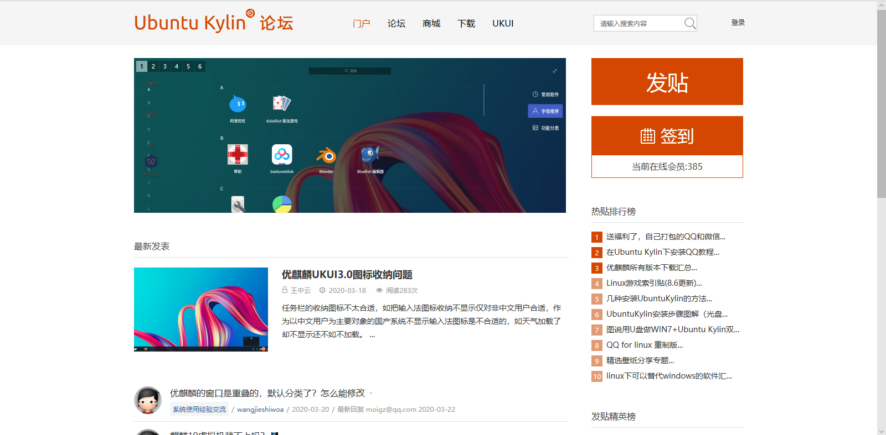
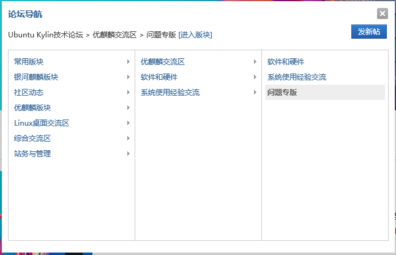
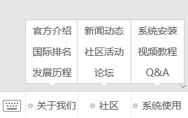
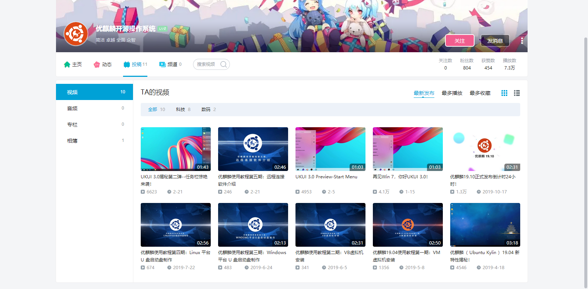
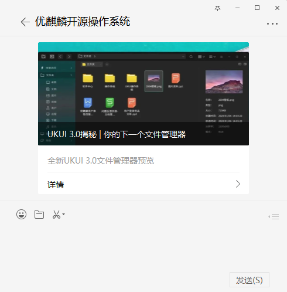
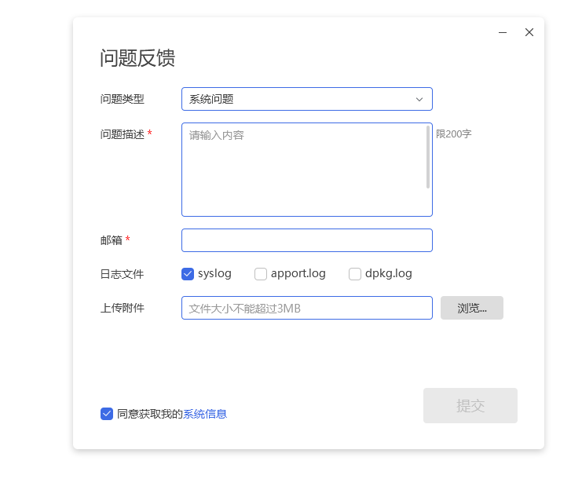
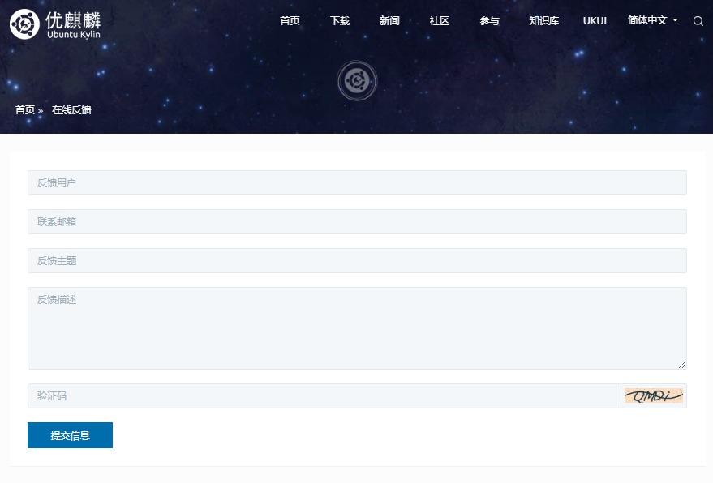

# Technical Services

UKUI is a lightweight desktop environment based on pluggable framework for Linux and other Unix-like Distributions.Developed using Qt, which is powered by the Ubuntu Kylin open source operating system by default, it provides a simpler and more enjoyable experience for browsing, searching and managing your computer.

## Official Channels

In order to ensure the timely update and feedback during the installation, operation and maintenance process, we provide the following official channels for feedback and assistance.

### Technical Support

**Official website**: [www.ubuntukylin.com](http://www.ubuntukylin.com)

### Ubuntu Kylin Forum

If you encounter any problems that require feedback during the process, you can post to the forum: [www.ubuntukylin.com/ukylin/forum.php](https://www.ubuntukylin.com/ukylin/forum.php)
* Note: Posting to the forum requires registration in the forum and a 900-minute wait before proceeding.

From the forum navigation window, select the common questions that you need feedback on, such as Ubuntu Kylin Board > Ubuntu Kylin Communication Area > Questions Board > Click "Post a new post".

### WeChat Public Platform
Ubuntu_Kylin

The WeChat menu is divided into three sections: About Us, Community, and System Use.

#### (1) About Us
In this section, you can view official profiles, international rankings, development history and more.
#### (2) Community
In this section, you can view community news updates, community events, and direct links to the forum.
#### (3) System Use
In this section, you can view the system installation information, video tutorials, and communicate your suggestions, questions and feedback directly with us through Q&A.

##### System Installation

##### Video Tutorials

The video tutorials provided by Ubuntu Kylin Public are directed to the BiliBili:

###### Q & A
The Q&A contains feedback on installation, startup, wireless card, graphics card, system use, etc. ,users can find the answers according to the tags.If you don't find a satisfactory answer, drop us a line in the background of the WeChat public platform of the Ubuntu Kylin.

### Tweets
[Ubuntu Kylin Community Weibo] (https://weibo.com/goodkylin)

### Community Mailbox
contact@ubuntukylin.com

### User Feedback  In  System

### Online Feedback From The Official Website

### UbuntuKylin Wiki

Users can Search for solutions to common problems at : [**UbuntuKylin Wiki**](https://ubuntukylin.github.io/).

## Service Guarantees

In order to enable customers to enjoy attentive, perfect, technically professional and image friendly service, and to provide a strong guarantee for the service enjoyed by customers, our **Long Term Support Version (LTS)** provides 5 years of renewal and maintenance, **Short Term Support Version** provides 9 months of renewal and maintenance.

