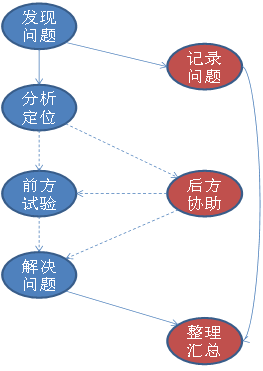

# 技术服务
## 技术服务体系
为实现全国客户服务统一管理，为客户提供标准化服务，保障在服务有效期内的签约用户获得全方位的产品服务与技术支持，天津麒麟公司构建了一套完整的服务体系。该体系包括专业安全服务、项目实施管理、安全培训和系统售后服务等一系列内容。

天津麒麟公司不仅向客户提供全面安全解决方案、各项应用工具和在业界领先的产品，还为客户提供各类方案管理所需的管理决策咨询、安全咨询、培训以及卓越的售后服务。

### 安全专家服务
由天津麒麟公司资深信息安全专家组成，能及时跟踪和分析研究最新的信息安全案例和攻击手段。

### 区域技术支持中心
天津麒麟公司总部在天津，同时在北京、长沙、天津设立了区域技术支持中心，各中心专业技术人员可独立承担该区域内的专业技术服务。

|天津麒麟公司	|详细信息|
| :------------ | :------------ |
|天津总部|	地址：天津市滨海新区海洋高新技术开发区信安创业广场3号楼
||电话：022-58955650
||传真：022-58955651
||邮编：300450
|北京营销中心|	地址：北京市海淀区蓝靛厂东路金源时代商务中心A座18D
||电话：010-88878781；010-88878791；010-88878792
||传真：010-88878782
||邮编：100097
|长沙分公司|	地址：长沙市开福区三一大道156号工美大厦10楼
||电话：0731-88280170
||传真：0731-88280166
||邮编：410073

 

### 服务支持体系概述
天津麒麟公司拥有多种服务团队，精细的服务分工和完善的服务内容，通过成熟的服务体系，为重点客户配备专业的支持团队。重点客户的技术支持团队具体配置如下。

|角色	|职责
| :------------ | :------------ |
|项目经理	|项目资源的协调和控制
|主管工程师|	技术问题的解决、分派和跟踪
|技术支持工程师|	系统的日常运行监控和故障维护
|技术顾问|	重大技术问题攻关和机理分析反馈
|产品研发责任工程师|	产品质量问题跟踪
|质量师	|参照GJB 5000A执行过程管理

 

### 基本服务支持类型
#### 现场支持和应急服务
a）如在法定工作日发生系统崩溃等紧急问题，技术工程师在接到客户问题报告后0.5小时内提供电话响应或在线支持服务。并在4小时内赶到现场进行技术维护；

b）如在法定工作日发生非系统崩溃性常规问题，技术工程师在接到客户问题报告后2小时内提供电话响应或在线支持服务。并根据客户的要求和实际情况在8小时内赶到现场进行技术维护；

c）如在节假日发生系统崩溃等紧急问题，技术工程师在接到客户问题报告后2小时之内提供电话响应或在线支持服务，并在8小时内赶到现场进行技术维护；

d）如在节假日发生非系统崩溃性常规问题，技术工程师在接到客户问题报告后4小时内提供电话响应或在线支持服务。并根据客户的要求和实际情况在24小时内赶到现场进行技术维护；

e）对于异地客户的现场技术服务响应时间将根据实际情况控制在48小时内（还可根据项目实际情况设驻场工程师提供直接服务）。

#### 远程电话支持
5 x 8技术服务热线支持。

#### 服务支持流程

### 服务保障
为使客户能够享受到周到、完美、技术专业、形象亲和的服务，为客户享有的服务提供有力保障，天津麒麟公司制定了完美的服务保障措施，包括服务质量监控、服务报告制度、客户满意度调查制度、异常情况处理措施，全方位保障客户享受的服务质量。

#### 服务质量监控
天津麒麟公司建立了完备的服务质量监控体系，加强服务项目的严格管理，从主动监控和被动监控两方面进行服务质量的监控。主动监控主要是通过定期提供服务报告，发现问题。被动监控主要是建立客户服务投诉专线，并借助成熟的公司级客户满意度调查体系进行监控。

#### 服务报告制度
为确保项目工程的服务质量，并让客户更清晰地了解服务实施情况，天津麒麟公司技服中心将定期提供服务实施报告（具体时间按双方协商确定）。内容包括该时间段的实施服务的类型、数量、解决方案、安全策略建议，使客户可以全面了解设备的运行状况，以便做出正确的选择。

#### 客户满意度调查制度
天津麒麟公司拥有完善的服务质量监控体系，每季度均由公司直属的中立部门，采取电话回访客户、上门拜访等方式，对公司各个部门的工作质量进行客户满意度调查。

#### 异常情况处理
天津麒麟公司建立客户服务投诉专线，按照公司客户服务的投诉处理流程准确及时地处理客户的投诉；如果一线服务机构提供的服务不能满足客户的需求，客户有权要求公司调整一线服务机构。

#### 联系方式
服务热线：400-089-1870

官方网站：http：//www.kylinos.cn

 

## 结束语
多年来，麒麟团队通过坚持军民融合、自主创新、并深度融入国际开源社区的方式，形成了一只具有强大凝聚力和雄厚科研能力的核心技术团队，在国内外操作系统行业中独领风骚。
银河麒麟操作系统及相关软硬件产品和解决方案已经在政府、军队、军工、电力、电信、金融、能源、交通、邮政、教育等行业以及国家援外项目中得到了成功应用，并将进一步联合其他芯片、整机、数据库、中间件、应用软件和系统集成企业，共建安全可控信息系统示范产品及生态环境。
