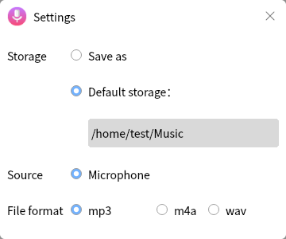
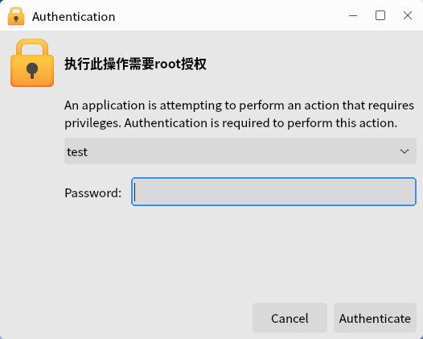
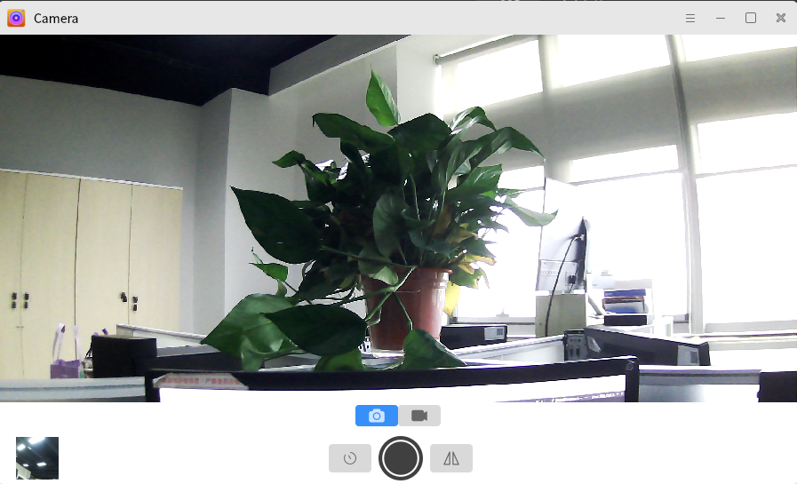

# Tools
## Cheese
Take photos and record videos. Users can add some visual effects. The main interface as shown below.

### Basic Function
- : The settings of photos, videos and burst.

- "Cheese Menus" > "Preferences" : The detail settings of webcam, image and capture.

 

### Shortcut Key

| Shortcut | Function |
| :------------ | :------------ |
| F11 |	Fullscreen |
| Ctrl+Q | Quit |

 
 

## Mate Calculator
Provide 4 modes of the calculate to meet the needs of conventional calculation. The main interface as shown below.

### Basic Function
Click "Mode" to change the mode of the calculator.

- **Advanced**

- **Financial**

- **Programming**

### Shortcut Key

| Shortcut | Function |
| :------------ | :------------ |
| Ctrl+C | Copy |
| Ctrl+V | Paste |
| Ctrl+Z | Undo |
| Shift+Ctrl+Z | Redo |
| Ctrl+Q | Quit |

 
 

## Screenshot
It can grab the whole desktop, the current window, and a selected area. The main interface as shown below.

### Shortcut Key

| Shortcut | Function |
| :------------ | :------------ |
| PrtSc | Grab the whole desktop |
| Ctrl + PrtSc | Grab the current window |
| Shift + PrtSc	| Select area to grab |

 
 

## Onboard
Show a soft keyboard on the screen, and users can input by it. The main interface as shown below.

### Basic Function
Icons and Function:

| Icon | Function | Icon | Function |
| :------------ | :------------ | :------------ |:------------ |
|| Open/Close caps||Open caps once
||	Open Alt||	Backspace
||	Enter	||	Hide onboard
||	Toggle click helpers || Move onboard
||	Main keyboard || Number block and snippets
||	Sinppets||||

 

#### Click Helpers
Click "" to toggle click helpers, as shown below.

|Icon| Function | Icon | Function |
| :------------ | :------------ | :------------ |:------------ |
||	Middle click || Right click
|| Double click || Drag click
|| Activate hover click||||

 

#### Preferences
Click  to set the layout, window, theme, etc. of Onboard.

 
 

## Mate Search Tool
It provides various rules to search files in the corresponding directories.

### Basic Function
Inputting the keywords in "Name contains" and select the folder, click "Find" to get the result.

### Advanced Function
Click "Select more options" to open the menu. Users can "Remove"/"Add" various options.

The available options as shown below.

 
 

## Sharing Desktop
Users can make settings related to desktop sharing through this app.

### Basic Function
#### Sharing
Check "Allow other users to view your desktop" to open desktop sharing; Users can also choose whether to allow others to control their desktop.

#### Security
Users can customize if it's necessary to confirm each access, set access password, and automatially configure UPnP router to open and forward ports.

#### Show Notification Area Icon
Users can set the status of the icon displayed in the notification area: Always, Only when someone is connected, and Never.

 
 

## Blueman Manager
Connect to bluetooth devices, and transfer/receive files.

### Basic Function
Icon and Function:

| Icon | Function | Icon | Function |
| :------------ | :------------ | :------------ | :------------ |
|| Search for nearby devices || Add this device to list
|| Pair with device || Mark/Unmark as trusted |
|| Run the assistant ||Remove this device from list 
|| Send a file |||

 

#### Pair  
Click “” to pair with the selected device.

Showing "" means pair successfully.

### Advanced Function
- Preferences
Click "Adapter" > "Preferences" to set the name and the visibility.

- View
Click "View" to choose the parts shown on the interface, and the settings of plugins and local services.

