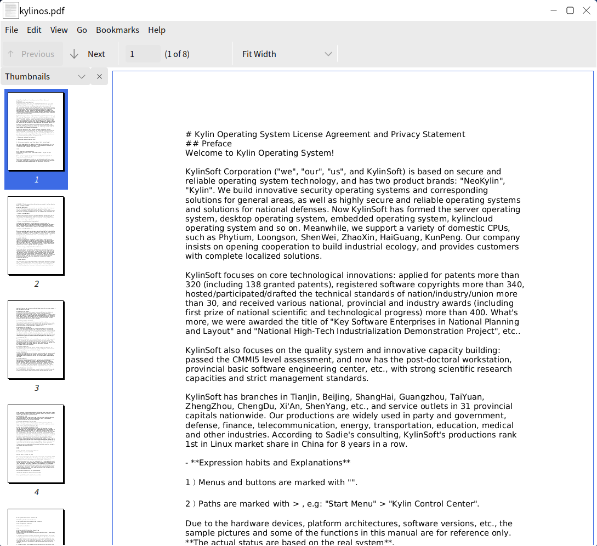
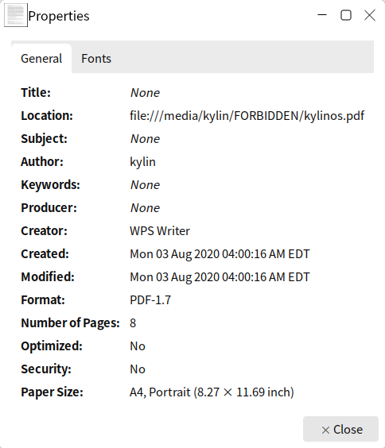
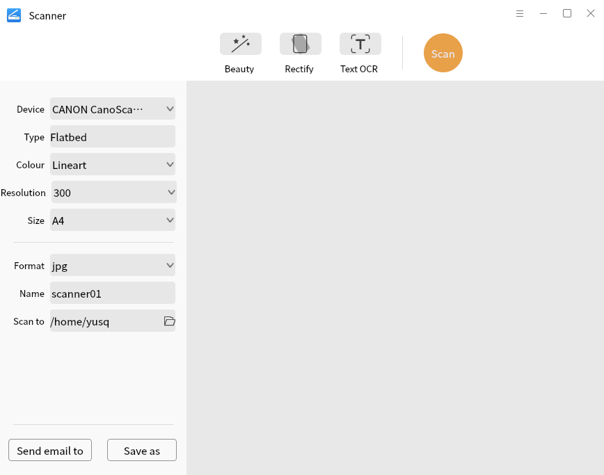

# Tools
## Onboard
Show a soft keyboard on the screen, and users can input by it. The main interface as shown in Fig 1.

- **Icon and Function**

| Icon | Function | Icon | Function |
| :------------ | :------------ | :------------ |:------------ |
||	Open/Close caps||Open caps once
||	Open Alt||Backspace	
||	Hide onboard||Toggle click helpers
||	Move onboard||Main board	
||	Number block and snippets||Sinppets

 

- **Click Helpers**

Click "" to toggle click helpers, as shown in Fig 2.

|Icon| Function | Icon | Function |
| :------------ | :------------ | :------------ |:------------ |
||	Middle click	||	Right click
|| Double click	||	Drag click
|| Activate hover click|||

 

Click  >  to set the layout, window, theme, etc. of Onboard.

 
 

## Atril Document Viewer
To view and read pdf files. 

- Click "" and "" to page-up and page-down.

- It provides page layout size options.

- The "View" on the menu bar can set the layout of the whole interface, and through the "File" can see the pdf's property.

 
 

## Display Switch
Press "Win + P" to select display mode, as shown in Fig 7.

- **Computer**

Only show all operations on the computer's screen.

- **Clone**

Show simultaneously both on the computer's screen and the projector.

- **Extend**

Use computer to do other operations without  interrupting projector display.

- **Output**

Only show all operations on the projector.

 
 

## Indicator China Weather
Indicator China Weather can get weather and living index informations, as shown in Fig 8.

Inputting city name in the searchbox, and it will show all the cities which are matching the keywords.

Click  and select "Add City" to see the collection list.

 
 

## Kylin Recorder
Kylin Recorder provides a simple audio recording function, as shown in Fig 10.

Click recording icon to enter recording interface.

Click  to pause/continue during recording. Click  to finish recording.

And the recording files will show on the right side automatically.

The settings interface as shown in Fig 12.

 
 

## Kylin Usb Creator
Kylin Usb Creator is used to make system boot U disks, as shown in Fig 13.

Select the iso file and U disk, and click "Start". It will ask for authentication, as shown in Fig 14.

Tips after finishing.

 
 

## Kylin Screenshot
Kylin Screenshot can capture any area on the current desktop and support to edit it simply. 

On the tools menu, here are: square, circle, straight line, arrow, pencil tool, mark, text, area blur.

After opening it, right click the icon on the tray menu and select "Open Launcher". Set the delay time and click "Take new screenshot".

 
 

## Kylin Calculator
Provide the function to meet the needs of conventional calculation, as shown in Fig 18.

Users can switch the mode by  at the top right corner.

 
 

## Kylin Camera
Kylin Camera is a photo software with friendly interface and easy to use, which is based on QT.

- Take a photo: Click the button to get the current photo of the camera, and it will be saved to local and displayed to the album.

- Video recording: Users can switch to video mode, and click the video button to record.

- Photo album: Click the photo album button to see the pictures and videos.

Open the setting interface can select delay photography, mirror image, etc..

 
 

## Kylin Scanner
Kylin Scanner is a user-friendly scanning software developed with Qt5. It provides scanning, beauty, rectify and text OCR functions.

1) When kylin scanner is opened, it will search and connect the device, and get the default parameters (color mode, resolution, paper size, etc.). The larger the resolution, the slower the scanning speed.

2) Click the "Scan" button in the upper right corner to scan.

3) After scanning, the image can be edited through the toolbar: crop, rotate, flip symmetrically and add watermark.

4) Beauty -- Increase contrast, sharpening and HDR effect to make the picture clearer.

5) Rectify -- Correct the image which is not in the center. And the image which is almost close to the center will not be corrected (the angle error is within 5°).

6) Text OCR -- Recognize the text of the scanned image, and save it as a text document.

 
 

## Plugins
### Notebook
To write down information at any time.

### Clock
It provides countdown, alarm clock, and stopwatch. Switch the functions through the top three icons.

