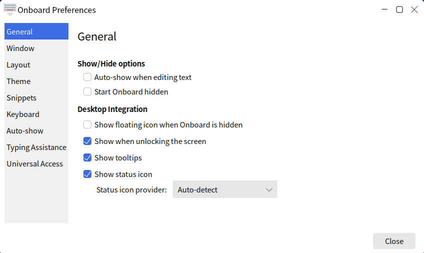
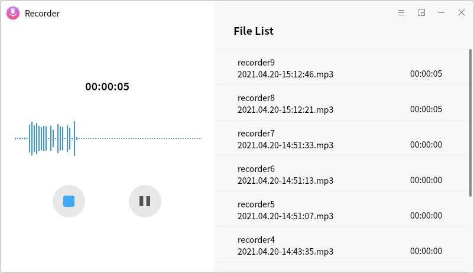
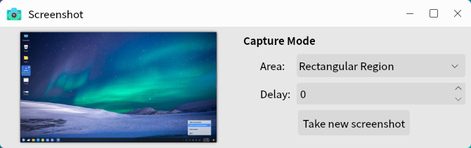
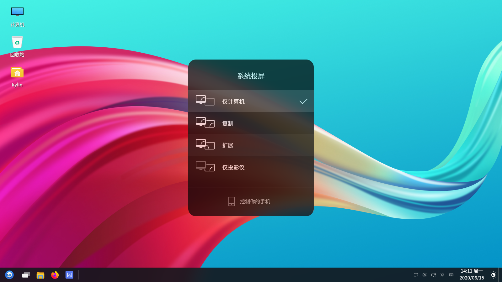

# 小工具
## 蓝牙管理器概述
蓝牙管理器是一款系统应用软件，可以连接/创建蓝牙网络，连接输入设备、音频设备，发送/接收/浏览文件等。主界面如图 1所示。

### 基本功能
主界面介绍：

图标及其功能介绍：

|图标	|图标功能说明|	图标|	图标功能说明
| :------------ | :------------ | :------------ | :------------ |
||	搜索附近的设备||将这个设备添加至已知设备列表
||	与设备进行配对||将这个设备标记/取消标记为信任
||	为此设备运行设置助理||将这个设备从已知设备列表中删去
||	向此设备发送文件||使用obrx ftp浏览这个设备

 

#### 查找设备
用户通过点击“”图标，可对附近蓝牙设备进行搜索，如图 3所示。

#### 配 对  
用户通过点击“”图标或单击鼠标右键选中的设备，可对选中的设备进行配对，如图 4所示。

当出现配对图标“”时，表明配对成功，如图 5所示。

#### 标记或取消信任
用户通过点击“”图标或单击右键选中的设备，可将当前设备标记为信任，如图 6所示。

#### 设置助理
用户通过点击“”图标或单击右键选中设备，可为选中设备运行设置助理。使用步骤简介:

- 1）进入设置助理后，进入引导界面，如图 7所示。

- 2）查看设备，在引导界面点击“前进”，进入到下一步，查看到设备列表，如图 8所示。

注：在此前已配对到kylin设备，因此此处列表中只有一个已配对过的设备。

- 3） 配对完成后，可根据蓝牙设备，连接到Headset、音频源、网络接入点三种状态，或不要连接，如图 9所示。

- 4）正在连接...

连接到设备，如图 10所示。

- 5）添加设备成功，如图11所示。

#### 移除设备
用户通过点击“”图标或单击右键选中设备，可移除当前已配对设备。

#### 发送文件
用户通过点击“”图标或单击右键选中设备，可向当前设备发送文件，如图 12所示。

#### 浏览设备
用户通过点击“”图标或单击右键选中设备，可向当前设备发送文件，如图 13所示。

### 高级功能
用户可以通过菜单的适配器、设备、视图、帮助选项，对蓝牙管理器进行相关操作。

主界面介绍：

图标及其功能介绍：

|图标	|图标功能说明|	图标|	图标功能说明
| :------------ | :------------ | :------------ | :------------ |
||	设置		||退出蓝牙管理器
||	给选中设备发送文件	||	移除选中设备
||	与选中设备断开连接	||	插件
||	本地服务（对网络和传输进行设置）	||	进入问题反馈网址
||	查看关于蓝牙管理器信息		||||

 

#### 适配器选项
用户可以通过点击：菜单 > 适配器，进入适配器选项，对蓝牙管理器进行设置、搜索蓝牙设备等操作，如图 15所示。

- **设 置**

用户可以通过点击：菜单 > 适配器 > 设置，对蓝牙管理器进行可见设置和名称设置，如图 16所示。

#### 设备选项
用户可以通过点击：菜单 > 设备，进入设备选项，可对蓝牙设备进行配对、信任、运行设备助手等，如图 17所示。

连接到蓝牙设备后，设备选项如图 18所示。

图标及其功能介绍:

|图标	|图标功能说明	|图标	|图标功能说明
| :------------ | :------------ | :------------ | :------------ |
||	网络接入点	||	Headset
||	音频源	||	音频配置

 

- **音频配置**

用户可以通过点击：菜单 > 设备 > 音频配置，进入音频配置选项，可选择PulseAudio的音频配置，如图 19所示。

- **重命名设备**

用户可以通过点击：菜单 > 设备 > 重命名设备，进入重命名设备选项，给选中设备重命名，如图 20所示。

#### 视图选项
用户可以通过点击：菜单 > 视图，进入视图选项，可设置蓝牙管理器主界面的工具栏、状态栏、设备列表显示顺序、插件以及本地服务，如图 21所示。

- **插 件**

用户可以通过点击：菜单 > 视图 > 插件，如图 22所示。

- **本地服务**

用户可以通过点击：菜单 > 视图 > 本地服务，如图 23所示。

#### 帮助选项
用户可以通过点击：菜单 > 帮助，进入帮助选项，可上传蓝牙管理器问题以及查看关于蓝牙管理器信息，如图 24所示。

- **报告问题**

用户可以通过点击：菜单 > 帮助 > 报告问题，如图 25所示。

- **关于蓝牙管理器**

用户可以通过点击：菜单 > 帮助 > 帮助，如图 26所示。

 
 

## 茄子摄像头概述
茄子摄像头是一款用摄像头拍照片和录制视频的系统应用软件，可添加眩晕、弯曲之类的视觉效果。主界面如图 27所示。

### 基本功能
主界面介绍：

图标及其功能介绍:

|图标	|图标功能说明|	图标|	图标功能说明
| :------------ | :------------ | :------------ | :------------ |
||	照片、视频、连拍模式设置||		摄像头

 

#### 茄子摄像头菜单
用户可以通过点击“茄子摄像头菜单”进入到菜单选项，如图 29所示。

- **首选项**

用户可以通过点击：茄子摄像头菜单 > 首选项，根据需求对摄像头、图像及抓取等参数进行设置，如图 30所示。

- **帮 助**

用户可以通过点击：茄子摄像头菜单 > 帮助，跳转到用户手册，如图 31所示。

- **关 于**

用户可以通过点击：茄子摄像头菜单>关于，查看茄子摄像头的信息，如图 32所示。

### 附 录
#### 快捷键

|选项	|快捷键|	操作内容
| :------------ | :------------ | :------------ |
|全屏（F）|F11|	将茄子摄像头投放到全屏
|退出（Q）|	Ctrl+Q|	退出茄子摄像头

 
 

## FTP客户端概述
FTP客户端是一款网络应用软件，可连接到FTP服务器上，进行目录、文件的上传和下载，主界面如图 33所示。

### 基本功能
主界面介绍：

图标及其功能介绍：

|图标	|图标功能说明	|图标	|图标功能说明
| :------------ | :------------ | :------------ | :------------ |
||	打开站点管理器（右击查看站点列表||	开/关消息记录显示
||	开/关本地目录树显示	||	开/关远程目录树显示
||	开/关传输队列显示	||	刷新文件和文件夹列表
||	断开当前可见的服务器	||	重新连接上一次使用过的服务器
||	打开目录列表过滤器对话框	||	开/关目录比较（右击改变比较模式）
||	启用/停止同步浏览	||	递归搜索文件

 

#### 工具栏
- **站点管理器**

用户可以通过点击“”图标，进入站点管理器，如图 35所示。

- **目录列表过滤器**

用户可以通过点击“”图标，进入目录列表过滤器（又名文件名过滤器）对话框，如图 36所示。

#### 快捷连接工具栏
1）输入FTP服务器地址

在顶部输入 FTP 服务器的地址，以及登录的用户名、密码和端口，连接到服务器。

2）查看远程目录并下载

右半部的窗口（远程目录窗口）能看到服务器上的目录和文件详情。右键单击，可选择文件下载等操作。

3）查看本地窗口并上传

左半部（本地目录窗口）是本机的目录和文件详情。右键单击，可选择文件上传等操作。

4）查看传输进度

传输的状态及进度,会在底部窗口显示并记录。

### 高级功能
用户可以通过菜单的文件、编辑、查看、传输、服务器、书签、帮助选项，对FTP客户端进行相关操作。

#### 文 件
用户可以通过点击：菜单 > 文件，如图9所示。

- **添加当前连接到站点管理器**

用户可以通过点击：菜单 > 文件 > 添加当前连接到站点管理器，如图 42所示。

- **导入&导出**

用户可以通过点击：菜单 > 文件 > 导入&导出，如图 43所示。

#### 编 辑
用户可以通过点击：菜单 > 编辑，如图 44所示。

- **网络配置向导**

用户可以通过点击：菜单 > 编辑 > 网络配置向导，如图 45所示。

- **清除个人信息**

用户可以通过点击：菜单 > 编辑 > 清除个人信息，如图 46所示。

- **设 置**

用户可以通过点击：菜单 > 编辑 > 设置，如图 47所示。

#### 查 看
用户可以通过点击：菜单 > 查看，如图 48所示。

- **目录比较**

用户可以通过点击：菜单 > 查看 > 目录比较，如图 49所示。

#### 传 输
用户可以通过点击：菜单 > 传输，如图 50所示。

- **对已存在文件的默认操作**

用户可以通过点击：菜单 > 传输 > 对已存在文件的默认操作，如图 51所示。

- **传输类型**

用户可以通过点击：菜单 > 传输 > 传输类型，如图 52所示传输类型有三类：自动、ASCLL、二进制。

- **保留传输文件的时间戳**

用户可以通过点击：菜单 > 传输 > 保存传输文件的时间戳，如图 53所示。

- **速度限制**

用户可以通过点击：菜单 > 传输 > 速度限制，进入速度限制选项的启用和配置，如图 54所示，可以对传输速度进行配置。

- **手动传输**

用户可以通过点击：菜单 > 传输 > 手动传输，如图 55所示。

#### 服务器
用户可以通过点击：菜单 > 服务器，进行快开连接、重新连接、搜索远程文件等操作，如图 56所示。

- **搜索远程文件**

用户可以通过点击：菜单 > 服务器 > 搜索远程文件，如图 57所示。

- **输入自定义命令**

用户可以通过点击：菜单 > 服务器 > 搜输入自定义命令，如图 58所示。

- **强制显示隐藏文件**

用户可以通过点击：菜单 > 服务器 > 强制险是隐藏文件，如图 59所示。

#### 书 签
用户可以通过点击：菜单 > 书签，如图 1所示。

- **添加&管理书签**

用户可以通过点击：菜单 > 添加书签&管理书签，如图 61所示。

#### 帮 助
用户可以通过点击：菜单 > 帮助，查看关于FTP客户端的信息，如图 62所示。

### 附录
#### 快捷键

|选项	|快捷键|	操作内容
| :------------ | :------------ | :------------: |
|站点管理器（S）	|Ctrl+S|	打开站点管理器
|新标签（T）	|Ctrl+T|	添加新标签
|关闭标签（O）|	Ctrl+W|	关闭当前标签
|显示正在被编辑的文件（H）|	Ctrl+E|	显示正在被编辑的文件
|退出（Q）|	Ctrl+Q|	退出FTP客户端
|刷新（R）|	F5|	刷新消息日志
|文件名过滤器（F）	|Ctrl+I|	打开文件名过滤器
|目录比较-启用（O）	|Ctrl+O	|启用目录比较
|同步浏览（Y）|	Ctrl+Y|	开启同步浏览
|处理队列（Q）|	Ctrl+P|	处理队列
|保留传输文件的时间戳（P）|	Ctrl+U|	保留传输文件的时间戳
|手动传输（M）	|Ctrl+M	|手动进行传输
|重新连接（R）|	Ctrl+R|	重新连接当前服务器
|断开连接（D）|	Ctrl+D|	断开当前服务器
|搜索远程文件（S）	|F3	|搜索远程文件
|添加书签（A）	|Ctrl+B|	添加书签
|管理书签（M）	|Shift+Ctrl+B|	管理书签

 
 

## MATE计算器概述
MATE计算器是一款提供基本、高级、财务、编程四种模式的计算器工具软件。主界面由标题栏（最小化、关闭）、菜单、数据显示区及计算操作区构成，如图 63所示。

### 基本功能
主界面介绍：

图标及其功能介绍：

|图标	|图标功能说明	|图标|	图标功能说明
| :------------ | :------------ | :------------ |:------------ |
||	复制||粘贴
||撤销	||	重做
||首选项||	退出MATE计算器
||关于MATE计算器	||||	

 

#### 计算器
用户可以通过点击：菜单 > 计算器，进入到计算器选项，对复制、粘贴、撤销等操作，如图 65所示。

 
- **首选项**

用户可以通过点击：菜单 > 计算器 > 首选项，根据需求对数字格式（自动、定点数、科学、工程）、角度单位（角度、弧度、百分度）、字长（8位、16位、32位、64位）等进行设置，如图 66所示。

#### 模 式
用户可以通过点击：菜单 > 模式，进入模式选项，将计算机模式设置成基本模式、高级模式、财务模式以及编程模式进行使用，如图 67所示。

- **基本模式**

基本模式为基本的计算机操作，如图 67所示。

- **高级模式**

高级模式可以进行更加丰富方式进行快捷计算，如图 68所示。

- **财务模式**

财务模式是针对财务相关的快捷计算，如图 69所示。

- **编程模式**

编程模式是针对编程相关的快捷计算，如图 70所示。

#### 帮 助
用户可以通过点击：菜单 > 帮助，进入帮助选项，如图 71所示。

- **内 容**

用户可以通过点击：菜单 > 帮助 > 内容，查看用户手册。

- **关 于**

用户可以通过点击：菜单 > 帮助 > 关于，查看MATE计算器的信息，如图 72所示。

### 附 录
#### 快捷键

|选项	|快捷键	|操作内容
| :------------ | :------------ | :------------ |
|复制（C）|	Ctrl+C|	复制计算内容
|粘贴（P）|	Ctrl+V|	粘贴当前复制内容
|撤销（U）|	Ctrl+Z|	撤销当前计算
|重做（R）|	Shift+Ctrl+Z|	重新计算
|退出（Q）|	Ctrl+Q	|退出MATE计算器

 
 

## 抓图概述
抓图是一款用于截图的工具软件，可以抓取整个桌面、当前窗口或截取区域，可设置延时抓图，并且可以设定相关特效，如：是否包含鼠标指针、是否包含窗口边框。主界面包括图片抓取方式设置、特效设置及功能按钮三个部分，如图 73所示。

### 基本功能
主界面介绍：

#### 抓 图
- **抓取整个桌面**

抓取整个桌面是对整个桌面的抓取，可设置抓取前的延时（秒），特效：包含鼠标指针，如图 74所示。

- **抓取当前窗口**

抓取当窗口是对当前打开窗口进行窗口截图，可设置抓取前的延时（秒），特效：包含鼠标指针、包含窗口边框，如图 75所示。

- **选择一个截取区域**

选择一个截取区域是对当前页面选取部分区域进行截图，操作即刻生效，如图 76所示。

- **延时设置**

延时设置只针对于“抓取整个桌面”和“抓取当前窗口”有效，延时时长设置如图 77所示。

#### 特 效
抓图的特效功能包含鼠标指针和窗口边框。

- **包含鼠标指针**

包含鼠标指针特效只针对于“抓取整个桌面”和“抓取当前窗口”有效。

- **包含窗口边框**

包含庄口边框特效只针对于“抓取当前窗口”有效，其应用特效有：无、阴影、边框，如图 78所示。

#### 功能按钮
功能按钮包括帮助，取消及抓图，图 79所示。

- **帮 助**

点击帮助按钮进入用户手册界面。

- **取 消**

点击取消按钮退出抓图软件。

- **抓 图**

点击抓图即可进行特定的截图操作。

### 附 录
#### 快捷键

|选项	|快捷键|	操作内容
| :------------ | :------------ | :------------ |
|抓取整个桌面	|打印	|对整个桌面的抓取
|抓取当前窗口	|Ctrl+打印|	对当前打开窗口进行窗口截图
|选择一个截取区域	|Shift+打印	|对当前页面选取部分区域进行截图

 
 

## 屏幕键盘概述
屏幕键盘是一款系统应用软件，用户可以通过屏幕上显示的软键盘，实现键盘输入功能。屏幕键盘主界面如图 80所示。

### 基本功能
主界面介绍：

图标及其功能介绍：

|图标	|图标功能说明	|图标	|图标功能说明
| :------------ | :------------ | :------------ |:------------ |
||	大写开启与关闭||键盘大写及常用符号开启（单击）与固定（双击）
||	显示连接到此计算机的驱动器和硬件（单击选择主菜单开启、双击固定主菜单）	||	固定Alt键
||	删除操作	||	关闭操作
||	回车	||	隐藏屏幕键盘
||	切换单击帮助程序	||	移动屏幕键盘
||	主键盘	||	数字键盘和片段
||	设置片段以便快捷输入（类搜狗输入法快捷用语）||||

 

#### 大写开启与关闭
用户通过点击“”图标，可以对键盘的大小写进行设定，如图 82所示。

#### 切换单击帮助程序
用户通过点击“”图标，切换单击帮助程序，如图 83所示。

图标及其功能介绍：

|图标|	图标功能说明| 	图标|	图标功能说明
| :------------ | :------------ | :------------ |:------------ |
||	中键单击	||	右击
||双击	||	拖拽点击
||激活悬停单击||||

#### 移动屏幕键盘
用户通过点击“”图标，移动屏幕键盘，如图 84所示。

#### 片 段
用户通过点击“”图标，添加常用语，如图 85所示。

### 高级功能
用户通过点击“”图标，可对屏幕键盘的常规、窗口、布局、主题等进行设置，如图 86所示。

 

## 搜索文件概述
搜索文件提供了以多种规则在对应目录中查找相关文件的功能，主界面如下图所示：

### 基本功能
在“名称包含”框中输入内容，并指定要搜索的文件夹，点击“查找”，即会出现内容。如下图所示：

### 高级功能
点击“选择更多选项”，打开折叠菜单，可根据用户需要，添加多个限制条件。选择选项后，点击右侧的“添加”/“删除”按钮，即可添加或删除该选项，如下图所示：

搜索文件提供的高级选项如下所示：

