# 小工具
## 屏幕键盘
屏幕键盘是一款系统应用软件，用户可以通过屏幕上显示的软键盘，实现键盘输入功能，界面如图1所示。

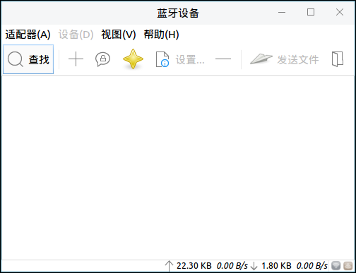

- **图标说明**

| 图标 | 功能说明 | 图标 | 功能说明 |
| :------------ | :------------ | :------------ |:------------ |
||	大写开启与关闭||键盘大写及常用符号开启（单击）与固定（双击）
||	固定Alt键||删除	
||	隐藏屏幕键盘||切换单击帮助程序
||	移动屏幕键盘|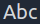|主键盘	
||	数字键盘和片段||设置片段以便快捷输入（类搜狗输入法快捷用语）

 

- **切换单击帮助程序**

点击“”，切换单击帮助程序，如图2所示。

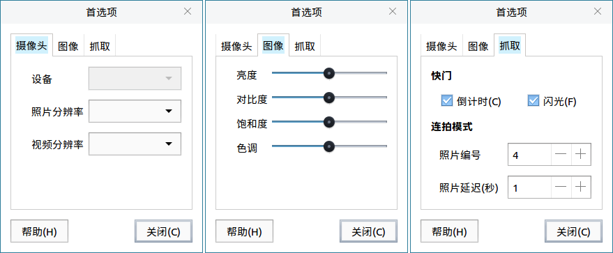

| 图标 | 功能说明 | 图标 | 功能说明 |
| :------------ | :------------ | :------------ |:------------ |
||	中键单击	||	右击
||双击	||	拖拽点击
||激活悬停单击|||

 

点击  >  ，可对屏幕键盘的常规、窗口、布局、主题等进行设置，如图3所示。

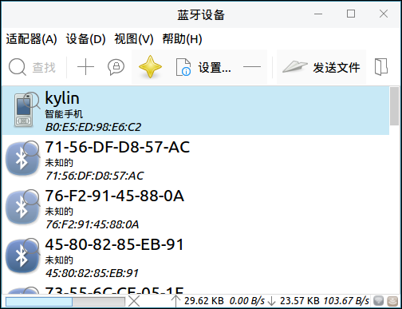
 
 

## 文档查看器
文档查看器用于浏览阅读pdf文件，如图4所示。

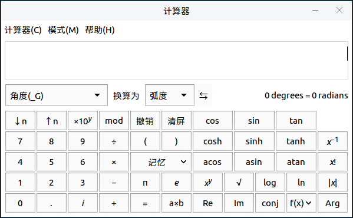

- 点击“”，“”可进行上下翻页。

- 软件提供了页面布局大小可选，如图5所示。

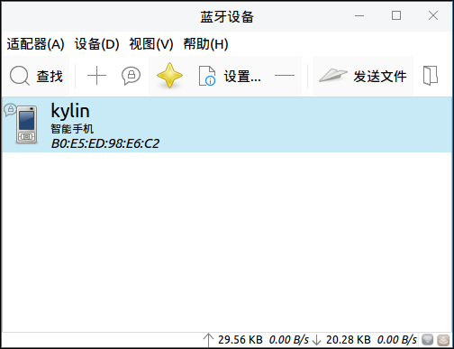

- 菜单栏上的“视图”可设置界面显示；“文件”可查看当前打开的pdf属性。

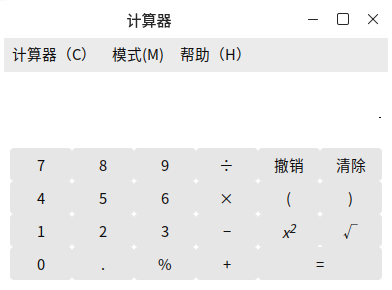
 
 

## 投影切换
通过“Windows徽标键 + P”，可选择演示显示模式。

如图7所示，提供了四种模式。

- **第一屏**

应用场景：在会议的准备阶段，需要将电脑中需要显示的内容拿出来粗略检查，而不希望参加会议的人员看到时，选择第一屏，一切操作将只会在电脑的电视屏上显示，投影仪上将不会显示电脑上的操作和内容。

- **镜像屏**

应用场景：用户需要电脑显示屏与投影仪显示屏同步显示。

- **扩展屏**

应用场景：当用户在会议中突然需要使用电脑查资料，又不想中断投影仪显示的时候，或者有临时事情需要紧急处理的时候，便可使用扩展模式。

- **其他屏**

应用场景：当主讲人离开电脑时，若有人不小心碰到了电脑，便可能导致会议中断，此时若选择其他屏模式，电脑屏幕处于完全黑屏的关闭状态，相对于复制和扩展模式会更省电；且投影仪上留下需要演讲的内容及相关操作。

 
 

## 麒麟天气
麒麟天气是一款能获取天气及生活指数信息（比如穿衣指数、感冒指数、紫外线指数）的应用软件，通过获取权威气象数据信息，让用户可以随意查看全国各地未来7天的天气状况，主界面如图8所示。

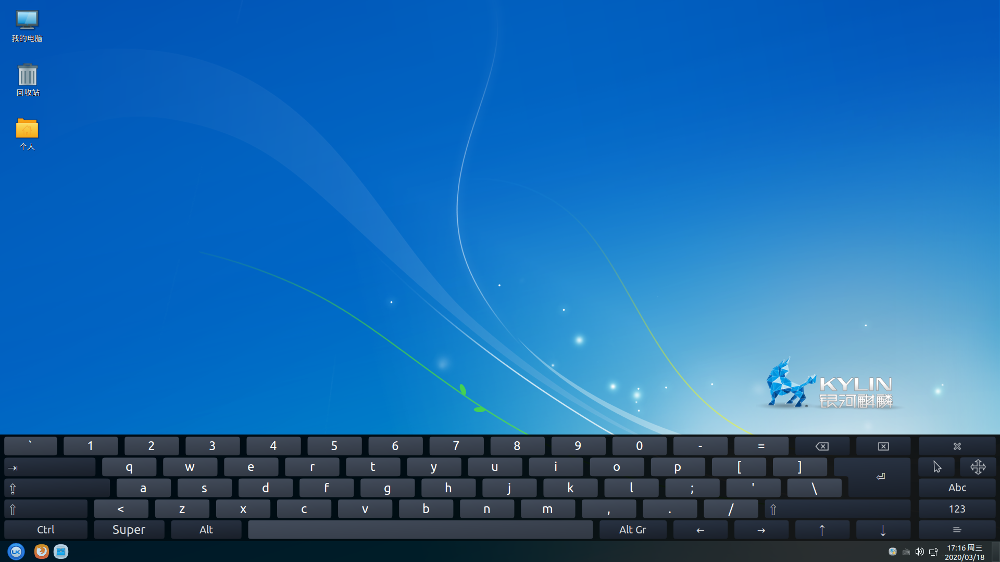

在主界面右上角搜索框输入城市或地区，会列出符合关键字的列表。点击列表中想查看的城市，即可切换当前页面的城市天气。如图9所示。

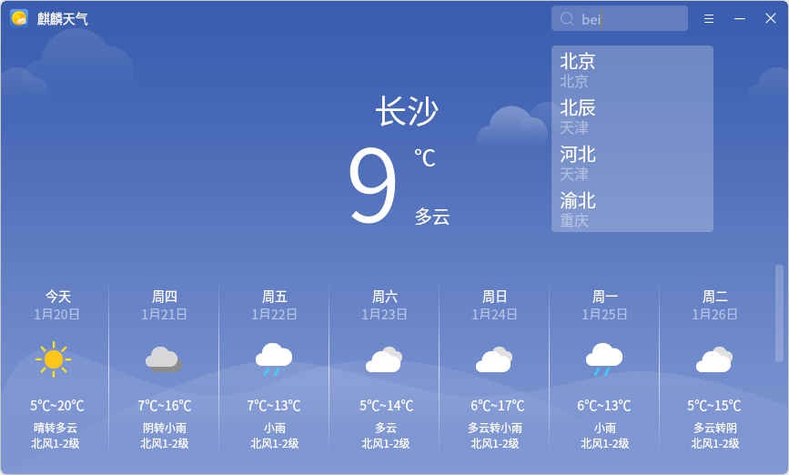

点击右上角的图标，选择增加城市，可以跳转至添加城市界面查看当前城市和已收藏的城市列表。

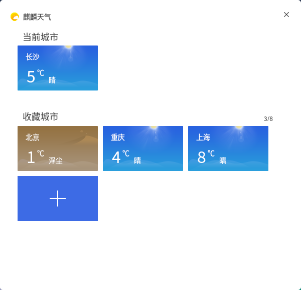

点击“+”号，在弹出的界面中，可以搜索想要关注的城市；点击城市后，即可将其添加到收藏城市列表。

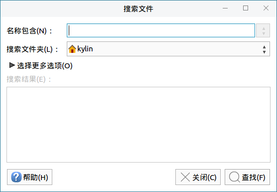
 
 

## 麒麟录音
麒麟录音，是一款界面友好操作简单的录音工具，支持麦克风录制，多音频格式录制如mp3、wav等，支持文件列表播放、删除以及迷你模式等功能，多方位满足您的录音需求。主界面如图12所示。

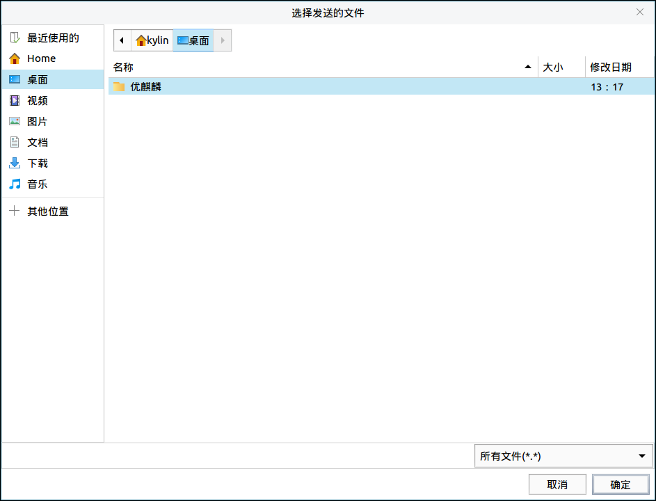

点击录音按钮开始录音，实时生成波形图。

录音过程中，点击，暂停/继续录音；点击，即完成本次录音，默认存储路径为个人的音乐目录。

每次录音成功后，生成的音频文件会自动显示在文件列表中，并且可以在文件列表中播放和删除。

设置界面如图 14所示，用户可自定义存储路径，选择录音文件格式。

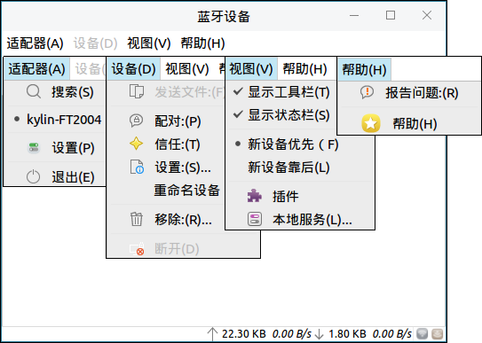

点击可进入mini模式，点击“最大化”按钮切回原界面。

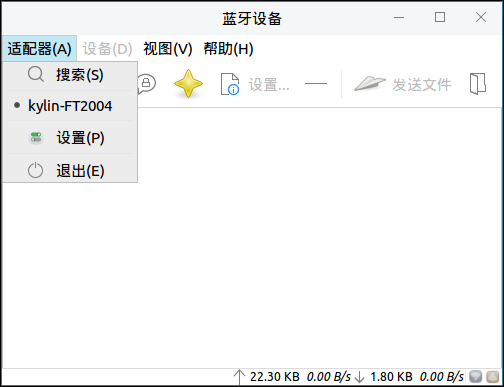
 
 

## 麒麟U盘启动器
麒麟U盘启动器用于制作系统启动U盘，主界面如图16所示。

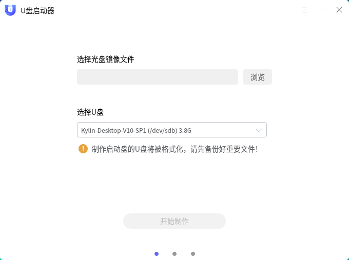

在选择好镜像文件，和要使用的U盘后，点击“开始制作”，在弹窗中输入用户密码，如图17所示。

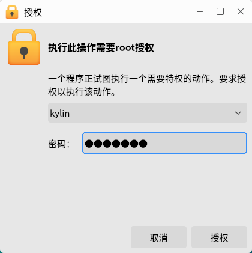

制作完成后，会出现提示。

 
 

## 麒麟截图
麒麟截图可截取当前桌面上的任意区域，并对其进行简单的编辑，从开始菜单打开该软件后，即可进行截图，如图19所示。

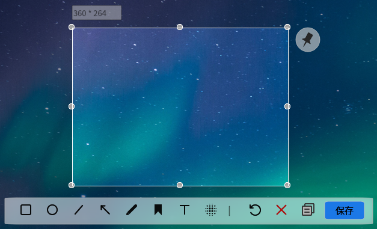

完成区域选择后，弹出的工具栏，提供了：方形画图，圆形画图，直线，箭头，铅笔画图，标记，输入文字，区域模糊。

若要使用延迟截图，在打开软件后，通过托盘菜单，找到麒麟截图。右键单击该图标，选择“打开启动器”，并在“延迟”处设置时间；点击“获取新屏幕截图”即可。

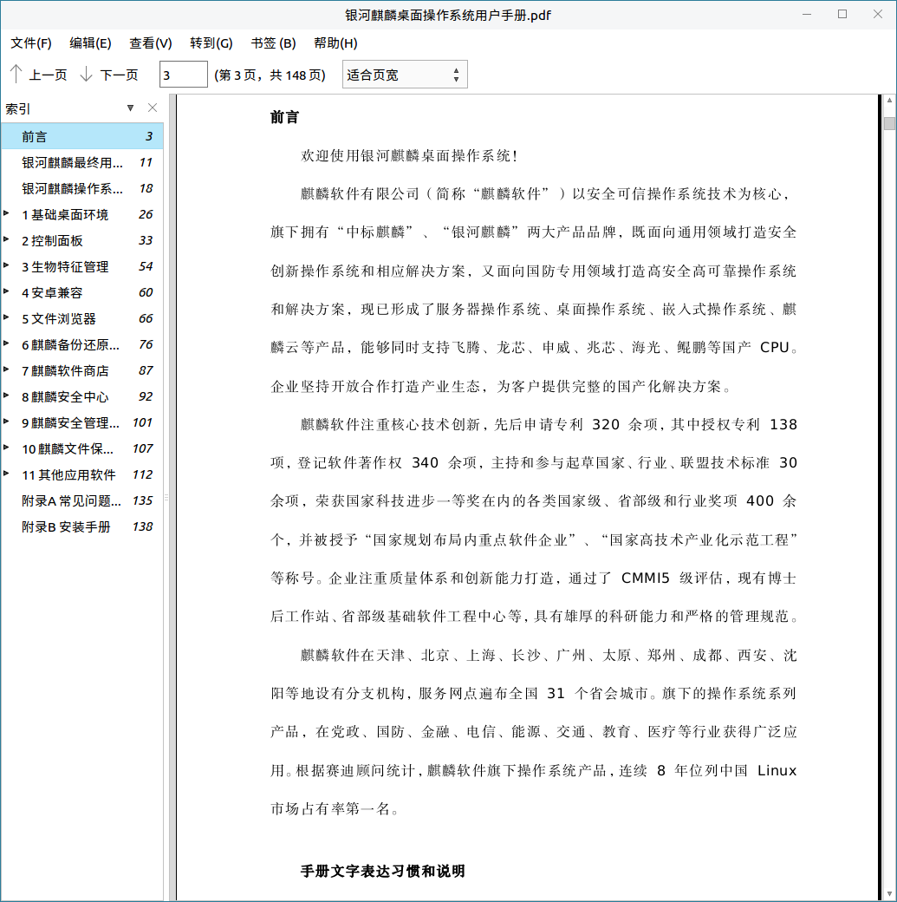

 
 

## 麒麟计算器
麒麟计算器是一款基于qt5开发的轻量级计算器，提供标准计算，科学计算和汇率换算，如图21所示。

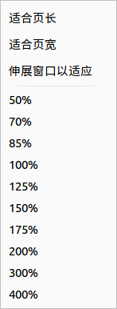

用户可以通过右上角图标来选择希望使用的模式。

 
 

## 麒麟摄像头
麒麟摄像头是一款基于qt开发界面友好使用方便的照相软件。

- 照相：点击按钮获取摄像头当前照片，保存到本地，并显示到相册。

- 录像：可切换到录像，点击录像按钮进行录像。

- 相册：点击相册按钮，相册显示拍的图片和录像。

打开设置框可以选择延迟拍照，图像镜像等。

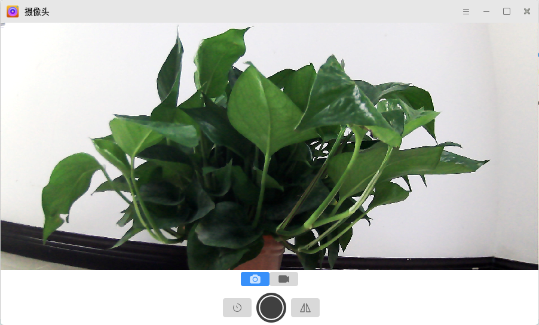
 
 

## 麒麟扫描
麒麟扫描是一款用户友好，使用Qt5进行开发的扫描软件，提供普通扫描、一键美化、智能纠偏和文字识别功能。

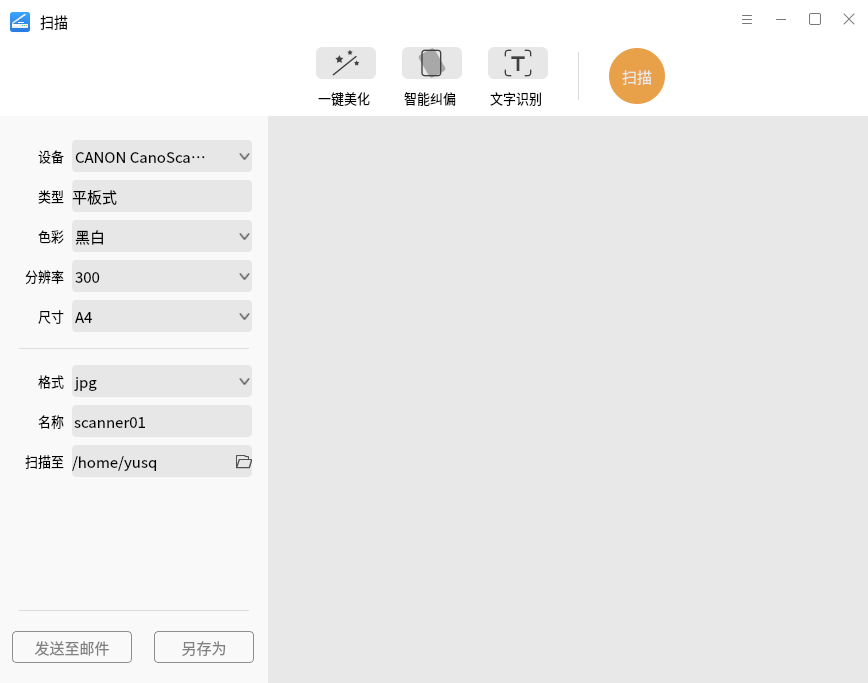

1）打开麒麟扫描，会自动查找、连接扫描设备，并获取默认参数（颜色模式、分辨率和纸张尺寸等），扫描前可自行设置。其中，分辨率越大，扫描速度就越慢。

2）点击右上角的“扫描”按钮进行普通扫描。

3）扫描完成后，可通过工具栏对图片进行编辑：裁剪、旋转、对称翻转和添加水印。

4）一键美化：包括增加对比度、锐化和HDR效果等，使图片更清晰。

5）智能纠偏：对已接近完全居中的图片不纠偏（角度误差在5°之内）；对本身不居中的图片可以进行纠偏操作。

6）文字识别：识别扫描完成图片的文字，可把文字保存为文本文档。
