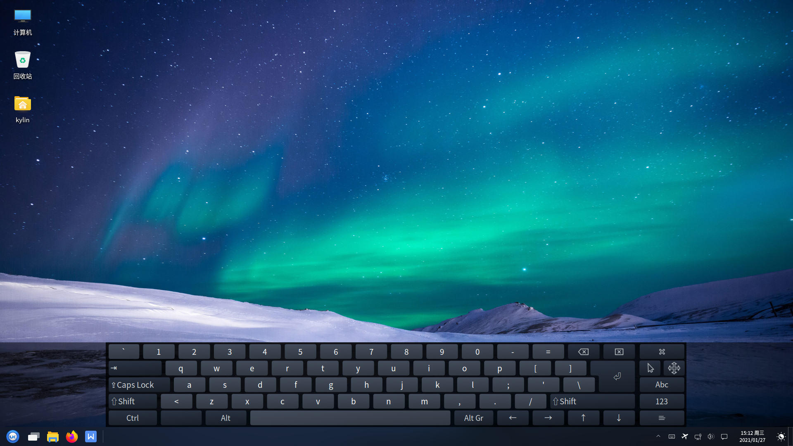
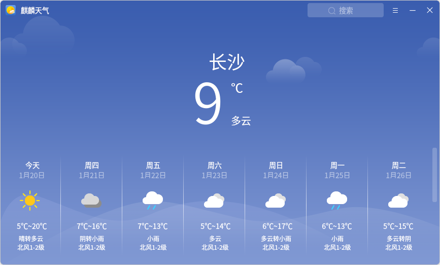
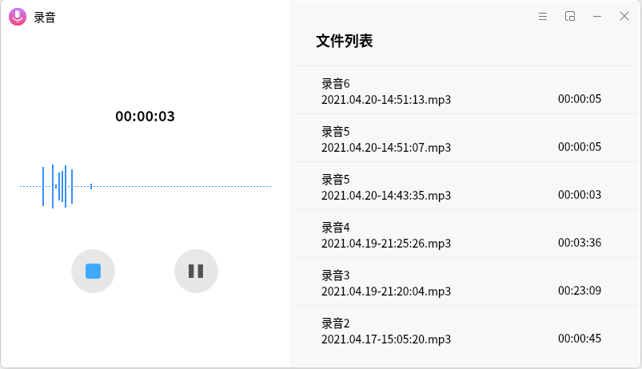

# 小工具
## 茄子摄像头概述
茄子摄像头是一款用摄像头拍照片和录制视频的系统应用软件，可添加眩晕、弯曲之类的视觉效果。主界面如图 1所示。

### 基本功能
- ：照片、视频、连拍模式设置。

- “茄子摄像头菜单” > “首选项” ：对摄像头、图像及抓取等参数进行设置。

### 快捷键

|快捷键|	功 能
| :------------ | :------------ |
|F11|	将茄子摄像头投放到全屏
|Ctrl + Q|	退出茄子摄像头

 
 

## MATE计算器概述
MATE计算器是一款提供基本、高级、财务、编程四种模式的计算器工具软件，如图 3所示。

### 基本功能 
点击“模式”可切换计算器模式。

- **高级模式**

- **财务模式**

- **编程模式**

### 快捷键

|快捷键	|功 能
| :------------ | :------------ |
|	Ctrl + C|	复制计算内容
|	Ctrl + V|	粘贴当前复制内容
|	Ctrl + Z|	撤销当前计算
|	Shift + Ctrl + Z|	重新计算
|	Ctrl + Q	|退出MATE计算器

 
 

## 抓图概述
抓图可以抓取整个桌面、当前窗口或截取区域，主界面如图 7所示。

### 快捷键

|快捷键|	功 能
| :------------ | :------------ |
|PrtSc | 桌面截图
|Ctrl + PrtSc|	窗口截图
|Shift + PrtSc	| 区域截图

 
 

## 屏幕键盘概述
屏幕键盘是一款系统应用软件，用户可以通过屏幕上显示的软键盘，实现键盘输入功能。屏幕键盘主界面如图 8所示。

### 基本功能
图标及其功能介绍：

|图标	|图标功能说明	|图标	|图标功能说明
| :------------ | :------------ | :------------ |:------------ |
||	大写开启与关闭||键盘大写及常用符号开启（单击）与固定（双击）
||	固定Alt键||删除操作	
||	回车	||	隐藏屏幕键盘
||	切换单击帮助程序	||	移动屏幕键盘
||	主键盘	||	数字键盘和片段
||	设置片段以便快捷输入（类搜狗输入法快捷用语）||||

 

#### 切换单击帮助程序
用户通过点击“”图标，切换单击帮助程序，如图 9所示。

图标及其功能介绍：

|图标|	图标功能说明| 	图标|	图标功能说明
| :------------ | :------------ | :------------ |:------------ |
||	中键单击	||	右击
||双击	||	拖拽点击
||激活悬停单击||||

 

#### 首选项
用户通过点击“”图标，可对屏幕键盘的常规、窗口、布局、主题等进行设置，如图 10所示。

 
 

## 搜索文件概述
搜索文件提供了以多种规则在对应目录中查找相关文件的功能。

### 基本功能
在“名称包含”框中输入内容，并指定要搜索的文件夹，点击“查找”，即会出现内容。

### 高级功能
点击“选择更多选项”，打开折叠菜单，可根据用户需要，添加多个限制条件。选择选项后，点击右侧的“添加”/“删除”按钮，即可添加或删除该选项，如下图所示：

搜索文件提供的高级选项如下所示：

 
 

## 桌面共享概述
桌面共享是一款网络应用软件，可以对桌面共享进行相关设置。主界面如图 15所示。

### 基本功能
#### 共 享
勾选“允许其他人查看您的桌面”即可。

#### 安 全
在安全设置区域，默认勾选“您必须为本机器确认每次访问”，同时可以根据用户需求，设置密码、自动配置UPnP路由器开放和转发端口。

#### 显示通知区域图标
用户在桌面共享时，可以设定显示通知区域图标的显示状态：总是、只在有用户连接时（默认）、永不。

 
 

## 蓝牙管理器概述
蓝牙管理器是一款系统应用软件，可以连接/创建蓝牙网络，连接输入设备、音频设备，发送/接收/浏览文件等。主界面如图 17所示。

### 基本功能
图标及其功能介绍：

|图标	|图标功能说明|	图标|	图标功能说明
| :------------ | :------------ | :------------ | :------------ |
||	搜索附近的设备||将这个设备添加至已知设备列表
||	与设备进行配对||将这个设备标记/取消标记为信任
||	为此设备运行设置助理||将这个设备从已知设备列表中删去
||	向此设备发送文件|||

 

#### 配 对  
点击“”图标或单击鼠标右键选中的设备，可对选中的设备进行配对。

当出现配对图标“”时，表明配对成功。

### 高级功能
用户可以通过菜单的适配器、设备、视图、帮助选项，对蓝牙管理器进行相关操作。

图标及其功能介绍：

|图标	|图标功能说明|	图标|	图标功能说明
| :------------ | :------------ | :------------ | :------------ |
||	设置		||退出蓝牙管理器
||	给选中设备发送文件	||	移除选中设备
||	与选中设备断开连接	||	插件
||	本地服务（对网络和传输进行设置）	||	进入问题反馈网址
||	查看关于蓝牙管理器信息		||||

 

- 适配器选项
点击“适配器” > “设置”，对蓝牙管理器进行可见设置和名称设置。

