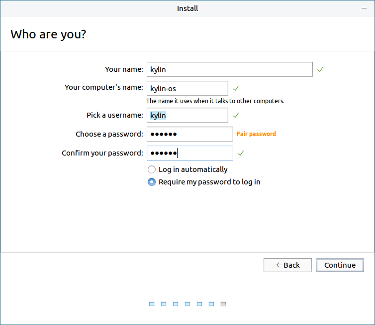

# System Installation
## Installation Preparation
* A hard disk can be divided into multiple partitions and they are independent of each other. So accessing different partitions is like accessing different hard disks.

* There are two types of partition: Primary, Logical.

* Please backup the important data to other storage devices before reinstalling system.
 

## Install Steps
### Boot Up
Insert the installation CD/U-disk and reboot.

According to the reminder at bootup, select to boot from installation device.

The system supports "Try without Installation" mode.

### Installation
Double click the installation icon on desktop.

#### Select language on the welcome page.

#### License agreement

Check to agree the license

#### Installation type

Select "Install from liveos" ("Install from ghost image" can refer to Ghost Image part in backup tools).

#### Installation option

- "Create Backup Partition": The mount point is "/backup". Check it and select "Erase disk and install Kylin", this partition size will be same as root partition. To use backup tool, this partition has to be created.

- "Create Data Partition": The mount point is "/data". Check it and select "Erase disk and install Kylin", this partition size will be the rest free space.

**These two choices are only for "Erase disk and install Kylin"**

- "Advanced installation": Customize partitions. 

- "Erase disk and install Kylin": Format the whole disk and partition it automatically.

Click "Install Now" in Fig 4 and the prompt windows as shown in Fig 5.

Click "Continue" (the disk has been formated and re-partition).

5) User configuration

Users can select to set up the account information now or next time start.

Choose set up now here. 

6) Click "Continue" to start copying files to the disk.

When installation completed, click "Restart Now" to reboot the system.

 

## Advanced Installation
Select "free space" > click "+", to create new partition.

- /boot partition: (must be /dev/sda1 on FT1500A and Mips64el, and not less than 1G)

- / partition:

- /swap partition: (2x the size of memory)

- Create /backup and /data partitions: (don't need to check in the previous step)

- Suggest to create EFI partition, and the size from 100M to 2G.

