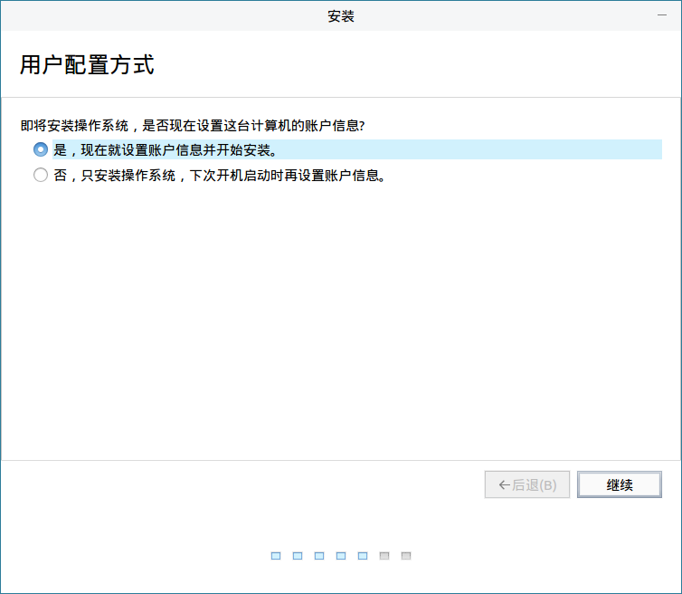

# 安装手册
## 安装准备
* 安装系统之前，请将硬盘上的重要数据备份到其他存储设备中。

* 一块硬盘可以被划分为多个分区，分区之间是相互独立的，访问不同的分区如同访问不同的硬盘。

* 一块硬盘最多可以有四个主分区，如果想在一块硬盘上拥有多于四个分区，就需要把分区类型设为逻辑分区。

 

## 安装步骤
### 启动引导
插入安装光盘/U盘，重启机器。

根据启动时的提醒，进入固件管理界面，选择从安装盘启动。

本系统支持体验模式，可试用一个全功能的操作系统而不安装。

### 系统安装
进入试用模式后，双击桌面上的“安装 Kylin-Desktop-V10”图标，进入安装程序。

1）语言选择

2）许可协议

勾选同意许可协议。

3）安装方式

选择“从Live镜像安装”（从Ghost镜像安装”可参考备份还原工具中的Ghost镜像部分）。

4）安装类型

以下是对4个选项的详细介绍：

- “创建备份还原分区”：挂载点为“/backup”。勾选后，选择“快速安装Kylin”时，分区大小默认与根分区相同。只有创建了该分区，备份还原功能才可以使用。备份还原对用户恢复数据或系统非常有帮助，建议创建。

- “创建数据盘”：挂载点为“/data”。勾选后，选择“快速安装Kylin”时，分区大小为整个磁盘除掉其他分区外的所有空间。/data类似于Windows系统除C盘外的其他盘符，建议创建。

注意，以上两个选项的勾选，是针对快速安装的设置。

- “高级安装”：用户自行根据实际需求，进行分区创建和分区大小分配。详细说明见后续。

- “快速安装Kylin”：全盘安装，该选项将会格式化整个硬盘，并进行自动分区。

选择“快速安装Kylin”选项，同时勾选“创建备份还原分区”和“创建数据盘”，点击“现在安装”按钮，弹出格式化分区警告信息。

点击“继续”（此时硬盘已经被格式化和重新分区）。

5）创建用户信息

用户可选择当下立即配置用户信息，也可以选择下次开机再设置，如图5所示。

此处选择立即设置，进入填写信息窗口。

6）信息正确填完后，“继续”按钮由灰变亮，点击“继续”按钮，此时会将系统信息写入硬盘。

安装完成后，会弹出提示窗口。点击“现在重启”按钮，系统会重新启动。

重启过程中系统会提示除移安装介质。

取回光驱或U盘后，等待系统进入登录界面，输入密码即可进入系统。

 

## 高级安装
在安装类型界面选择“高级安装”，点击“继续”，则出现硬盘分区界面。点击“新建分区表”，弹出提示窗口，选择“继续”，即可创建硬盘分区。

选中“空闲”所在行，此时“＋”由灰变亮。点击“＋”，则弹出创建分区窗口，开始创建分区。

注意：在arm64架构上，/boot必须是主分区中的第一个分区；在amd64架构上，对于挂载点顺序和分区，没有特殊要求。

- /boot分区创建如图所示：

- 在创建根分区的时候，“新分区的类型”选择“主分区”，“新分区的位置”默认为“空间起始位置”，“用于”选择“Ext4日志文件系统”：

- 交换分区大小一般设置为内存的2倍大小，“新分区的类型”选择“逻辑分区，“新分区的位置”保持默认，“用于”选择“交换空间”；

- 不管是否勾选“创建备份还原分区”和“创建数据盘”，用户都可以创建“/backup”分区和“/data”分区。这两个分区创建时，“新分区的类型”选择“逻辑分区”，“新分区的位置”默认为“空间起始位置”，“用于”选择“Ext4日志文件系统”，挂载点选择对应的/backup、/data即可；建议/backup分区和根分区大小一致。

- 建议用户创建EFI系统分区。EFI分区大小应在100M — 2G之间：

- 若是中途需要改变已创建的分区，具体方式如下：

1）添加分区：选中空闲分区所在行，点击“+”按钮。

2）编辑分区：选中已创建的分区，点击“更改”按钮。

3）删除分区：选中已创建的分区，点击“-”按钮。

