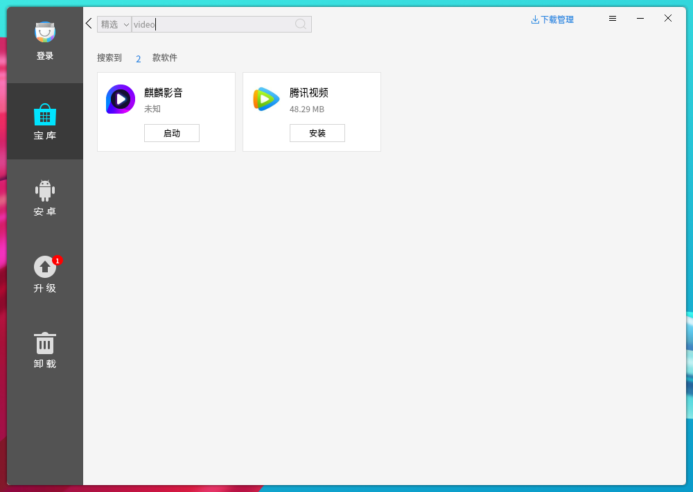
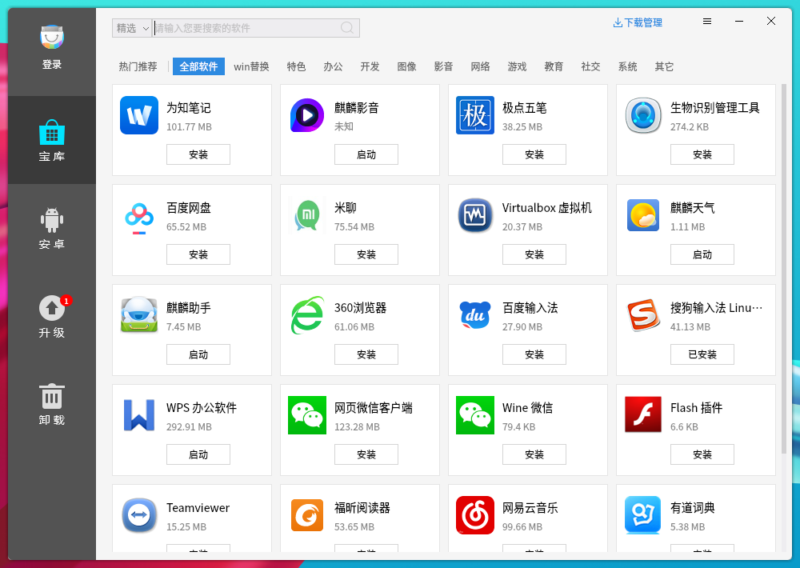
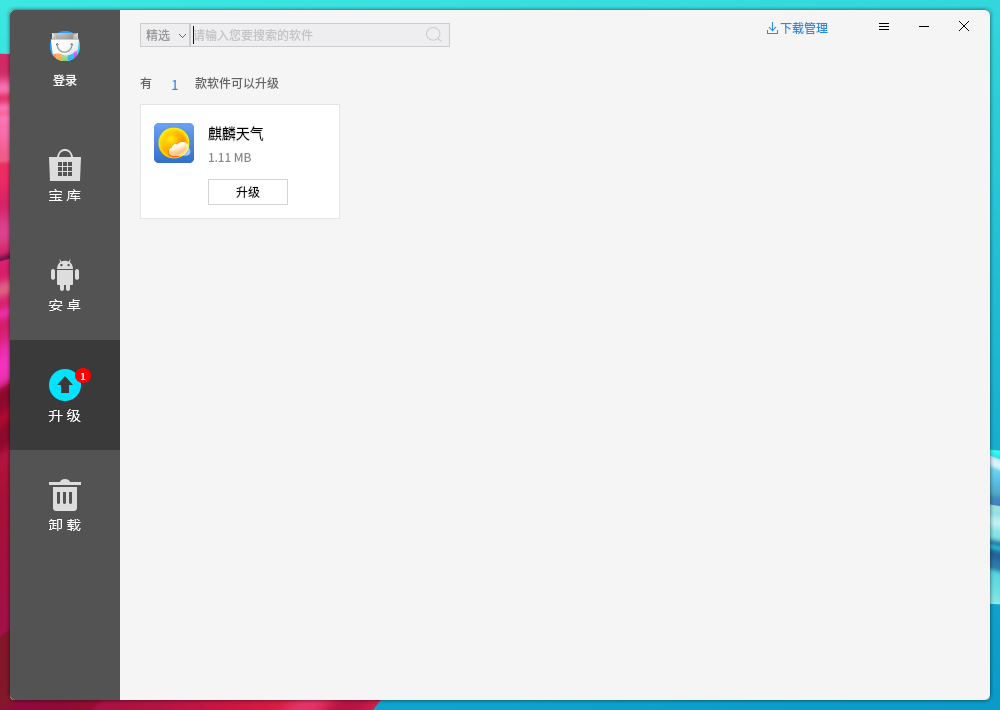
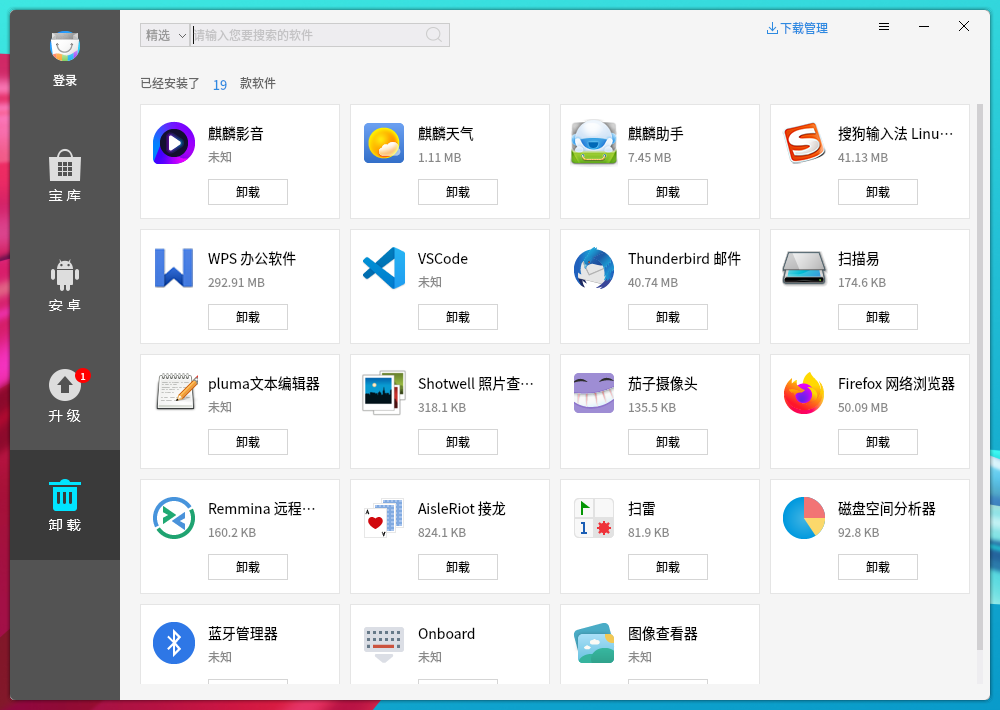
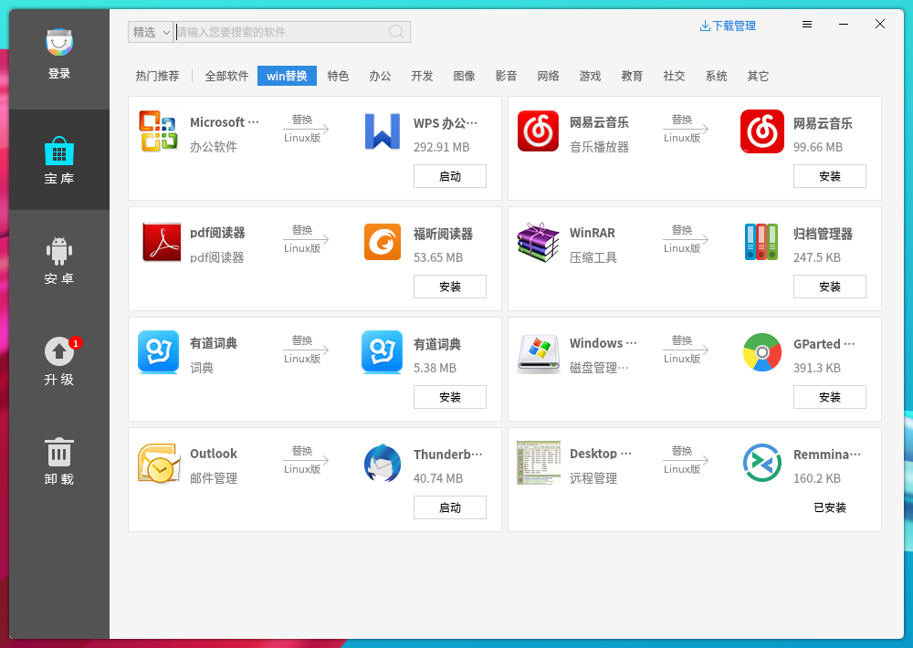
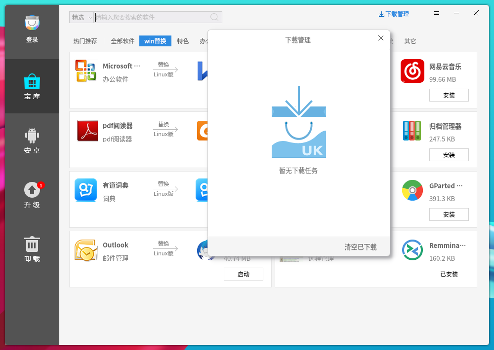
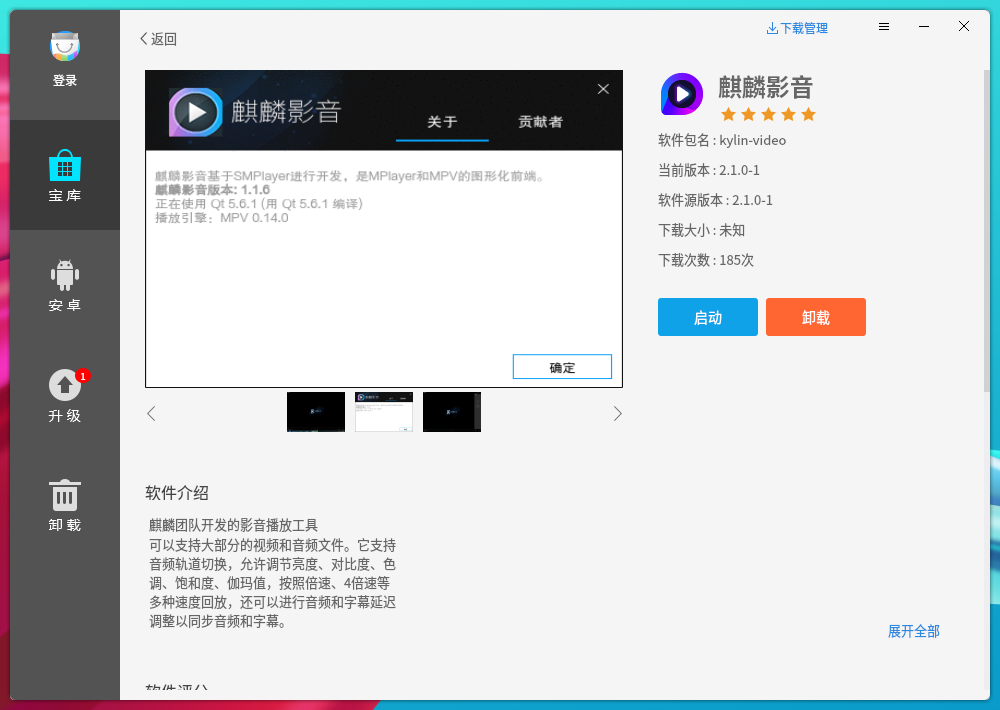
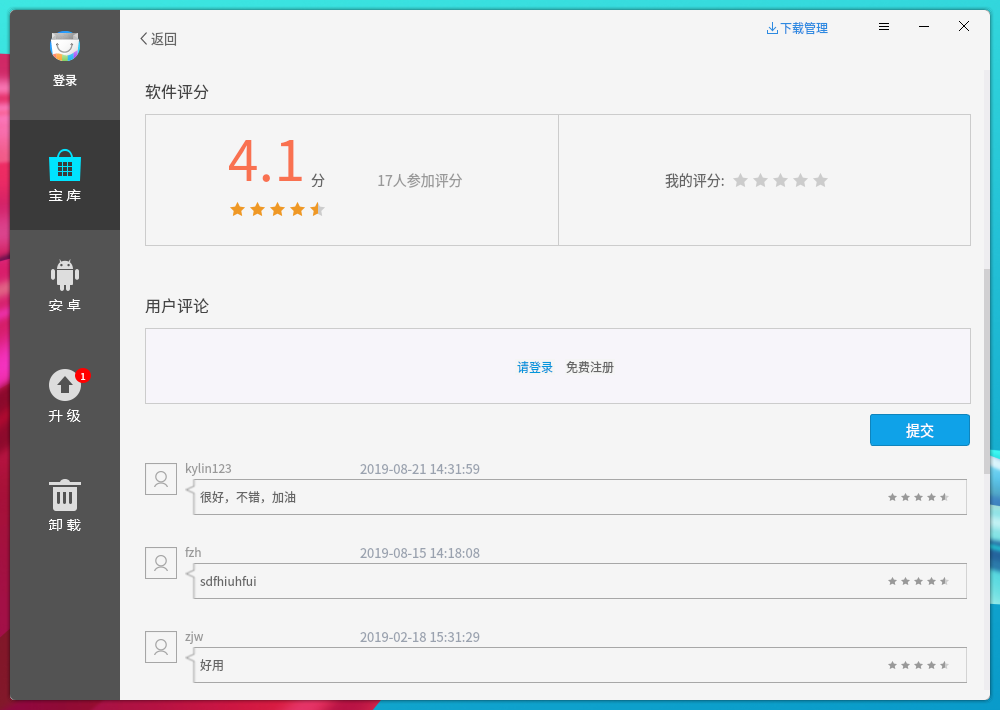

# Kylin Software Center
## Overview
Kylin Software Center provides the functions to install/uninstall/search/upgrade softwares, edit sources list, etc.. The main interface as shown in Fig 1.

 

## Basic Function
### Search Software
Input the key words and press Enter/click search icon. 

Search mode:

- ALL: Search from all softwares in the source list, and the found softwares may be unavailable or have other quality problems.

- Chc: Search from the filtered softwares. It's default mode.

When search in the "Cell Phone", "Upgrade", "Uninstall" page, it means search in the current page softwares.

### Download Management
Click "" to see the download box, as shown in Fig 3.

### Library
The softwares have been divided into multiple categories, and the "All soft" as shown in Fig 4.

### Cell Phone
This page provides Kydroid, so users can install Android apps, such as QQ, Wechat, etc..

Tips: Not all platforms support this function.

### Upgrade
It prompts which softwares can be upgraded to the newer version, as shown in Fig 5.

### Uninstall
It shows the list of softwares can be uninstalled, as shown in Fig 6.

 

## Advanced Function
### Login and Register
Click the login icon at the top left corner, and the popup as shown below.

### Source List
Click "" to set the source list, as shown in Fig 8.

- "deb-src" is used to obtain the software's code.

- Take CD source for example, "file:///media/kylin/Kylin". Start from "/media" means the path of CD, and "kylin" means the user name.

- "juniper" means the series of softwares.

Then, click "Determine" > "Update software source".

### Reset Password
This function as shown below.

### Software Details
Click a software to see the details.

It includes name, version, introduction, rating and comments.
 

## Kylin Update Manager
Kylin Update Manager provides to upgrade applications, quilts, and system series. Click "Start Menu" > "All App" > "Kylin Update Manager" to open it, and the loading interface as shown in Fig 11.

After loading, it will show the details, including name, version number, and description.

Click “” to set the detection mode.

