# UKUI Desktop Environment
## Overview
Desktop Environment is the basis for the user's operation on the graphical interface, and it provides multiple functions. As shown in Fig 1.
 

 

## Desktop
### Desktop Icon
There are three icons: personal folder, "Computer", "Trash" by default. Double click to open it.

Right clicking "Computer" and selecting "Properties", it can show the current system version, kernel version, activation and other related informations, as shown in Fig 2.

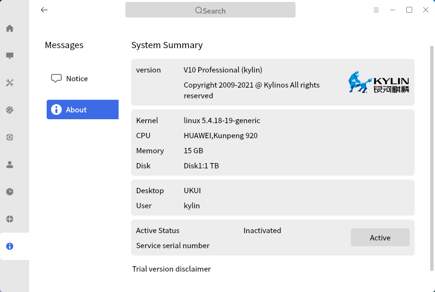

### Right-click Menu
Right-click on the desktop blank and a menu appears as shown in Fig 3.
 
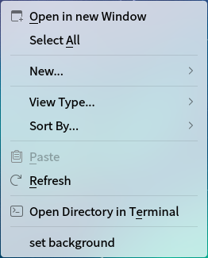
 

## Taskbar
Taskbar is located at the bottom and includes the Start Menu, File Manager, Tray Menu, etc..

The individual components as shown below.

| Component | Decsription |
| :------------ | :------------ |
|  | Start menu: Open the system menu to find applications |
|  | Taskview: Work in different workspaces |
|  | File manager: Browse and manage documents in the system |
|   | Kylin store: Software center |
|   | QAX browser: Provide a convenient and safe way to access the Internet |
|   | WPS Office |
|   | Ukui search:  Search files, applications, etc. |
| Window Area | The blank part in the middle of the horizontal bar. Display running programs, opened documents, and allow to close windows, etc. |
| Tray Menu | Include settings for input method, volume, network connection, etc. |
| Show Desktop | The button is on far right. Minimize all windows and return to the desktop; Click again will restore the windows |

 

### Workspace
Click "" and the interface as shown in Fig 4.

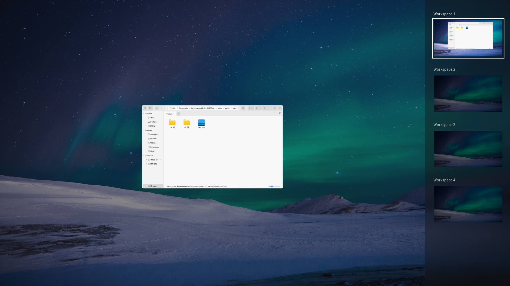

### Preview Window
Move the mouse to the application's icon on the taskbar, and it will show a preview of the opened windows, as shown in Fig 5.

Right click the icon to close all the window of this application.

### Sidebar
Click the sidebar icon on the tray menu and the popup as shown in Fig 6.

#### Notification Center
It will show the lastest news. Click "Clean up" to empty the list.

#### Clipboard
It will store the lastest copy or cut contents.

The second tab is plugins -- clock, kylin memo, and kylin service support.

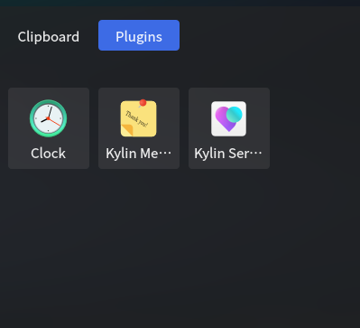

1) Clock

It provides countdown, alarm clock, and stopwatch. Switch the functions through the top three icons.

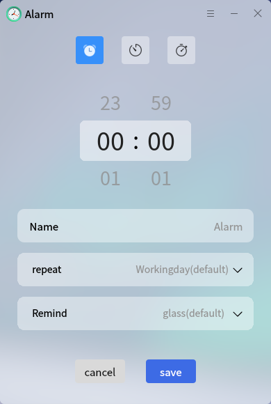

2) Kylin Memo

To write down information at any time.

3) Kylin Service Support

Please go to the main interface to see the details.

### Input Method
Here are some options can be selected. Right click the input icon, as shown in Fig 12.

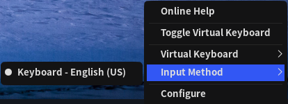

### Network
Click the network icon, and users can choose wifi or wired connection.

Click one wired connection to see the details.

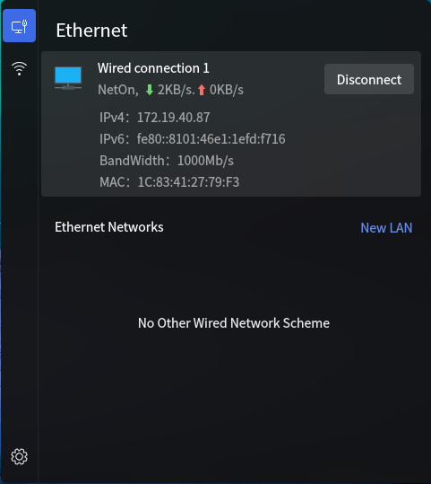

### Calendar
Click the date and time on the taskbar to pop up the calendar window.

### Advanced Settings
Right click the taskbar, users can set the layout of taskbar, as shown in Fig 16.
 
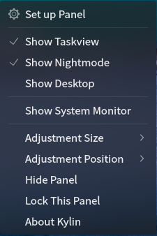
 

## Windows
### Window manager
The functions provided as shown below.

| Function | Description |
| :------------ | :------------ |
| Title Bar | Show the title name of current window |
| Minimize/Maximize/Close | The three icon buttons at the right of the title bar correspond to minimize, maximize and close |
| Side Sliding | Scroll up and down to view the page by the slider at the right of the window |
| Stack | Allow overlap among windows |
| Drag and Drop | Long press the left mouse button at the title bar to move the window to any position |
| Resize | Move the mouse to the corner of the window and long press the left button to resize the window |

 

### Window Switch
There are three ways:

* Click the window title on the Taskbar

* Click the different window at the desktop

* Shortcut Alt + Tab

 

## Start Menu
Click the button to open it, and the main interface as shown in Fig 17.
 

### Category Menu
There are 3 categories:

* All App: List all applications

* Sort by Letter: List the applications by the first letter.

* Sort by Function: List the applications by the function.

Click fullscreen icon on the upper right corner to open the full screen mode.

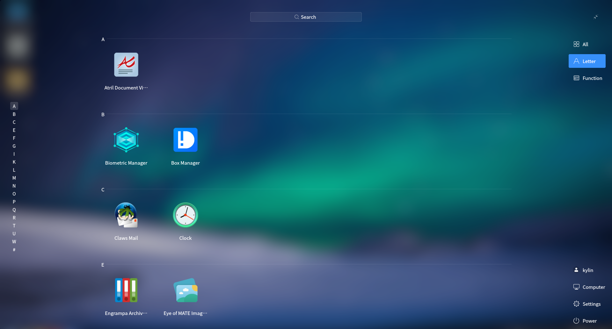

#### Other Functions
1) User Informations

Click "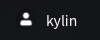" to see the user informations.

2) Computer

Click "" to enter the computer path in file manager.

3) Settings

Click "" to open the control center.

### Power Menu
Click "Power" button, and the options as shown in Fig 19.
 

1)  Lock Screen

When users do not need to use the computer temporarily, the lock screen can be selected (without affecting the current running state of the system) to prevent misoperations. And input the password to re-enter the system. The system will automatically lock the screen after a period of idle time by default.
 

2) Switch Users & Log Out

When you want to select another user to log in uing the computer, you can select "Log out" or "Switch user". At this point, the system will close all running applications; Therefore, please save the current jobs before performing this action.

3) Right click the Start Menu can also pop up the shutdown options.
 
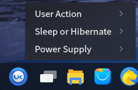

### Application
Input keywords in the search box, and the result will show up automatically. As shown in Fig 22.

Right click an application in the start menu, and the pop up menu as shown in Fig 23.
 

 

## Q&A
#### Can not login the system after locking the screen
1) Switch to terminal interface by Ctrl + Alt + F1

2) Input the user-name and password to login

3) Execute "sudo rm -rf ~/.Xauthority"

4) Switch to graphical interface by Ctrl + Alt + F7, and input the password

 

## Appendix 
### Shortcut Key

| Shortcut | Function |
| :------------ | :------------ |
| F1  | Open the user guide |
| Alt + Tab  | Switch window |
| Win  | Open the start menu |
| Ctrl + Alt + L  | Lock screen |
| Ctrl + Alt + Delete  | Open the shutdown management interface |
| Ctrl + Alt + F1~6  | Switch to terminal interface |
| Ctrl + Alt + F7  | Switch to graphic interface |
| Alt + F9 | Minimization window |
| Alt + F10 | Switch maximize state / Resume |
