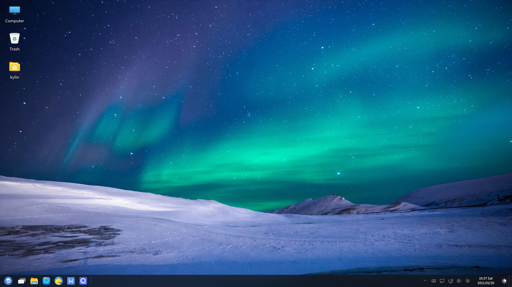
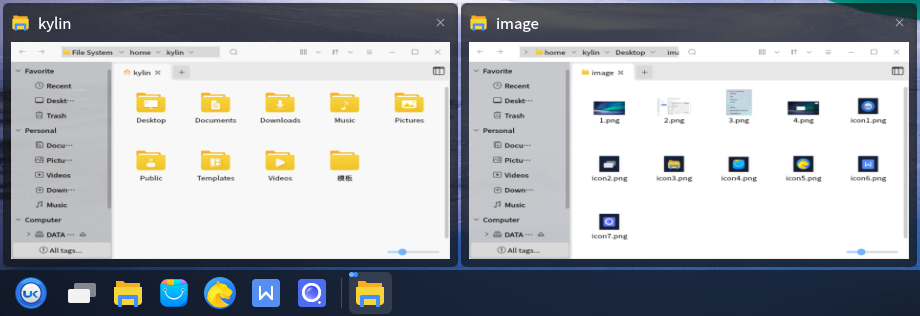
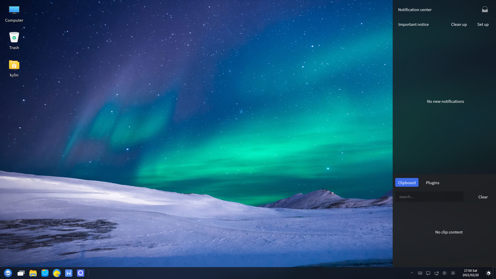
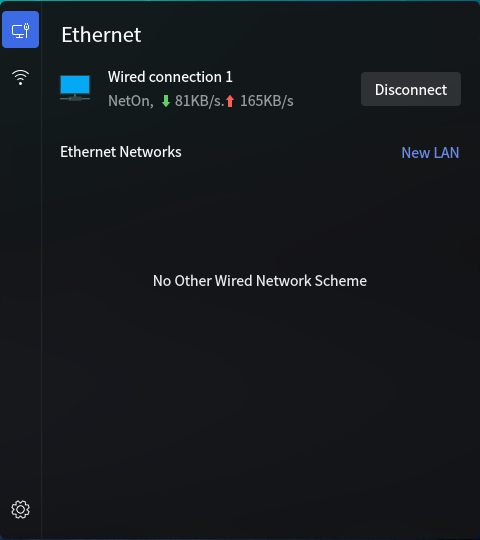

# Basic Desktop Environment
## Overview
Desktop Environment is the basis for the user's operation on the graphical interface, and it provides multiple functions including taskbar, start menu, etc.. As shown in Fig 1.
 

 

## Desktop
### Desktop Icon
There are three icons: personal folder, "Computer", "Trash" by default. Double click to open it.

Right-clicking "Computer" and selecting "Properties", it can show the current system version, kernel version, activation and other related informations, as shown in Figure 2.

### Right-click Menu
Right-click on the desktop blank and a menu appears as shown in Figure 3.
 

Some of the options as shown below.

| Option | Function |
| :------------ | :------------ |
| Create Document | Create folders or empty files |
| Arrange Items | Provide multiple ways to arrange icons |
| Icon Size | Zoom in/out or normal size |

 

### Taskbar
#### Basic Function
Taskbar is located at the bottom and includes the Start Menu, Firefox Web Browser, File Browser, and Tray Menu.

The individual components as shown below.

| Component | Decsription |
| :------------ | :------------ |
|   | Start menu: Open the system menu to find applications and files |
|   | Firefox Web Browser: Provide a convenient and safe way to access the Internet |
|   | File Browser: Browse and manage documents in the system |
| Window Area | The blank part in the middle of the horizontal bar. Display running programs, opened documents, and allow to close windows, top windows, etc. |
|   | Tray Menu: Include settings for input method, volume, network connection, date and time |
| Show Desktop | The button is on far right. Minimize all windows and return to the desktop; Click again will restore the windows |

 

#### Advanced Function
Right click the taskbar, as shown in Fig 4.
 

The "Settings" window as shown in Fig 5. And select "Reset Panel" in the right-click menu to restore default settings.
 

### Workspace
Users can place the current works classification in different workspaces. Uncheck "Hide workspace" in the taskbar settings and the workspace will show up.

There are 2 rows and 2 columns by default. Click to switching, and right click to setting, as shown in Fig 6.
   

 

## Windows
### Window manager
The functions provided as shown below.

| Function | Description |
| :------------ | :------------ |
| Title Bar | Show the title name of current window |
| Minimize/Maximize/Close | The three icon buttons at the right of the title bar correspond to minimize, maximize and close |
| Side Sliding | Scroll up and down to view the page by the slider at the right of the window |
| Stack | Allow overlap among windows |
| Drag and Drop | Long press the left mouse button at the title bar to move the window to any position |
| Resize | Move the mouse to the corner of the window and long press the left button to resize the window |

 

### Window Switch
There are three ways:

* Click the window title on the Taskbar

* Click the different window at the desktop

* Shortcut Alt + Tab

 

## Start Menu
### Basic Function
Click the button to open it, and the main interface as shown in Fig 7.
 

There are four categories on the left side: "Favorite", "All App", "Home", "Settings".

* Favorite: List the applications used recently

* All App: List all applications

Input the key words at the search box to find the application. The key words can be the name of the package or the Chinese name.

### Advanced Function
Right click Start Menu icon, and the options as shown in Fig 8.
 

Select "Property" to open the setting window, as shown in Fig 9.
 

* Normal Menu: Default way. Don't classify applications in "All App"

* Category Menu: Classify applications in "All App" as below
 

### Application
Right click an application in the start menu, and the pop up menu as shown in Fig 11.
 

| Option | Function |
| :------------ | :------------ |
| Add to desktop | Generate a shortcut icon of this app on the desktop |
| Lock to panel | Generate the icon of this app on the taskbar |
| Add to startup menu | Add this app to "Favorite" |
| Property | View this app's type, name, command and note |

 

## Shutdown Menu
"Start Menu" > the button near "Power", there provides some options.
 

### Lock Screen
When users do not need to use the computer temporarily, the lock screen can be selected (without affecting the current running state of the system) to prevent misoperations. And input the password to re-enter the system. The system will automatically lock the screen after a period of idle time by default.
 

### Switch Users & Log Out
When you want to select another user to log in uing the computer, you can select "Log out" or "Switch user". At this point, the system will close all running applications; Therefore, please save the current jobs before performing this action.

### Shutdown & Reboot
There are two ways:

1) "Start Menu" > "Power"

It will pop up a window and users can choose shutdown or reboot as needed.

2) "Start Menu" > the button near "Power" > "Power"/"Reboot"

The system will shutdown or reboot immediately without poping up window.

### Timing Shutdown
Users can set the time and frequency of shutdown, as shown in Fig 14.
 

 

## Q&A
### Taskbar doesn't show
1) Open the terminal by Ctrl + Alt + T

2) Execute "sudo mate-panel --reset" to restart the taskbar

3) If it's still not effective, please execute "reboot"

### Can't login the system after locking the screen
1) Switch to terminal interface by Ctrl + Alt + F1

2) Input the user-name and password to login

3) Execute "sudo rm -rf ~/.Xauthority"

4) Switch to graphical interface by Ctrl + Alt + F7, and input the password

 

## Appendix 
### Shortcut Key

| Shortcut | Function |
| :------------ | :------------ |
| F5  | Refresh desktop |
| Alt + Tab  | Switch window |
| win  | Open the start menu |
| Ctrl + Alt + L  | Lock screen |
| Ctrl + Alt + Delete  | Log out |
| Ctrl + Alt + F1~6  | Switch to terminal interface |
| Ctrl + Alt + F7  | Switch to graphic interface |
