# 桌面环境
桌面是用户进行图形界面操作的基础，提供了多个功能部件，包括任务栏、开始菜单等，主界面如图1所示。

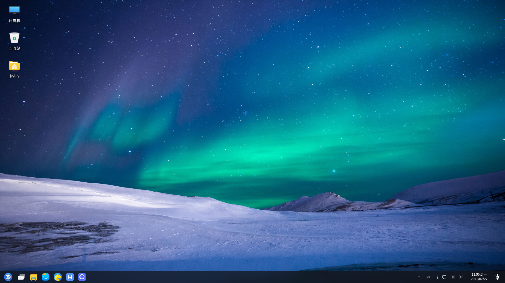
 

## 桌 面
### 桌面图标
系统默认放置了计算机、回收站、个人三个图标，鼠标左键双击即可打开页面，功能如下表所示。 

|图标|	说明
| :------------ | :------------ |
|| 计算机：显示连接到本机的驱动器和硬件
|| 回收站：显示被删除到回收站的文件
|| 主文件夹：显示个人主目录

 

另外，右键单击“计算机”，选择“属性”，可显示当前系统版本、内核版本、激活等相关信息，如图2所示。

### 右键菜单
在桌面空白处单击鼠标右键，出现的菜单如图3所示，为用户提供了一些快捷功能。

部分选项说明如下。

|选项	|说明
| :------------ | :------------ |
|新建	|可新建文件夹、文本文档、WPS文件
|视图类型	|提供四种视图类型：小图标、中图标、大图标、超大图标
|排列方式	|提供多种排列图标的方式

 

## 任务栏
任务栏位于底部，包括开始菜单、文件管理器、托盘菜单等，其各个组件如下。

|组件	|说明
| :------------ | :------------ |
||	开始菜单，用于弹出系统菜单，可查找应用和文件
||	可在多个工作区互不干扰进行操作
||	文件管理器，可浏览和管理系统中的文件
||	麒麟软件商店
||	奇安信可信浏览器，提供便捷安全的上网方式
||	WPS办公套件，可以实现办公软件最常用的文字、表格、演示等多种功能
||	搜索工具，查找文件、应用等
|窗口显示区| 横条中间空白部分；显示正在运行的程序或打开的文档，可进行关闭窗口、窗口置顶操作
|托盘菜单| 包含了输入法、网络连接、日期、夜间模式等
|显示桌面| 按钮位于最右侧；点击后，最小化桌面的所有窗口，再次点击则恢复窗口

 

### 工作区
点击任务栏“”图标，即可进入如图5所示界面，选择当下需要的工作区。

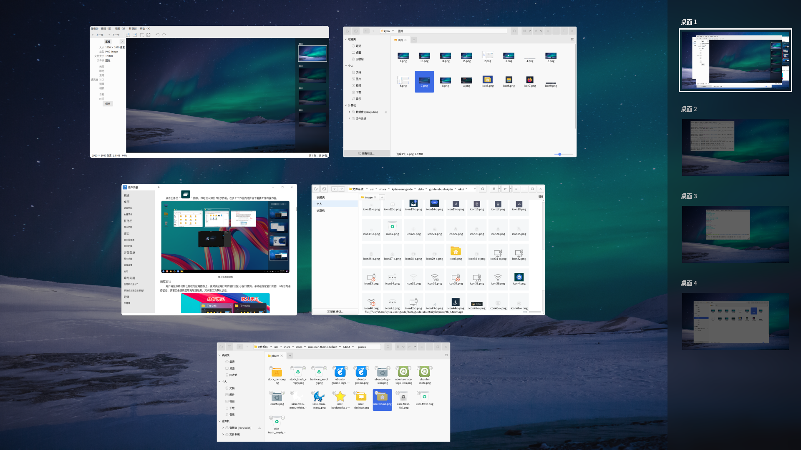

### 预览窗口
用户将鼠标移动到任务栏的应用图标上，会对该应用打开的窗口进行小窗口预览，如图6所示，悬停在指定窗口，该窗口会呈现毛玻璃效果，如图右侧，其余为默认状态。

鼠标右键点击任务栏的应用图标，可关闭该应用当前打开的所有窗口。

### 日 历
鼠标左键点击任务栏上的时间日期，弹出日历窗口。

用户可筛选年、月、日查看某日信息，并有当日的节气、农历，宜忌可点击下方勾选查看。

### 设置任务栏
右键单击任务栏，用户可对任务栏的布局进行设定。

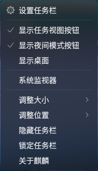
 

## 侧边栏
侧边栏是桌面环境软件之一，可收纳用户尚未查看的消息通知，保存用户日常操作的剪贴字段，并提供了一些小插件。

点击任务栏右侧托盘菜单中的侧边栏图标，弹出界面如图8所示。

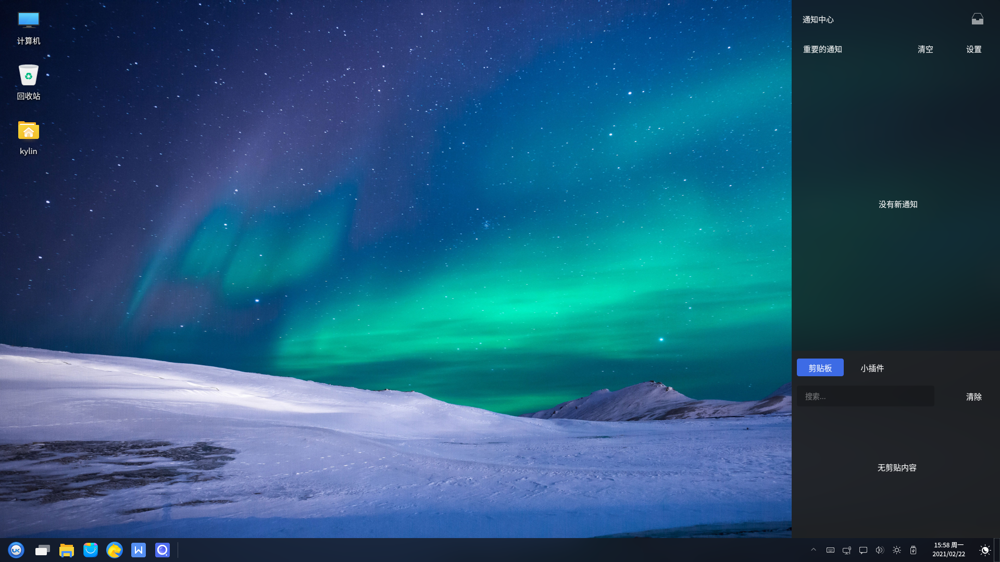

### 通知中心
通知中心将会显示最新的信息列表。默认状态下，提示“没有消息通知”；有通知时，如图9所示。

其中，点击可以把该条消息设为不重要的信息，并收纳起来。

选择右上角“清空”可将信息列表清空，选择“设置”则进入控制面板的通知设置界面。

同一应用发送多条通知，默认为折叠显示效果，点击可展开；展开状态时，鼠标点击第一条通知可返回折叠效果。 

### 剪切板
剪切板可保存近期选择复制或剪切的内容，同时可通过下表中说明的图标进行相应操作。

| 图标 | 说明 | 图标 | 说明 |
| :------------ | :------------ | :------------ | :------------ |
||	固定剪切板上的该内容 || 编辑剪切板上的该内容（仅限文字内容） |
||	删除剪切板上的该内容 |||	

 

- 默认状态下提示“无剪贴内容”，搜索处于不可用状态。

- 支持复制的文字、图片、文件（单个、多个）。

- 当内容超过固定高度时，会出现竖向滑动条，可以通过鼠标滚动。

- 当一条文字内容超过规定宽度，其省略部分用"..."表示，可在编辑窗口中查看全部内容。

- 点击搜索框右侧的“清除”按钮，可清空除固定项外的所有内容。

### 小插件
剪切板的第二个标签为小插件。

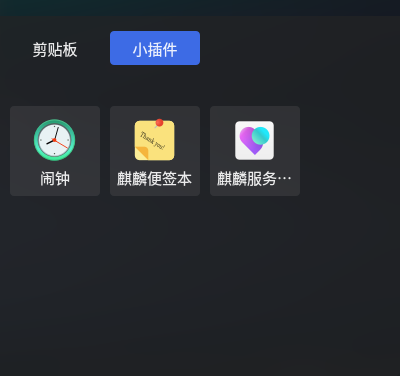

#### 闹 钟
闹钟提供了倒计时，闹钟，秒表的功能，可通过顶部三个图标切换。

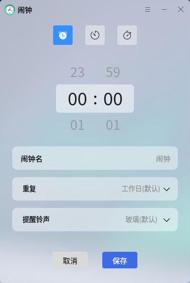

#### 麒麟便签本
麒麟便签本提供了随时记录信息的功能。

可设置的选项：加粗，倾斜，下划线，删除线，分点显示，分序号显示，字号，字体颜色。

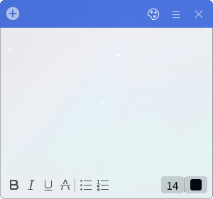

#### 麒麟服务与支持
详细内容见主页上“麒麟服务与支持”板块。

 

## 网 络
麒麟网络工具可连接有线网络，修改网络名称、配置参数，新建有线网络；连接普通可见wifi、wpa个人与企业安全性的隐藏wifi，查看wifi信号强度和安全性等信息。

用户可点击托盘菜单上的网络图标，根据需要选择有线或无线连接。

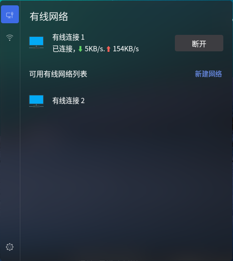

### 有线网络
1）有线界面显示了当前已经创建的有线网络，鼠标悬停在某个连接上时，会出现“连接”按钮。

2） 已经连接的网络会显示在顶部，点击该连接，会显示详细信息。

3）网线插拔时，有线会自动连接/断开。

4）同一个网卡设备只允许同时连接一个有线网络；在有多个网卡设备时，则可以有多个有线网络同时连接。

5）鼠标左键点击网络工具图标，选择左下角的设置图标，或右键单击图标，选择“设置网络”。在弹出的窗口中，选中已有的网络连接可以删除或编辑，也可新建网络连接。

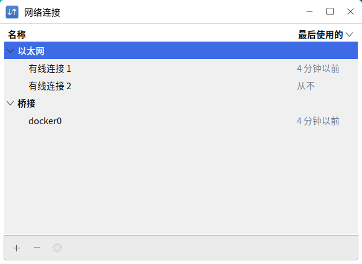

### 无线网络
无线网络需要计算机存在无线网卡。点击左上角无线按钮，并打开无线网络的开关。

1）当不需要密码时，点击“连接”按钮，会正常连接到该无线网络。

2）当需要密码时，点击“连接”按钮，输入正确密码后连接到该无线网络；已连接过的wifi可直接连接。

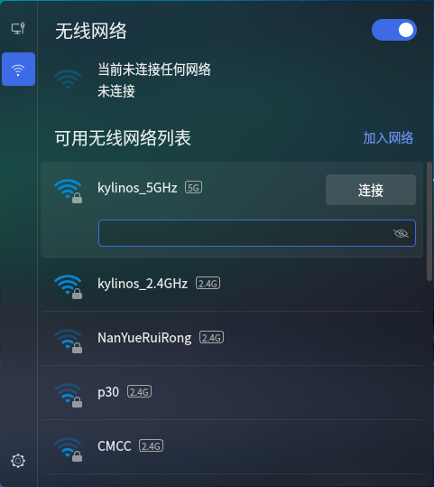

3）连接隐藏无线网络时，点击“加入网络”按钮，在弹出的窗口中，根据需要选择wifi安全性类型，并输入网络名称和密码，点击连接即可。

 

## 窗口管理器
窗口管理器为用户提供了如下所示的功能。

| 功能 | 说明 |
| :--------| :----------|
|窗口标题栏 |	显示当前窗口的标题名称
|最小化/最大化/关闭 | 标题栏右侧的三个图标按钮，分别对应最小化窗口、最大化窗口、关闭窗口的功能
|侧边滑动 | 在窗口右侧提供滑动条，可上下滚动查看页面
|窗口堆叠 | 允许窗口之间产生重叠
|窗口拖拽 | 在窗口标题栏长按鼠标左键，可移动窗口到任意位置
|窗口大小调整 | 将鼠标移至窗口四角，长按左键，可任意调整窗口大小

 

### 窗口切换
用户有三种方式可以切换：

* 在任务栏上点击窗口标题

* 在桌面上点击不同窗口

* 使用快捷键 Alt + Tab

 

## 开始菜单
开始菜单基于QT开发，使用UKUI3.0风格，具有更丰富的交互体验、更简洁的交互界面、更完善的交互功能。

单击“开始菜单”按钮，如图20所示，为按字母排序显示系统应用。

### 分类菜单
右侧边提供三种分类方式：“所有软件”、“字母排序”、“功能分类”，其中：

* 所有软件：列出系统中所有软件，并支持将软件固定至前端

* 字母排序：根据中文首字母分类显示系统所有软件，并支持字母导航

* 功能分类：根据功能分类显示系统所有软件；分类包括移动软件，网络，社交，影音，开发，图像，游戏，办公，教育，系统和其它。

点击右上角的全屏图标，进入全屏菜单。

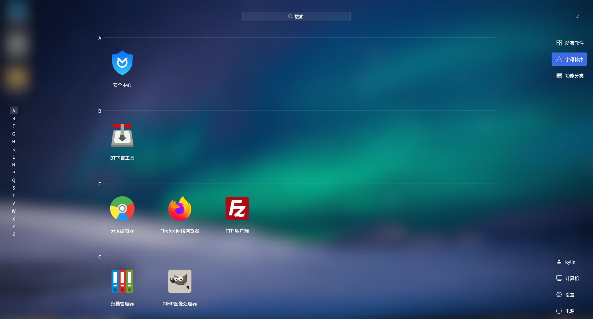

### 应 用
用户可以在搜索框中，通过关键字搜索应用。搜索界面支持中英文与首字母实时搜索，查询结果会随着输入自动显示出来。

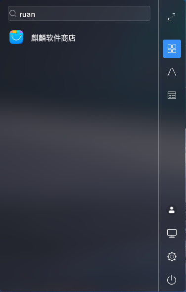

右键点击开始菜单中的某个应用，可将选中应用固定到“所有软件”/任务栏，添加到桌面快捷方式，或是卸载该应用。

### 快捷功能键
* 点击“”，查看用户信息。

* 点击“”，进入计算机目录。

* 点击“”，进入系统设置。

 

## 会话管理
### 打开方式
- “开始菜单” > “电源”，或是右键单击开始菜单图标，直接选择需要的操作

- Ctrl + Alt + Delete

如果系统不支持休眠，则休眠按钮不会显示。

### 锁 屏
当用户暂时不需要使用计算机时，可以选择锁屏（不会影响系统当前的运行状态），防止误操作；用户返回后，输入密码即可重新进入系统。在默认设置下，系统在一段空闲时间后，将自动锁定屏幕。

### 切换用户
选择后，跳转到登录界面。用户可以选择登录另一个账户，也可以再次登录当前账户，回到点击之前的界面。此时，系统会关闭所有正在运行的应用；所以，在执行此操作前，请先保存当前工作。

### 休 眠
选择后，当前系统被挂载到硬盘swap分区，停止系统中的一切行为。用户可以通过按下电源键，选择进入之前休眠前的系统，回到休眠前的状态。

### 睡 眠
选择后，当前系统被挂载到内存中，停止系统中的一切行为。用户可以通过触碰键盘，移动鼠标的方式唤醒，回到睡眠前的状态。

### 注 销
选择后，退出当前用户，回到登录界面。此时，系统会关闭所有正在运行的应用；所以，在执行此操作前，请先保存当前工作。

 

## 常见问题
#### 锁屏后无法登录系统
1）通过Ctrl + Alt + F1切换到字符终端。

2）输入用户名和密码后登录。

3）执行命令“sudo rm -rf ~/.Xauthority”。

4）通过Ctrl + Alt + F7切回图形界面，输入用户密码登录。

 

## 附 录
### 快捷键

|快捷键	|功能
| :------ | :-----
|F1	| 打开用户手册
|Alt + Tab | 切换窗口
|Win | 打开开始菜单
|Ctrl + Alt + L | 锁屏
|Ctrl + Alt + Delete | 打开会话管理
|Ctrl + Alt + F1~6 | 切换至字符系统界面
|Ctrl + Alt + F7 | 切换至图形界面
| Alt + F9 | 窗口最小化
| Alt + F10 | 窗口最大化
