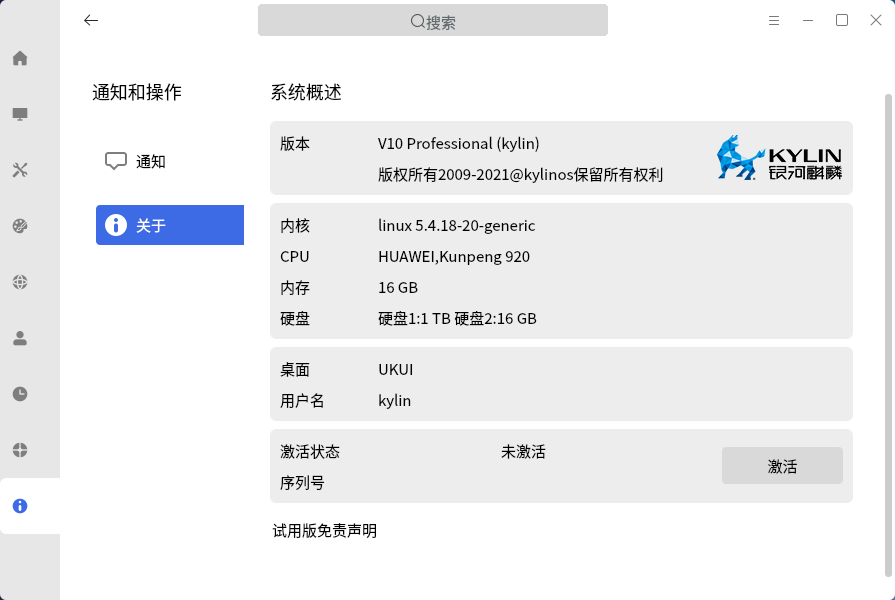
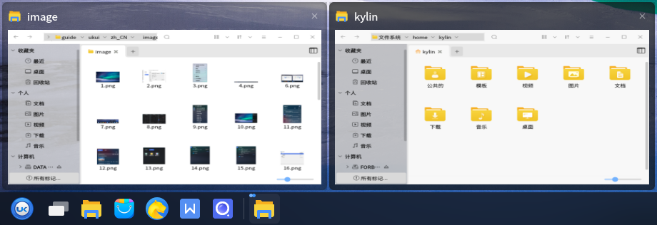
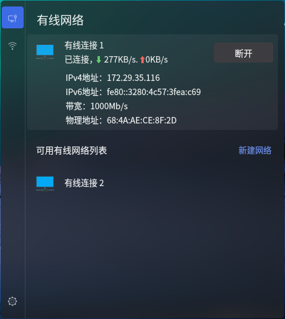

# 基础桌面环境
## 1  概述

桌面是用户进行图形界面操作的基础，提供了多个功能部件，包括任务栏、开始菜单等，主界面如图所示。
 

## 2  桌面
### 2.1  桌面图标

系统默认放置了“我的电脑”、“回收站”、“个人”三个图标，鼠标左键双击即可打开页面。功能如下表。

| 图标  | 说明  |
| :------------ | :------------ |
|   | 显示连接到本机的驱动器和硬件  |
|   | 显示除移的文件  |
|   | 显示个人主目录  |

另外，右键单击“我的电脑”，选择“属性”，可显示当前系统版本、内核版本、激活等相关信息，如图所示。
 

### 2.2  右键菜单

在桌面空白处单击鼠标右键，出现的菜单如图所示，为用户提供了一些快捷功能。
 

部分选项说明如下表。

| 选项  | 说明  |
| :------------ | :------------ |
| 新建  | 可新建文件夹、文本文档、WPS文件  |
| 排列项目  | 提供多种排列图标的方式  |
| 图标大小  | 放大、缩小图标显示  |

### 2.3  任务栏
#### 2.3.1  基本功能

任务栏位于底部，包括开始菜单、Firefox网络浏览器、文件浏览器和状态菜单，如图所示。
 

其各个组件如下表。

| 组件  | 说明  |
| :------------ | :------------ |
|   | 开始菜单，用于弹出系统菜单，可查找应用和文件  |
|   | Firefox网页浏览器，提供便捷安全的上网方式  |
|   | 文件浏览器，可浏览和管理系统中的文件  |
| 窗口显示区  | 横条中间空白部分；显示正在运行的程序或打开的文档，可进行关闭窗口、窗口置顶操作。  |
|   | 状态菜单，包含了对输入法、声音、网络连接、日期的设置  |
| 显示桌面  | 按钮位于最右侧；最小化桌面的所有窗口，返回桌面；再次单击将恢复窗口  |

#### 2.3.2  高级设置

右键单击任务栏，出现的菜单如图所示。
 

在“任务栏设置”中，可进行相关设置，包括任务栏透明度、位置、高度、是否锁定任务栏等，如图所示。若想要直接恢复默认设置，可选择右键菜单中的“重置该面板”。
 

### 2.4  工作区

通过使用工作区，用户可以把当前工作分类放置在不同区域中，便于管理窗口。系统默认隐藏了工作区域，在任务栏设置中取消对“隐藏工作区”的勾选后，工作区会显示在任务栏上。

工作区默认为2行2列，左键单击不同的区块，可以直接切换工作区；右键单击工作区，可进行设置，如图所示。
   

## 3  窗口
### 3.1  窗口管理器

窗口管理器为用户提供了如表所示的功能。

| 功能  | 说明  |
| :------------ | :------------ |
| 窗口标题栏  | 显示当前窗口的标题名称  |
| 最小化/最大化/关闭  | 标题栏右侧的三个图标按钮，分别对应最小化窗口、最大化窗口、关闭窗口的功能  |
| 侧边滑动  | 在窗口右侧提供滑动条，可上下滚动查看页面  |
| 窗口堆叠  | 允许窗口之间产生重叠  |
| 窗口拖拽  | 在窗口标题栏长按鼠标左键，可移动窗口到任意位置  |
| 窗口大小调整  | 将鼠标移至窗口四角，长按左键，可任意调整窗口大小  |

### 3.2  窗口切换

用户有三种方式可以切换：

* 在任务栏上点击窗口标题

* 在桌面上点击不同窗口

* 使用快捷键\<Alt\> + \<Tab\>

## 4  开始菜单
### 4.1  基本功能

单击“开始菜单”按钮，主界面如图所示。
 

左侧默认显示四个分类：“常用软件”、“所有软件”、“我的电脑”、“控制面板”。其中：

* 常用软件：列出最近使用过的软件

* 所有程序：列出系统中的所有软件

用户还可以在搜索框中，通过关键字搜索应用。如所示，可输入中文，也可以输入软件包名，查询结果会随着输入自动显示出来。
   

> **软件商店对应的包名为kylin-software-center。**

### 4.2  高级设置

右键单击开始菜单图标，会出现如图所示的选项。
 

通过“属性”，可以对开始菜单的类型、历史打开文件/应用的显示、透明度进行设置，如下图。
 

其中：

* 常规菜单：为系统默认的方式；在“所有程序”中，不对应用进行分类，直接显示。

* 分类菜单：在“所有程序”中，对应用进行分类显示，如下图。
 

### 4.3  应用
对开始菜单中的某个应用右键单击，会出现如下图所示的菜单。
 

各个选项说明如下表。

| 选项  | 说明  |
| :------------ | :------------ |
| 打开  | 打开软件  |
| 添加到桌面  | 在桌面生成应用的快捷方式图标  |
| 锁定到任务栏  | 在任务栏上生成应用的图标  |
| 附到[开始菜单]  | 在开始菜单中的“常用软件”添加应用  |
| 卸载  | 卸载软件  |
| 属性  | 查看应用的类型、名字、命令和注释信息  |

## 5  关机菜单

关机菜单位于“开始菜单”左下角的“关闭”按钮处，如图所示。
 

### 5.1  锁屏

当用户暂时不需要使用计算机时，可以选择锁屏（不会影响系统当前的运行状态），防止误操作；用户返回后，输入密码即可重新进入系统。在默认设置下，系统在一段空闲时间后，将自动锁定屏幕。

锁屏界面如图所示。
 

### 5.2  切换用户和注销

当要选择其他用户登录使用计算机时，可选择“注销”或“切换用户”。此时，系统会关闭所有正在运行的应用；所以，在执行此操作前，请先保存当前工作。

### 5.3  关机与重启

有两种操作方式：

（1）“开始菜单” > “关机”

会弹出如图所示的对话框，用户可根据需要选择重启或关机。
 

（2）“开始菜单” > “关机”按钮右边菜单 > “关机”/“重启”

系统将直接关机/重启，不再弹出对话框。

### 5.4  定时关机

系统还提供了定时关机的功能，用户可根据需要设置关机时间和关机频率，如图所示。
 

## 6  常见问题
### 6.1  任务栏不显示？

（1）通过Ctrl + Alt + T打开终端。

（2）执行命令`sudo mate-panel --reset`，重新启动任务栏。

（3）若依然未生效，可执行命令`reboot`，重启系统。

### 6.2  锁屏后无法登录系统？

（1）通过Ctrl + Alt + F1切换到字符终端。

（2）输入用户名和密码后登录。

（3）执行命令`sudo rm -rf ~/.Xauthority`。

（4）通过Ctrl + Alt + F7切回图形界面，输入用户密码登录。

## 附录 快捷键

| 快捷键  | 功能  |
| :------------ | :------------ |
| F5  | 刷新桌面  |
| F1  | 打开用户手册  |
| Alt + Tab  | 切换窗口  |
| win  | 打开开始菜单  |
| Ctrl + Alt + L  | 锁屏  |
| Ctrl + Alt + Delete  | 注销  |
| Ctrl + Alt + F1~6  | 切换至字符系统界面  |
| Ctrl + Alt + F7  | 切换至图形界面  |
