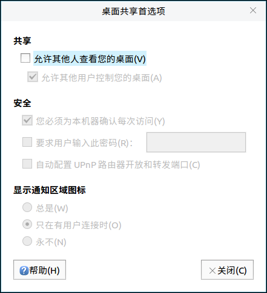
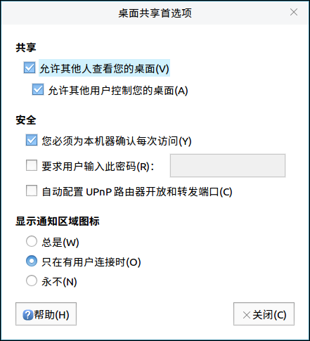
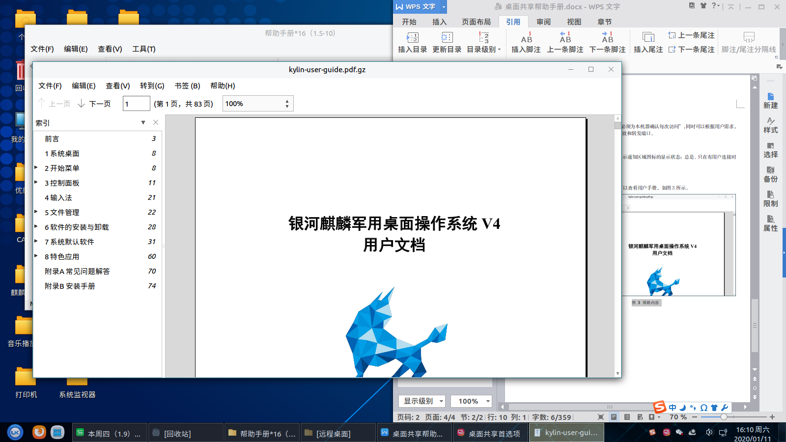

# 桌面共享帮助手册

## 1. 概 述
桌面共享是一款网络应用软件，可以对桌面共享进行相关设置。主界面如图1所示。

## 2. 功能模块
桌面共享可对共享、安全及显示通知区域图标三部分进行设置。
### 2.1. 共 享
用户在共享桌面时，勾选“允许其他人查看您的桌面”即可，如图2所示。

### 2.2. 安 全
在安全设置区域，默认勾选“您必须为本机器确认每次访问”，同时可以根据用户需求，设置密码、自动配置UPnP路由器开放和转发端口。
### 2.3. 显示通知区域图标
用户在桌面共享时，可以设定显示通知区域图标的显示状态：总是、只在有用户连接时（默认）、永不。
### 2.4. 帮 助
用户通过点击“帮助”按键，可以查看用户手册，如图3所示。

## 3. 常见问题
（待补充）
