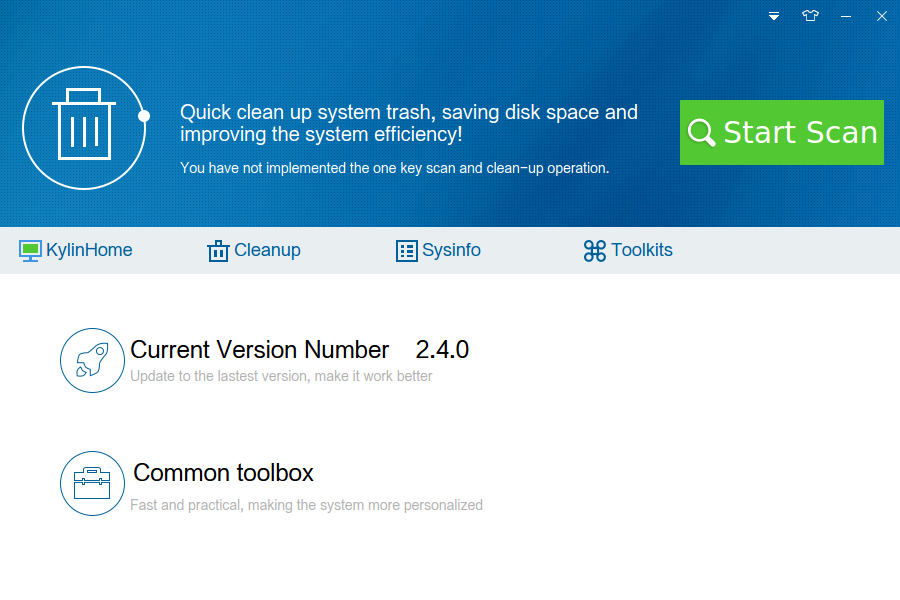
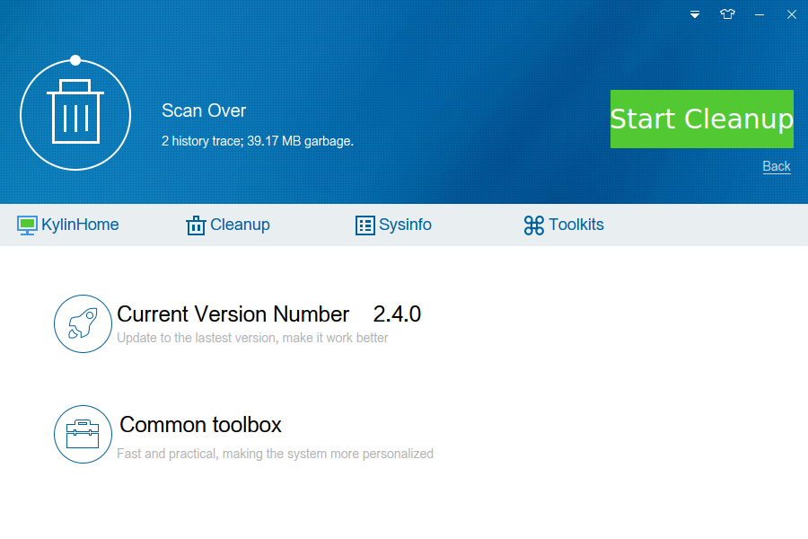
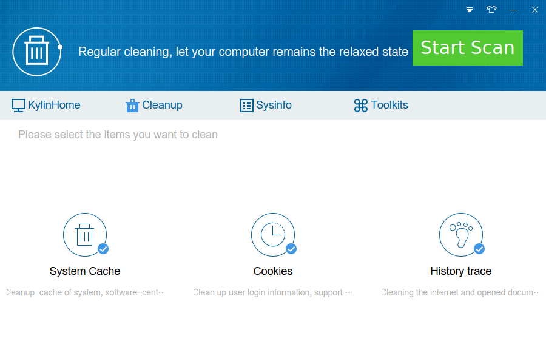
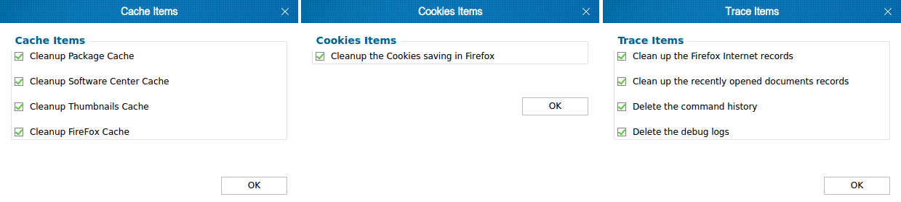
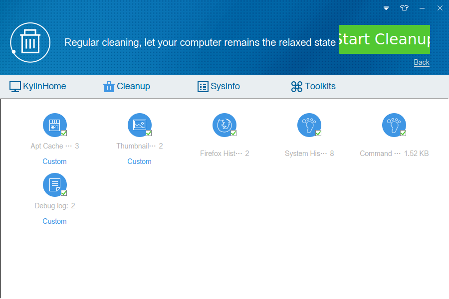
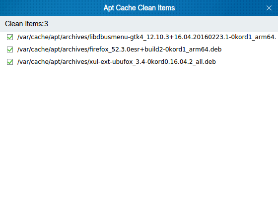
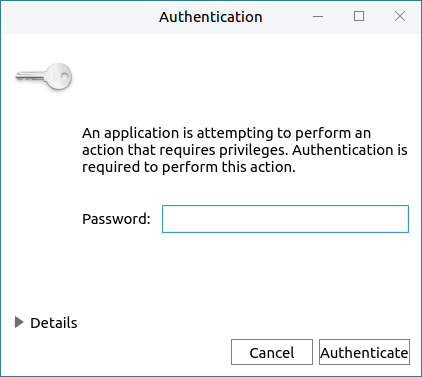
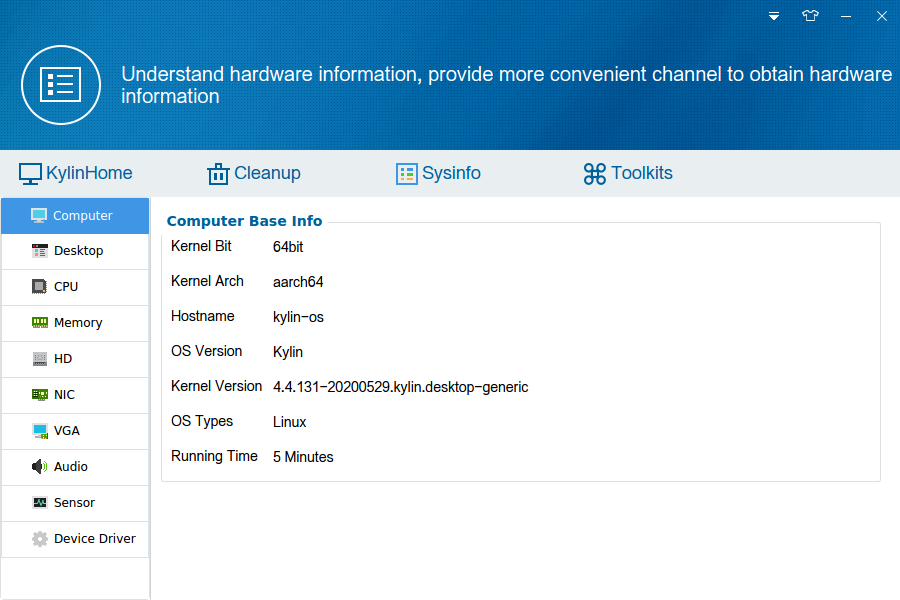
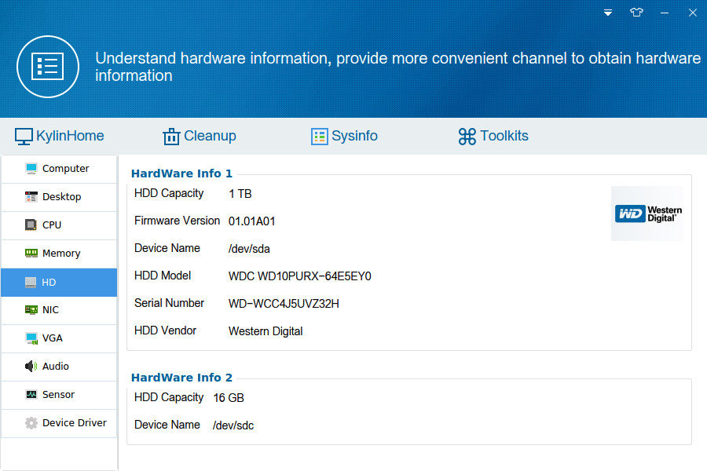

# 麒麟助手
## 概 述
麒麟助手作为系统级工具配置工具，主要针对系统配置进行扩展性加强配置，另外可以实时查询当前计算机的硬件详细信息，便于用户加深了解计算机组成。

麒麟助手包括麒麟首页，系统清理，系统信息，功能大全。

 

## 麒麟首页
“麒麟首页”作为麒麟助手的开始页，秉承简约的设计风格，简化页面结构，提供“当前版本号”的提示信息，还有功能大全的快速入口“工具箱”，以及简易的系统清理功能“一键扫描”。

点击“一键扫描”按钮，程序开始对系统进行扫描；扫描完成后“一键扫描”按钮变化为“开始清理”，如下图所示。
 

- “开始清理”按钮：执行清理操作

- “返回”按钮：取消清理，程序恢复初始状态

首页的一键清理功能仅扫描系统历史痕迹、浏览器Cookies、软件包缓存这些非耗时清理项；更精细的垃圾清理可以使用“系统清理”功能。

 

## 系统清理
“系统清理”提供“系统缓存”、“Cookies”、“历史痕迹”三个方面的扫描项。主界面如下图所示。
 

### 系统缓存
点击“系统缓存”图标，弹出选项页面如下图所示。
 

用户可根据需要进行勾选，只有勾选状态下的选项才会扫描。

### Cookies
点击“Cookies”，弹出选项页面如下图所示。
 

当前仅支持“清理火狐浏览器的Cookie”，勾选状态下才会扫描。

### 历史痕迹
点击“历史痕迹”，弹出页面如下图所示。
 

用户可根据需要进行勾选，只有勾选状态下的选项才会扫描。

点击“开始扫描”按钮，程序进入扫描状态，所有勾选的扫描项均会扫描，扫描完成后进入清理界面，如下图所示。
 

所有的扫描项如果存在垃圾就会在界面显示；点击“自定义”按钮，会弹出详细的清理项目。
 

用户可根据自己需要勾选，已选的清理项将会被直接清除。

另外，清理项目图标的右下角提供了“一键全选功能”，点击后所有清理项目全部 勾选/取消勾选 。

点击“开始清理”按钮，进入清理状态，弹出授权窗口，需要合法用户授予麒麟助手权限去清理垃圾，防止出现非法用户任意操作，导致系统崩溃等问题，如下图所示。
 

- 如果授权通过，麒麟助手清理掉系统垃圾，并还原到待扫描状态。

- 如果授权未通过，重新弹出认证窗口请用户认证，共有3此认证机会。

- 如果3次全部错误，清理进程终止，麒麟助手回到待清理状态等待用户操作

- 在待清理状态下，用户可以点击“返回”按钮终止清理操作，麒麟助手回到待扫描状态。

 

## 系统信息
从系统底层获取计算机硬件详细信息以及操作系统信息，并显示给用户，主界面如下图所示。

（注：具体信息会根据平台和系统而变动，与截图示例不一定相符。）

- 根据当前硬件组成动态显示，如果该硬件不存在，则不会显示条目。

- 如果未从底层获取到该硬件的信息，界面上也不会显示相应条目。

- 点击相应项目，切换到该硬件的详细信息页面；以“硬盘”为例，如下图所示。
 

 

## 功能大全
“功能大全”作为麒麟助手的功能扩展，使用了插件的开发模式，其中的所有功能均以插件的形式整合进麒麟助手，主界面如下图所示。
 

- “麒麟软件商店”是一个快捷入口，点击后，打开系统预装的软件商店。

- “文件粉碎机”可以彻底清除任意文件，并且无法使用恢复工具等手段找回。点击“文件粉碎机”弹出界面，如下图所示。
 

点击黄色文件夹图标，弹出文件选择界面。
 

选中需要粉碎的文件后，选择打开 > 粉碎文件，执行粉碎操作。

如果希望退出粉碎窗口可以点击“取消粉碎”按钮。

 

## 常见问题
### “系统信息”中未看到“内存”信息
出现该情况是因为麒麟助手从底层接口未获取到内存相关信息，所以界面上也不会显示“内存”条目。
